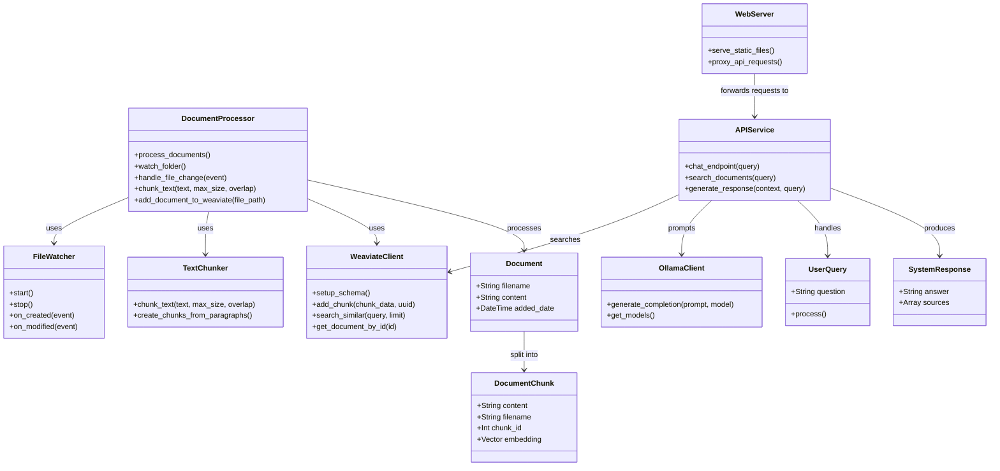

# RAG System with Folder Watching

This setup creates a document chat system where:
- Admins add text (.txt) files to a watched folder
- Documents are automatically processed and indexed
- End-users can query the documents through a web interface
- The LLM runs locally through Ollama

## Architecture

### Class diagram

### Document processing flow

### Query processing flow

### RAG System Component Diagram

### RAG System Deployment Diagram

