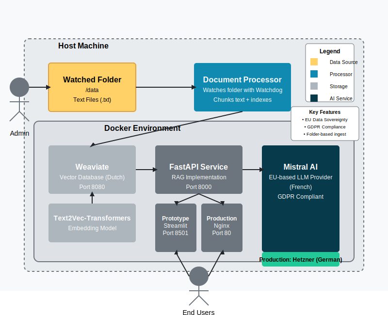

# System Architecture

This document provides a comprehensive overview of the EU-Compliant Document Chat system architecture.

## System Overview

The system is designed as a modular, containerized application that allows users to query documents using natural language. It follows a Retrieval-Augmented Generation (RAG) pattern, where:

1. Documents are processed and stored as vector embeddings
2. User queries are vectorized and used to retrieve relevant document chunks
3. Retrieved chunks are sent to an LLM along with the original query to generate an informed response
4. Responses include source citations to maintain transparency

## Technology Stack

| Component | Technology | Purpose |
|-----------|------------|---------|
| **Vector Database** | Weaviate | Stores and searches document embeddings |
| **Text Embeddings** | text2vec-transformers | Converts text to vector embeddings |
| **LLM Provider** | Mistral AI | Generates responses based on retrieved context |
| **Backend API** | FastAPI | Handles requests, orchestrates RAG process |
| **Document Processor** | Python/watchdog | Monitors and processes new text documents |
| **Prototype Frontend** | Streamlit | Provides user chat interface |
| **Production Frontend** | HTML/JS + Nginx | Lightweight production web interface |
| **Containerization** | Docker | Packages all components for deployment |
| **Production Hosting** | Hetzner | EU-based cloud provider for production |

## Core Components

### Document Processor

- **Purpose**: Monitors folder for new text files, chunks text, and indexes in vector database
- **Technology**: Python with watchdog library
- **Location**: Runs in dedicated container, watches mounted volume

### Vector Database

- **Purpose**: Stores document chunks as vector embeddings for semantic search
- **Technology**: Weaviate (Dutch company, GDPR compliant)
- **Features**: Vector search, metadata filtering, scalable storage

### API Service

- **Purpose**: Orchestrates the RAG workflow, connecting frontend, database, and LLM
- **Technology**: FastAPI (Python)
- **Key Features**: Token budget management, rate limiting, caching, error handling

### Language Model

- **Purpose**: Generates natural language responses based on retrieved context
- **Technology**: Mistral AI (French company, GDPR compliant)
- **Security**: API-based access, no data retention

### Web Interface

- **Prototype**: Streamlit-based interface for development and testing
- **Production**: Nginx serving static HTML/JS application
- **Features**: Chat interface, source citations, system status information

### Chat Logger

- **Purpose**: Enables privacy-compliant logging of chat interactions for research purposes
- **Technology**: Python with JSONL file storage
- **Features**: Anonymization, automatic rotation, GDPR compliance
- **Location**: Integrated with API service, logs stored in mounted volume

## Data Flow

1. **Document Ingestion**:
   - Admin adds text and metadata json files to watched folder
   - System checks for corresponding `.metadata.json` files
   - Processor detects changes, reads files and metadata
   - Text is chunked and stored in Weaviate with metadata
   - Embeddings are generated by text2vec-transformers

2. **Query Processing**:
   - User submits question through web interface
   - API receives query and converts to vector embedding
   - Weaviate performs similarity search
   - Top relevant chunks are retrieved
   - Chunks are formatted as context
   - Context and query are sent to Mistral AI
   - Response is generated and returned with sources
   
## Metadata Support
The system includes bibliographic metadata support for academic and research documents:
   - **Storage**: Document metadata is stored alongside content as JSON
   - **Formats**: Support for various document types (journal articles, books, etc.)
   - **Display**: Metadata is shown with source citations in responses
   - **Flexibility**: Schema accommodates various metadata fields without rigid structure
   - **Integration**: Compatible with Zotero-style bibliographic data

## Security and Compliance

- All components run within Docker environment
- Data remains within system boundaries
- All providers are EU-based
- Built-in rate limiting and token budget controls
- Stateless design with minimal data retention
- **Docker Secrets** for secure credentials management
- **Basic authentication** for web interface access
- **Comprehensive request validation** to prevent injection attacks
- **API key rotation mechanism** with age checking
- **Security headers** via Nginx reverse proxy
- **Network isolation** between frontend and backend components
- **Content filtering** for document ingestion
- **Non-root container execution** with privilege restrictions
- Chat logging is disabled by default and opt-in only
- All user identifiers are anonymized when logging is enabled
- Automatic deletion of logs after configurable retention period (default: 30 days)
- Clear user notification when logging is active

## Deployment Architecture

The system is deployed as Docker containers, making it portable across environments. For production, it's hosted on Hetzner (German cloud provider) to maintain EU data sovereignty.

## Class Structure

For developers who need to understand the code organization, the system follows this class structure:

[Reference to detailed class diagram in diagrams folder]

## Future Architecture Considerations

- Scaling vector database for larger document collections
- Adding authentication for multi-tenant usage
- Implementing finer-grained permission controls
- Supporting additional document formats (PDF, DOCX)
- Adding a feedback loop for response quality improvement