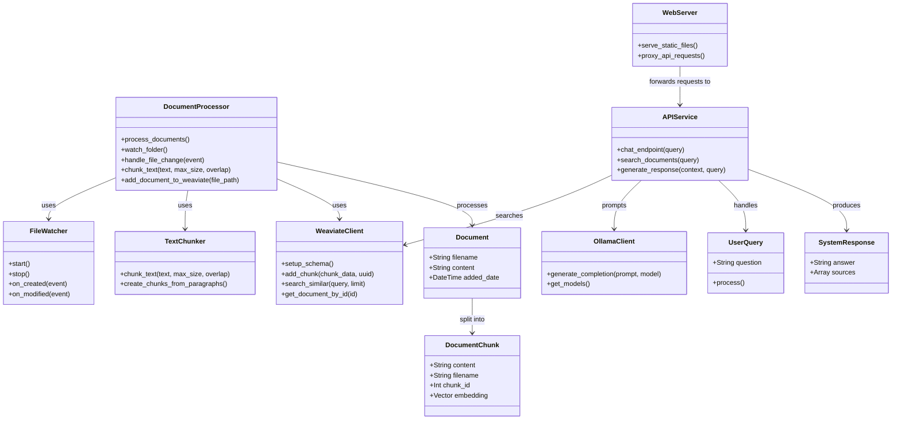
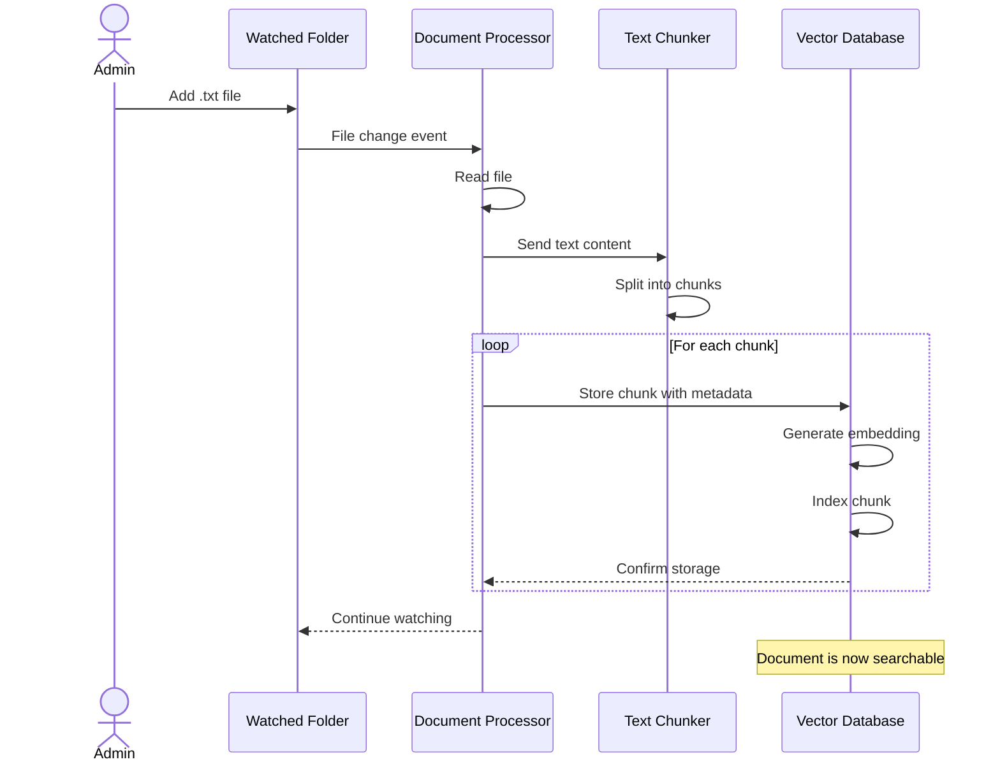
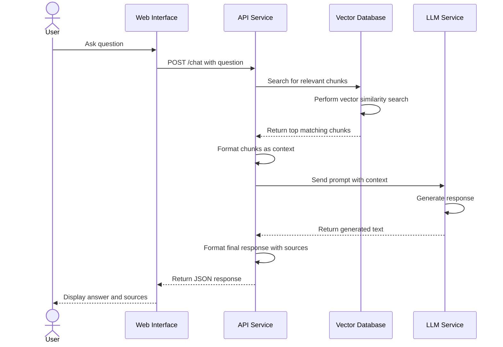
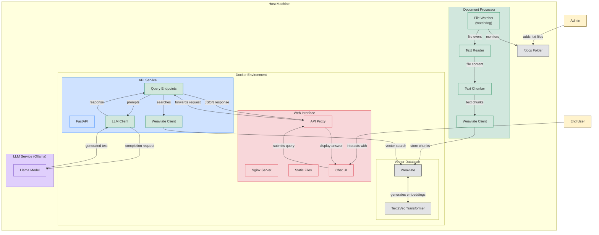
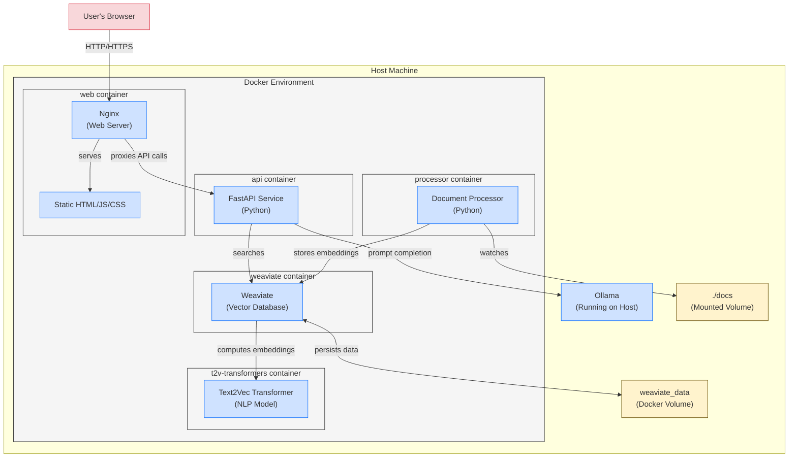
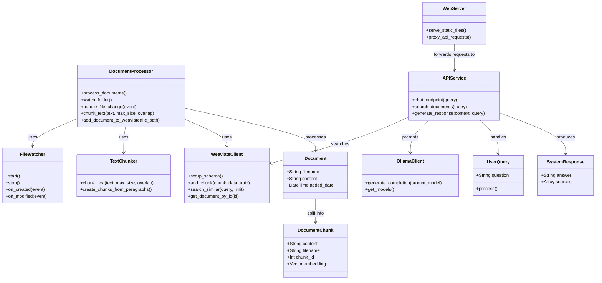

# Project Documentation

# Project Structure
```
doc_chat/
├── api/
│   ├── Dockerfile
│   ├── main.py
│   ├── requirements.txt
├── docs/
│   ├── architecture-diagram.svg
│   ├── chat_with_your_data.md
│   ├── doc_chat_project_knowledge.md
│   ├── docker_debugging_notes.md
│   ├── llm-comparison.md
│   ├── requirements-table.md
│   ├── simplified-architecture.svg
│   ├── todo.md
├── processor/
│   ├── Dockerfile
│   ├── processor.py
│   ├── requirements.txt
├── tests/
│   ├── quickstart_locally_hosted/
│   │   ├── docker-compose.yml
│   │   ├── quickstart_check_readiness.py
│   │   ├── quickstart_create_collection.py
│   │   ├── quickstart_import.py
│   │   ├── quickstart_neartext_query.py
│   │   ├── quickstart_rag.py
├── web-production/
├── web-prototype/
│   ├── Dockerfile
│   ├── app.py
│   ├── requirements.txt
├── LICENSE
├── README.md
├── docker-compose.yml
├── start.ps1
```

# api\Dockerfile
```text
FROM python:3.9-slim

WORKDIR /app

COPY requirements.txt .
RUN pip install --no-cache-dir -r requirements.txt

COPY main.py .

CMD ["uvicorn", "main:app", "--host", "0.0.0.0", "--port", "8000"]
```


# api\main.py
```python
import os
import logging
from fastapi import FastAPI, HTTPException
from pydantic import BaseModel
import weaviate
from weaviate.config import AdditionalConfig, Timeout
from dotenv import load_dotenv
from mistralai import Mistral

# Configure logging
logging.basicConfig(level=logging.INFO, 
                    format='%(asctime)s - %(levelname)s - %(message)s')
logger = logging.getLogger(__name__)

# Load environment variables
load_dotenv()

app = FastAPI(title="EU-Compliant RAG API")

# Initialize Weaviate client
weaviate_url = os.getenv("WEAVIATE_URL", "http://weaviate:8080")
mistral_api_key = os.getenv("MISTRAL_API_KEY", "")
mistral_model = os.getenv("MISTRAL_MODEL", "mistral-tiny")

# Initialize Mistral client
mistral_client = None
if mistral_api_key:
    try:
        mistral_client = Mistral(api_key=mistral_api_key)
        logger.info("Mistral client initialized")
    except Exception as e:
        logger.error(f"Failed to initialize Mistral client: {str(e)}")

# Create Weaviate client
try:
    # Parse the URL to get components
    use_https = weaviate_url.startswith("https://")
    host_part = weaviate_url.replace("http://", "").replace("https://", "")
    
    # Handle port if specified
    if ":" in host_part:
        host, port = host_part.split(":")
        port = int(port)
    else:
        host = host_part
        port = 443 if use_https else 80
    
    # Connect to Weaviate using the same method as the processor
    client = weaviate.connect_to_custom(
        http_host=host,
        http_port=port,
        http_secure=use_https,
        grpc_host=host,
        grpc_port=50051,  # Default gRPC port
        grpc_secure=use_https,
        additional_config=AdditionalConfig(
            timeout=Timeout(init=60, query=30, insert=30)
        )
    )
    logger.info(f"Connected to Weaviate at {weaviate_url}")
except Exception as e:
    logger.error(f"Failed to connect to Weaviate: {str(e)}")
    client = None

class Query(BaseModel):
    question: str

@app.get("/")
async def root():
    return {"message": "EU-Compliant RAG API is running"}

@app.get("/status")
async def status():
    """Check the status of the API and its connections."""
    weaviate_status = "connected" if client and client.is_ready() else "disconnected"
    
    return {
        "api": "running",
        "weaviate": weaviate_status,
        "mistral_api": "configured" if mistral_client else "not configured"
    }

@app.post("/search")
async def search_documents(query: Query):
    """Search for relevant document chunks without LLM generation."""
    if not client:
        raise HTTPException(status_code=503, detail="Weaviate connection not available")
    
    try:
        # Search Weaviate for relevant chunks
        collection = client.collections.get("DocumentChunk")
        response = collection.query.near_text(
            query=query.question,
            limit=5,
            return_properties=["content", "filename", "chunkId"]
        ).do()
        
        # Format results
        results = []
        for obj in response.objects:
            results.append(obj.properties)
        
        return {
            "query": query.question,
            "results": results
        }
        
    except Exception as e:
        logger.error(f"Error in search: {str(e)}")
        raise HTTPException(status_code=500, detail=f"Internal server error: {str(e)}")

@app.post("/chat")
async def chat(query: Query):
    """RAG-based chat endpoint that queries documents and generates a response."""
    if not client:
        raise HTTPException(status_code=503, detail="Weaviate connection not available")
    
    if not mistral_client:
        raise HTTPException(status_code=503, detail="Mistral API client not configured")
    
    try:
        # Get the collection
        collection = client.collections.get("DocumentChunk")
        
        # Search Weaviate for relevant chunks using v4 API
        search_result = collection.query.near_text(
            query=query.question,
            limit=3,
            return_properties=["content", "filename", "chunkId"]
        )
        
        # Check if we got any results
        if len(search_result.objects) == 0:
            return {
                "answer": "I couldn't find any relevant information to answer your question.",
                "sources": []
            }
        
        # Format context from chunks
        context = "\n\n".join([obj.properties["content"] for obj in search_result.objects])
        
        # Format sources for citation
        sources = [{"filename": obj.properties["filename"], "chunkId": obj.properties["chunkId"]} 
                   for obj in search_result.objects]
        
        # Use Mistral client to generate response
        messages = [
            {"role": "system", "content": "You are a helpful assistant that answers questions based on the provided document context. Stick to the information in the context. If you don't know the answer, say so."},
            {"role": "user", "content": f"Context:\n{context}\n\nQuestion: {query.question}"}
        ]
        
        chat_response = mistral_client.chat.complete(
            model=mistral_model,
            messages=messages,
            temperature=0.7,
        )
        
        answer = chat_response.choices[0].message.content
            
        return {
            "answer": answer,
            "sources": sources
        }
            
    except Exception as e:
        logger.error(f"Error in chat: {str(e)}")
        raise HTTPException(status_code=500, detail=f"Internal server error: {str(e)}")

if __name__ == "__main__":
    import uvicorn
    uvicorn.run(app, host="0.0.0.0", port=8000)

```


# api\requirements.txt
```cmake
fastapi==0.115.11
uvicorn==0.34.0
python-dotenv==1.0.1
weaviate-client==4.11.1
mistralai==1.5.0
```


# docs\architecture-diagram.svg
```text
<svg xmlns="http://www.w3.org/2000/svg" viewBox="0 0 800 650">
  <!-- Background -->
  <rect width="800" height="600" fill="#f8f9fa" rx="0" ry="0"/>
  
  <!-- Host Machine Container -->
  <rect x="50" y="80" width="700" height="480" fill="#e9ecef" rx="10" ry="10" stroke="#6c757d" stroke-width="2" stroke-dasharray="5,5"/>
  <text x="120" y="100" font-family="Arial" font-size="16" font-weight="bold">Host Machine</text>
  
  <!-- Watched Folder -->
  <rect x="100" y="130" width="180" height="100" fill="#ffd166" rx="5" ry="5" stroke="#e09f3e" stroke-width="2"/>
  <text x="190" y="170" font-family="Arial" font-size="16" font-weight="bold" text-anchor="middle">Watched Folder</text>
  <text x="190" y="190" font-family="Arial" font-size="12" text-anchor="middle">/data</text>
  <text x="190" y="210" font-family="Arial" font-size="12" text-anchor="middle">Text Files (.txt)</text>
  
  <!-- Document Processor Service -->
  <rect x="400" y="130" width="200" height="100" fill="#118ab2" rx="5" ry="5"/>
  <text x="500" y="170" font-family="Arial" font-size="16" font-weight="bold" text-anchor="middle" fill="white">Document Processor</text>
  <text x="500" y="190" font-family="Arial" font-size="12" text-anchor="middle" fill="white">Watches folder with Watchdog</text>
  <text x="500" y="210" font-family="Arial" font-size="12" text-anchor="middle" fill="white">Chunks text + indexes</text>

  <!-- Docker Environment Container -->
  <rect x="70" y="250" width="660" height="290" fill="#dee2e6" rx="10" ry="10" stroke="#6c757d" stroke-width="2"/>
  <text x="215" y="270" font-family="Arial" font-size="16" font-weight="bold">Docker Environment</text>

  <!-- Weaviate Vector DB -->
  <rect x="100" y="300" width="180" height="100" fill="#adb5bd" rx="5" ry="5"/>
  <text x="190" y="350" font-family="Arial" font-size="16" font-weight="bold" text-anchor="middle" fill="white">Weaviate</text>
  <text x="190" y="370" font-family="Arial" font-size="12" text-anchor="middle" fill="white">Vector Database (Dutch)</text>
  <text x="190" y="390" font-family="Arial" font-size="12" text-anchor="middle" fill="white">Port 8080</text>
  
  <!-- Text2vec Embeddings -->
  <rect x="100" y="420" width="180" height="80" fill="#adb5bd" rx="5" ry="5"/>
  <text x="190" y="455" font-family="Arial" font-size="14" font-weight="bold" text-anchor="middle" fill="white">Text2Vec-Transformers</text>
  <text x="190" y="475" font-family="Arial" font-size="12" text-anchor="middle" fill="white">Embedding Model</text>
  
  <!-- API Service -->
  <rect x="320" y="300" width="180" height="100" fill="#6c757d" rx="5" ry="5"/>
  <text x="410" y="350" font-family="Arial" font-size="16" font-weight="bold" text-anchor="middle" fill="white">FastAPI Service</text>
  <text x="410" y="370" font-family="Arial" font-size="12" text-anchor="middle" fill="white">RAG Implementation</text>
  <text x="410" y="390" font-family="Arial" font-size="12" text-anchor="middle" fill="white">Port 8000</text>
  
  <!-- Web Interface - Split into Prototype and Production -->
  <rect x="320" y="420" width="85" height="100" fill="#6c757d" rx="5" ry="5"/>
  <text x="362" y="455" font-family="Arial" font-size="12" font-weight="bold" text-anchor="middle" fill="white">Prototype</text>
  <text x="362" y="470" font-family="Arial" font-size="12" text-anchor="middle" fill="white">Streamlit</text>
  <text x="362" y="485" font-family="Arial" font-size="12" text-anchor="middle" fill="white">Port 8501</text>
  
  <rect x="415" y="420" width="85" height="100" fill="#6c757d" rx="5" ry="5"/>
  <text x="457" y="455" font-family="Arial" font-size="12" font-weight="bold" text-anchor="middle" fill="white">Production</text>
  <text x="457" y="470" font-family="Arial" font-size="12" text-anchor="middle" fill="white">Nginx</text>
  <text x="457" y="485" font-family="Arial" font-size="12" text-anchor="middle" fill="white">Port 80</text>
  
  <!-- Mistral AI (replaced Ollama) -->
  <rect x="540" y="300" width="160" height="220" fill="#073b4c" rx="5" ry="5"/>
  <text x="620" y="350" font-family="Arial" font-size="16" font-weight="bold" text-anchor="middle" fill="white">Mistral AI</text>
  <text x="620" y="370" font-family="Arial" font-size="12" text-anchor="middle" fill="white">EU-based LLM Provider</text>
  <text x="620" y="390" font-family="Arial" font-size="12" text-anchor="middle" fill="white">(French)</text>
  <text x="620" y="410" font-family="Arial" font-size="12" text-anchor="middle" fill="white">GDPR Compliant</text>
  
  <!-- Deployment label -->
  <rect x="540" y="520" width="160" height="30" fill="#20c997" rx="5" ry="5"/>
  <text x="620" y="540" font-family="Arial" font-size="12" font-weight="bold" text-anchor="middle">Production: Hetzner (German)</text>
  
  <!-- Connections -->
  <!-- Folder to Processor -->
  <line x1="280" y1="180" x2="400" y2="180" stroke="#212529" stroke-width="2"/>
  <polygon points="395,175 405,180 395,185" fill="#212529"/>
  
  <!-- Processor to Weaviate -->
  <line x1="500" y1="230" x2="190" y2="300" stroke="#212529" stroke-width="2"/>
  <polygon points="192,294 185,304 197,299" fill="#212529"/>
  
  <!-- Weaviate to API -->
  <line x1="280" y1="350" x2="320" y2="350" stroke="#212529" stroke-width="2"/>
  <polygon points="315,345 325,350 315,355" fill="#212529"/>
  
  <!-- API to Web Prototype -->
  <line x1="410" y1="400" x2="362" y2="420" stroke="#212529" stroke-width="2"/>
  <polygon points="359,415 365,425 368,415" fill="#212529"/>
  
  <!-- API to Web Production -->
  <line x1="410" y1="400" x2="457" y2="420" stroke="#212529" stroke-width="2"/>
  <polygon points="454,415 460,425 463,415" fill="#212529"/>
  
  <!-- API to Mistral -->
  <line x1="500" y1="350" x2="540" y2="350" stroke="#212529" stroke-width="2"/>
  <polygon points="535,345 545,350 535,355" fill="#212529"/>
  
  <!-- Text2Vec to Weaviate -->
  <line x1="190" y1="420" x2="190" y2="400" stroke="#212529" stroke-width="2"/>
  <polygon points="185,405 190,395 195,405" fill="#212529"/>
  
  <!-- Admin -->
  <circle cx="40" cy="180" r="20" fill="#6c757d"/>
  <line x1="40" y1="200" x2="40" y2="230" stroke="#6c757d" stroke-width="2"/>
  <line x1="20" y1="210" x2="60" y2="210" stroke="#6c757d" stroke-width="2"/>
  <line x1="20" y1="250" x2="40" y2="230" stroke="#6c757d" stroke-width="2"/>
  <line x1="60" y1="250" x2="40" y2="230" stroke="#6c757d" stroke-width="2"/>
  
  <text x="40" y="280" font-family="Arial" font-size="14" text-anchor="middle">Admin</text>
  
  <!-- Admin to Folder arrow -->
  <line x1="60" y1="180" x2="100" y2="180" stroke="#212529" stroke-width="2"/>
  <polygon points="95,175 105,180 95,185" fill="#212529"/>
  
  <!-- End Users -->
  <circle cx="410" cy="570" r="20" fill="#6c757d"/>
  <line x1="410" y1="590" x2="410" y2="610" stroke="#6c757d" stroke-width="2"/>
  <line x1="390" y1="600" x2="430" y2="600" stroke="#6c757d" stroke-width="2"/>
  <line x1="390" y1="630" x2="410" y2="610" stroke="#6c757d" stroke-width="2"/>
  <line x1="430" y1="630" x2="410" y2="610" stroke="#6c757d" stroke-width="2"/>
  
  <text x="410" y="650" font-family="Arial" font-size="14" text-anchor="middle">End Users</text>
  
  <!-- End Users to Web Interfaces -->
  <line x1="390" y1="570" x2="362" y2="520" stroke="#212529" stroke-width="2"/>
  <polygon points="359,525 365,515 367,525" fill="#212529"/>
  
  <line x1="430" y1="570" x2="457" y2="520" stroke="#212529" stroke-width="2"/>
  <polygon points="454,525 460,515 463,525" fill="#212529"/>
  
  <!-- Legend -->
  <rect x="630" y="90" width="100" height="120" fill="white" rx="5" ry="5" stroke="#6c757d" stroke-width="1"/>
  <text x="680" y="110" font-family="Arial" font-size="12" font-weight="bold" text-anchor="middle">Legend</text>
  
  <rect x="640" y="120" width="15" height="15" fill="#ffd166"/>
  <text x="680" y="132" font-family="Arial" font-size="10">Data Source</text>
  
  <rect x="640" y="145" width="15" height="15" fill="#118ab2"/>
  <text x="680" y="157" font-family="Arial" font-size="10">Processor</text>
  
  <rect x="640" y="170" width="15" height="15" fill="#adb5bd"/>
  <text x="680" y="182" font-family="Arial" font-size="10">Storage</text>
  
  <rect x="640" y="195" width="15" height="15" fill="#073b4c"/>
  <text x="680" y="207" font-family="Arial" font-size="10">AI Service</text>
  
  <!-- Key Features Box -->
  <rect x="600" y="220" width="140" height="70" fill="white" rx="5" ry="5" stroke="#6c757d" stroke-width="1"/>
  <text x="670" y="235" font-family="Arial" font-size="10" font-weight="bold" text-anchor="middle">Key Features</text>
  <text x="670" y="250" font-family="Arial" font-size="9" text-anchor="middle">• EU Data Sovereignty</text>
  <text x="670" y="265" font-family="Arial" font-size="9" text-anchor="middle">• GDPR Compliance</text>
  <text x="670" y="280" font-family="Arial" font-size="9" text-anchor="middle">• Folder-based ingest</text>
</svg>

```


# docs\chat_with_your_data.md
```markdown
# Chat with your data solutions

RAG is currently popular because it balances effectiveness, cost, and implementation complexity. Each alternative has specific trade-offs around data size limits, training requirements, and maintenance complexity. Alternatively, fine-tuning an LLM directly on your data is an option.

# RAG Implementation Options Comparison

| Aspect | Self-Hosted | Cloud Services | Hybrid |
|--------|-------------|----------------|---------|
| **Data Privacy** | Maximum control, data stays on premises, compliance-friendly | Data leaves premises, requires vendor agreements, potential compliance issues | Data processing on premises, only queries to cloud LLM |
| **Setup Complexity** | High - requires infrastructure setup, software installation, integration | Low - minimal setup, managed services | Medium - local infrastructure needed but reduced complexity |
| **Maintenance** | High - regular updates, monitoring, troubleshooting required | Low - vendor managed updates and maintenance | Medium - split responsibility between local and cloud components |
| **Scalability** | Limited by local hardware (10-100 concurrent users) | High (1000+ users), automatic scaling | Depends on local infrastructure, typically medium (100-500 users) |
| **Initial Cost** | High - hardware, setup labor, software licenses | Low - usually pay-as-you-go | Medium - some hardware costs, reduced setup complexity |
| **Per-Query Cost** | Low - mainly power and maintenance | Medium to High ($0.01-0.10 per query) | Medium - split between local costs and API fees |
| **Example Solutions** | LocalGPT, custom LlamaIndex implementation | Azure AI Search, Amazon Kendra | Hybrid LangChain with cloud LLM |
| **Best For** | High privacy requirements, technical teams, cost-sensitive at scale | Quick deployment, scalability needs, limited IT resources | Balance of control and convenience, moderate scale |


# RAG Solutions Deployment Options

| Solution | Type | Description |
|----------|------|-------------|
| **Self-Hosted Solutions** |
| LocalGPT | Self-hosted | Complete local RAG implementation with local LLMs |
| LlamaIndex | Self-hosted | Framework for building custom RAG pipelines |
| Chroma | Self-hosted | Vector database with RAG capabilities |
| Weaviate | Self-hosted/Cloud | Vector database, can be self-hosted or cloud |
| Qdrant | Self-hosted/Cloud | Vector database with both deployment options |
| txtai | Self-hosted | Lightweight semantic search engine |
| **Cloud Services** |
| Azure AI Search | Cloud | Microsoft's enterprise search with RAG |
| Amazon Kendra | Cloud | AWS enterprise search solution |
| Pinecone | Cloud | Managed vector database service |
| Supabase | Cloud | PostgreSQL-based vector search |
| Zilliz | Cloud | Cloud-native vector database platform |
| Google Vertex AI Search | Cloud | Google's enterprise search solution |
| **Hybrid/SaaS Solutions** |
| Embedchain | Hybrid | No-code RAG platform |
| GPTCache | Hybrid | Caching layer for LLM responses |
| Vectara | Hybrid | Enterprise search with flexible deployment |
| LangChain | Hybrid | Framework supporting various deployments |


# European/independent options

European Cloud Providers:
- Mistral AI (French) - Offers AI/LLM services
- OVHcloud (French) - Enterprise cloud with AI capabilities
- T-Systems (German) - Enterprise solutions
- Scaleway (French) - Cloud infrastructure

Independent Vector DB/Search:
- Weaviate (Dutch company)
- Qdrant (Originally Russian, now EU-based)
- Milvus (Open source, can self-host)

These typically offer:
- GDPR compliance
- EU data sovereignty
- Transparent pricing
- Open source components

For maximum independence, consider self-hosting using open source tools like Weaviate or Qdrant combined with local LLMs or European LLM providers.


# The basic workflow would be:
1. Load documents into Weaviate
2. Weaviate chunks and creates embeddings
3. Connect to Mistral API for LLM responses
4. Query system finds relevant chunks using vector search
5. Mistral LLM generates answers based on retrieved context

Benefits:
- EU-based solution
- GDPR compliant
- Self-hosted data control
- Good documentation/community
- Scales well with large documents


```


# docs\doc_chat_project_knowledge.md
```markdown
# Project Documentation

# Project Structure
```
doc_chat/
├── api/
│   ├── Dockerfile
│   ├── main.py
│   ├── requirements.txt
├── docs/
│   ├── architecture-diagram.svg
│   ├── chat_with_your_data.md
│   ├── docker_debugging_notes.md
│   ├── llm-comparison.md
│   ├── requirements-table.md
│   ├── simplified-architecture.svg
│   ├── todo.md
├── processor/
│   ├── Dockerfile
│   ├── processor.py
│   ├── requirements.txt
├── tests/
│   ├── quickstart_locally_hosted/
│   │   ├── docker-compose.yml
│   │   ├── quickstart_check_readiness.py
│   │   ├── quickstart_create_collection.py
│   │   ├── quickstart_import.py
│   │   ├── quickstart_neartext_query.py
│   │   ├── quickstart_rag.py
├── web-production/
├── web-prototype/
│   ├── Dockerfile
│   ├── app.py
│   ├── requirements.txt
├── LICENSE
├── README.md
├── docker-compose.yml
├── start.ps1
```

# api\Dockerfile
```text
FROM python:3.9-slim

WORKDIR /app

COPY requirements.txt .
RUN pip install --no-cache-dir -r requirements.txt

COPY main.py .

CMD ["uvicorn", "main:app", "--host", "0.0.0.0", "--port", "8000"]
```


# api\main.py
```python
import os
import logging
from fastapi import FastAPI, HTTPException
from pydantic import BaseModel
import weaviate
import httpx
from dotenv import load_dotenv
from mistralai.client import MistralClient
from mistralai.models.chat_completion import ChatMessage

# Configure logging
logging.basicConfig(level=logging.INFO, 
                    format='%(asctime)s - %(levelname)s - %(message)s')
logger = logging.getLogger(__name__)

# Load environment variables
load_dotenv()

app = FastAPI(title="EU-Compliant RAG API")

# Initialize Weaviate client
weaviate_url = os.getenv("WEAVIATE_URL", "http://weaviate:8080")
mistral_api_key = os.getenv("MISTRAL_API_KEY", "")

# Initialize Mistral client
mistral_client = None
if mistral_api_key:
    try:
        mistral_client = MistralClient(api_key=mistral_api_key)
        logger.info("Mistral client initialized")
    except Exception as e:
        logger.error(f"Failed to initialize Mistral client: {str(e)}")

# Create Weaviate client
try:
    client = weaviate.Client(weaviate_url)
    logger.info(f"Connected to Weaviate at {weaviate_url}")
except Exception as e:
    logger.error(f"Failed to connect to Weaviate: {str(e)}")
    client = None

class Query(BaseModel):
    question: str

@app.get("/")
async def root():
    return {"message": "EU-Compliant RAG API is running"}

@app.get("/status")
async def status():
    """Check the status of the API and its connections."""
    weaviate_status = "connected" if client and client.is_ready() else "disconnected"
    
    return {
        "api": "running",
        "weaviate": weaviate_status,
        "mistral_api": "configured" if mistral_client else "not configured"
    }

@app.post("/search")
async def search_documents(query: Query):
    """Search for relevant document chunks without LLM generation."""
    if not client:
        raise HTTPException(status_code=503, detail="Weaviate connection not available")
    
    try:
        # Search Weaviate for relevant chunks
        result = client.query.get(
            "DocumentChunk", ["content", "filename", "chunkId"]
        ).with_near_text({
            "concepts": [query.question]
        }).with_limit(5).do()
        
        if "errors" in result:
            logger.error(f"Weaviate query error: {result['errors']}")
            raise HTTPException(status_code=500, detail="Error querying the vector database")
        
        chunks = result.get("data", {}).get("Get", {}).get("DocumentChunk", [])
        
        return {
            "query": query.question,
            "results": chunks
        }
        
    except Exception as e:
        logger.error(f"Error in search: {str(e)}")
        raise HTTPException(status_code=500, detail=f"Internal server error: {str(e)}")

@app.post("/chat")
async def chat(query: Query):
    """RAG-based chat endpoint that queries documents and generates a response."""
    if not client:
        raise HTTPException(status_code=503, detail="Weaviate connection not available")
    
    if not mistral_client:
        raise HTTPException(status_code=503, detail="Mistral API client not configured")
    
    try:
        # Search Weaviate for relevant chunks
        search_result = client.query.get(
            "DocumentChunk", ["content", "filename", "chunkId"]
        ).with_near_text({
            "concepts": [query.question]
        }).with_limit(3).do()
        
        chunks = search_result.get("data", {}).get("Get", {}).get("DocumentChunk", [])
        
        if not chunks:
            return {
                "answer": "I couldn't find any relevant information to answer your question.",
                "sources": []
            }
        
        # Format context from chunks
        context = "\n\n".join([chunk["content"] for chunk in chunks])
        
        # Format sources for citation
        sources = [{"filename": chunk["filename"], "chunkId": chunk["chunkId"]} 
                   for chunk in chunks]
        
        # Use Mistral client to generate response
        messages = [
            ChatMessage(role="system", content="You are a helpful assistant that answers questions based on the provided document context. Stick to the information in the context. If you don't know the answer, say so."),
            ChatMessage(role="user", content=f"Context:\n{context}\n\nQuestion: {query.question}")
        ]
        
        chat_response = mistral_client.chat(
            model="mistral-tiny",
            messages=messages,
            temperature=0.7,
        )
        
        answer = chat_response.choices[0].message.content
            
        return {
            "answer": answer,
            "sources": sources
        }
            
    except Exception as e:
        logger.error(f"Error in chat: {str(e)}")
        raise HTTPException(status_code=500, detail=f"Internal server error: {str(e)}")

if __name__ == "__main__":
    import uvicorn
    uvicorn.run(app, host="0.0.0.0", port=8000)

```


# api\requirements.txt
```cmake
fastapi==0.104.1
uvicorn==0.24.0
python-dotenv==1.0.0
weaviate-client==3.24.1
httpx==0.25.1
mistralai==0.0.8
```


# docs\architecture-diagram.svg
```text
<svg xmlns="http://www.w3.org/2000/svg" viewBox="0 0 800 650">
  <!-- Background -->
  <rect width="800" height="600" fill="#f8f9fa" rx="0" ry="0"/>
  
  <!-- Host Machine Container -->
  <rect x="50" y="80" width="700" height="480" fill="#e9ecef" rx="10" ry="10" stroke="#6c757d" stroke-width="2" stroke-dasharray="5,5"/>
  <text x="120" y="100" font-family="Arial" font-size="16" font-weight="bold">Host Machine</text>
  
  <!-- Watched Folder -->
  <rect x="100" y="130" width="180" height="100" fill="#ffd166" rx="5" ry="5" stroke="#e09f3e" stroke-width="2"/>
  <text x="190" y="170" font-family="Arial" font-size="16" font-weight="bold" text-anchor="middle">Watched Folder</text>
  <text x="190" y="190" font-family="Arial" font-size="12" text-anchor="middle">/data</text>
  <text x="190" y="210" font-family="Arial" font-size="12" text-anchor="middle">Text Files (.txt)</text>
  
  <!-- Document Processor Service -->
  <rect x="400" y="130" width="200" height="100" fill="#118ab2" rx="5" ry="5"/>
  <text x="500" y="170" font-family="Arial" font-size="16" font-weight="bold" text-anchor="middle" fill="white">Document Processor</text>
  <text x="500" y="190" font-family="Arial" font-size="12" text-anchor="middle" fill="white">Watches folder with Watchdog</text>
  <text x="500" y="210" font-family="Arial" font-size="12" text-anchor="middle" fill="white">Chunks text + indexes</text>

  <!-- Docker Environment Container -->
  <rect x="70" y="250" width="660" height="290" fill="#dee2e6" rx="10" ry="10" stroke="#6c757d" stroke-width="2"/>
  <text x="215" y="270" font-family="Arial" font-size="16" font-weight="bold">Docker Environment</text>

  <!-- Weaviate Vector DB -->
  <rect x="100" y="300" width="180" height="100" fill="#adb5bd" rx="5" ry="5"/>
  <text x="190" y="350" font-family="Arial" font-size="16" font-weight="bold" text-anchor="middle" fill="white">Weaviate</text>
  <text x="190" y="370" font-family="Arial" font-size="12" text-anchor="middle" fill="white">Vector Database (Dutch)</text>
  <text x="190" y="390" font-family="Arial" font-size="12" text-anchor="middle" fill="white">Port 8080</text>
  
  <!-- Text2vec Embeddings -->
  <rect x="100" y="420" width="180" height="80" fill="#adb5bd" rx="5" ry="5"/>
  <text x="190" y="455" font-family="Arial" font-size="14" font-weight="bold" text-anchor="middle" fill="white">Text2Vec-Transformers</text>
  <text x="190" y="475" font-family="Arial" font-size="12" text-anchor="middle" fill="white">Embedding Model</text>
  
  <!-- API Service -->
  <rect x="320" y="300" width="180" height="100" fill="#6c757d" rx="5" ry="5"/>
  <text x="410" y="350" font-family="Arial" font-size="16" font-weight="bold" text-anchor="middle" fill="white">FastAPI Service</text>
  <text x="410" y="370" font-family="Arial" font-size="12" text-anchor="middle" fill="white">RAG Implementation</text>
  <text x="410" y="390" font-family="Arial" font-size="12" text-anchor="middle" fill="white">Port 8000</text>
  
  <!-- Web Interface - Split into Prototype and Production -->
  <rect x="320" y="420" width="85" height="100" fill="#6c757d" rx="5" ry="5"/>
  <text x="362" y="455" font-family="Arial" font-size="12" font-weight="bold" text-anchor="middle" fill="white">Prototype</text>
  <text x="362" y="470" font-family="Arial" font-size="12" text-anchor="middle" fill="white">Streamlit</text>
  <text x="362" y="485" font-family="Arial" font-size="12" text-anchor="middle" fill="white">Port 8501</text>
  
  <rect x="415" y="420" width="85" height="100" fill="#6c757d" rx="5" ry="5"/>
  <text x="457" y="455" font-family="Arial" font-size="12" font-weight="bold" text-anchor="middle" fill="white">Production</text>
  <text x="457" y="470" font-family="Arial" font-size="12" text-anchor="middle" fill="white">Nginx</text>
  <text x="457" y="485" font-family="Arial" font-size="12" text-anchor="middle" fill="white">Port 80</text>
  
  <!-- Mistral AI (replaced Ollama) -->
  <rect x="540" y="300" width="160" height="220" fill="#073b4c" rx="5" ry="5"/>
  <text x="620" y="350" font-family="Arial" font-size="16" font-weight="bold" text-anchor="middle" fill="white">Mistral AI</text>
  <text x="620" y="370" font-family="Arial" font-size="12" text-anchor="middle" fill="white">EU-based LLM Provider</text>
  <text x="620" y="390" font-family="Arial" font-size="12" text-anchor="middle" fill="white">(French)</text>
  <text x="620" y="410" font-family="Arial" font-size="12" text-anchor="middle" fill="white">GDPR Compliant</text>
  
  <!-- Deployment label -->
  <rect x="540" y="520" width="160" height="30" fill="#20c997" rx="5" ry="5"/>
  <text x="620" y="540" font-family="Arial" font-size="12" font-weight="bold" text-anchor="middle">Production: Hetzner (German)</text>
  
  <!-- Connections -->
  <!-- Folder to Processor -->
  <line x1="280" y1="180" x2="400" y2="180" stroke="#212529" stroke-width="2"/>
  <polygon points="395,175 405,180 395,185" fill="#212529"/>
  
  <!-- Processor to Weaviate -->
  <line x1="500" y1="230" x2="190" y2="300" stroke="#212529" stroke-width="2"/>
  <polygon points="192,294 185,304 197,299" fill="#212529"/>
  
  <!-- Weaviate to API -->
  <line x1="280" y1="350" x2="320" y2="350" stroke="#212529" stroke-width="2"/>
  <polygon points="315,345 325,350 315,355" fill="#212529"/>
  
  <!-- API to Web Prototype -->
  <line x1="410" y1="400" x2="362" y2="420" stroke="#212529" stroke-width="2"/>
  <polygon points="359,415 365,425 368,415" fill="#212529"/>
  
  <!-- API to Web Production -->
  <line x1="410" y1="400" x2="457" y2="420" stroke="#212529" stroke-width="2"/>
  <polygon points="454,415 460,425 463,415" fill="#212529"/>
  
  <!-- API to Mistral -->
  <line x1="500" y1="350" x2="540" y2="350" stroke="#212529" stroke-width="2"/>
  <polygon points="535,345 545,350 535,355" fill="#212529"/>
  
  <!-- Text2Vec to Weaviate -->
  <line x1="190" y1="420" x2="190" y2="400" stroke="#212529" stroke-width="2"/>
  <polygon points="185,405 190,395 195,405" fill="#212529"/>
  
  <!-- Admin -->
  <circle cx="40" cy="180" r="20" fill="#6c757d"/>
  <line x1="40" y1="200" x2="40" y2="230" stroke="#6c757d" stroke-width="2"/>
  <line x1="20" y1="210" x2="60" y2="210" stroke="#6c757d" stroke-width="2"/>
  <line x1="20" y1="250" x2="40" y2="230" stroke="#6c757d" stroke-width="2"/>
  <line x1="60" y1="250" x2="40" y2="230" stroke="#6c757d" stroke-width="2"/>
  
  <text x="40" y="280" font-family="Arial" font-size="14" text-anchor="middle">Admin</text>
  
  <!-- Admin to Folder arrow -->
  <line x1="60" y1="180" x2="100" y2="180" stroke="#212529" stroke-width="2"/>
  <polygon points="95,175 105,180 95,185" fill="#212529"/>
  
  <!-- End Users -->
  <circle cx="410" cy="570" r="20" fill="#6c757d"/>
  <line x1="410" y1="590" x2="410" y2="610" stroke="#6c757d" stroke-width="2"/>
  <line x1="390" y1="600" x2="430" y2="600" stroke="#6c757d" stroke-width="2"/>
  <line x1="390" y1="630" x2="410" y2="610" stroke="#6c757d" stroke-width="2"/>
  <line x1="430" y1="630" x2="410" y2="610" stroke="#6c757d" stroke-width="2"/>
  
  <text x="410" y="650" font-family="Arial" font-size="14" text-anchor="middle">End Users</text>
  
  <!-- End Users to Web Interfaces -->
  <line x1="390" y1="570" x2="362" y2="520" stroke="#212529" stroke-width="2"/>
  <polygon points="359,525 365,515 367,525" fill="#212529"/>
  
  <line x1="430" y1="570" x2="457" y2="520" stroke="#212529" stroke-width="2"/>
  <polygon points="454,525 460,515 463,525" fill="#212529"/>
  
  <!-- Legend -->
  <rect x="630" y="90" width="100" height="120" fill="white" rx="5" ry="5" stroke="#6c757d" stroke-width="1"/>
  <text x="680" y="110" font-family="Arial" font-size="12" font-weight="bold" text-anchor="middle">Legend</text>
  
  <rect x="640" y="120" width="15" height="15" fill="#ffd166"/>
  <text x="680" y="132" font-family="Arial" font-size="10">Data Source</text>
  
  <rect x="640" y="145" width="15" height="15" fill="#118ab2"/>
  <text x="680" y="157" font-family="Arial" font-size="10">Processor</text>
  
  <rect x="640" y="170" width="15" height="15" fill="#adb5bd"/>
  <text x="680" y="182" font-family="Arial" font-size="10">Storage</text>
  
  <rect x="640" y="195" width="15" height="15" fill="#073b4c"/>
  <text x="680" y="207" font-family="Arial" font-size="10">AI Service</text>
  
  <!-- Key Features Box -->
  <rect x="600" y="220" width="140" height="70" fill="white" rx="5" ry="5" stroke="#6c757d" stroke-width="1"/>
  <text x="670" y="235" font-family="Arial" font-size="10" font-weight="bold" text-anchor="middle">Key Features</text>
  <text x="670" y="250" font-family="Arial" font-size="9" text-anchor="middle">• EU Data Sovereignty</text>
  <text x="670" y="265" font-family="Arial" font-size="9" text-anchor="middle">• GDPR Compliance</text>
  <text x="670" y="280" font-family="Arial" font-size="9" text-anchor="middle">• Folder-based ingest</text>
</svg>

```


# docs\chat_with_your_data.md
```markdown
# Chat with your data solutions

RAG is currently popular because it balances effectiveness, cost, and implementation complexity. Each alternative has specific trade-offs around data size limits, training requirements, and maintenance complexity. Alternatively, fine-tuning an LLM directly on your data is an option.

# RAG Implementation Options Comparison

| Aspect | Self-Hosted | Cloud Services | Hybrid |
|--------|-------------|----------------|---------|
| **Data Privacy** | Maximum control, data stays on premises, compliance-friendly | Data leaves premises, requires vendor agreements, potential compliance issues | Data processing on premises, only queries to cloud LLM |
| **Setup Complexity** | High - requires infrastructure setup, software installation, integration | Low - minimal setup, managed services | Medium - local infrastructure needed but reduced complexity |
| **Maintenance** | High - regular updates, monitoring, troubleshooting required | Low - vendor managed updates and maintenance | Medium - split responsibility between local and cloud components |
| **Scalability** | Limited by local hardware (10-100 concurrent users) | High (1000+ users), automatic scaling | Depends on local infrastructure, typically medium (100-500 users) |
| **Initial Cost** | High - hardware, setup labor, software licenses | Low - usually pay-as-you-go | Medium - some hardware costs, reduced setup complexity |
| **Per-Query Cost** | Low - mainly power and maintenance | Medium to High ($0.01-0.10 per query) | Medium - split between local costs and API fees |
| **Example Solutions** | LocalGPT, custom LlamaIndex implementation | Azure AI Search, Amazon Kendra | Hybrid LangChain with cloud LLM |
| **Best For** | High privacy requirements, technical teams, cost-sensitive at scale | Quick deployment, scalability needs, limited IT resources | Balance of control and convenience, moderate scale |


# RAG Solutions Deployment Options

| Solution | Type | Description |
|----------|------|-------------|
| **Self-Hosted Solutions** |
| LocalGPT | Self-hosted | Complete local RAG implementation with local LLMs |
| LlamaIndex | Self-hosted | Framework for building custom RAG pipelines |
| Chroma | Self-hosted | Vector database with RAG capabilities |
| Weaviate | Self-hosted/Cloud | Vector database, can be self-hosted or cloud |
| Qdrant | Self-hosted/Cloud | Vector database with both deployment options |
| txtai | Self-hosted | Lightweight semantic search engine |
| **Cloud Services** |
| Azure AI Search | Cloud | Microsoft's enterprise search with RAG |
| Amazon Kendra | Cloud | AWS enterprise search solution |
| Pinecone | Cloud | Managed vector database service |
| Supabase | Cloud | PostgreSQL-based vector search |
| Zilliz | Cloud | Cloud-native vector database platform |
| Google Vertex AI Search | Cloud | Google's enterprise search solution |
| **Hybrid/SaaS Solutions** |
| Embedchain | Hybrid | No-code RAG platform |
| GPTCache | Hybrid | Caching layer for LLM responses |
| Vectara | Hybrid | Enterprise search with flexible deployment |
| LangChain | Hybrid | Framework supporting various deployments |


# European/independent options

European Cloud Providers:
- Mistral AI (French) - Offers AI/LLM services
- OVHcloud (French) - Enterprise cloud with AI capabilities
- T-Systems (German) - Enterprise solutions
- Scaleway (French) - Cloud infrastructure

Independent Vector DB/Search:
- Weaviate (Dutch company)
- Qdrant (Originally Russian, now EU-based)
- Milvus (Open source, can self-host)

These typically offer:
- GDPR compliance
- EU data sovereignty
- Transparent pricing
- Open source components

For maximum independence, consider self-hosting using open source tools like Weaviate or Qdrant combined with local LLMs or European LLM providers.


# The basic workflow would be:
1. Load documents into Weaviate
2. Weaviate chunks and creates embeddings
3. Connect to Mistral API for LLM responses
4. Query system finds relevant chunks using vector search
5. Mistral LLM generates answers based on retrieved context

Benefits:
- EU-based solution
- GDPR compliant
- Self-hosted data control
- Good documentation/community
- Scales well with large documents


```


# docs\docker_debugging_notes.md
```markdown

Rebuild and restart a container, e.g. the processor:
```bash
docker-compose stop processor
docker-compose build processor
docker-compose up -d processor
```

Check the logs to see if it's processing the existing files (--follow gives real-time logs):

```bash
docker logs doc_chat-processor-1 --follow
```

Check if the processor environment variables are correct:
```bash
docker inspect doc_chat-processor-1 | Select-String "DATA_FOLDER"
```

List the contents of the data directory as seen by the container:
```bash
docker exec doc_chat-processor-1 ls -la /data
```

Print the current working directory in the container
```bash
docker exec doc_chat-processor-1 pwd
```

Check the environment variables to see what DATA_FOLDER is set to
```bash
docker exec doc_chat-processor-1 printenv | findstr DATA_FOLDER
```

Check if the processor container can read a specific file
```bash
docker exec doc_chat-processor-1 cat /data/gdpr_info.txt
```


```


# docs\llm-comparison.md
```markdown
| Feature | Local Llama (via Ollama) | Mistral AI (French) |
|---------|------------------------|---------------------|
| **EU Compliance** |
| Data Location | All data stays local | EU-based company with EU data centers |
| GDPR Compliance | Inherently compliant (self-hosted) | Built with GDPR compliance |
| Data Sovereignty | Complete control | EU-based, subject to EU laws |
| **Technical Aspects** |
| Performance | Limited by local hardware | High-performance cloud infrastructure |
| Dutch Language Support | Varies by model version | Generally good multilingual support |
| Latency | No network latency, but depends on hardware | Network latency, but faster processing |
| Offline Usage | Fully offline capable | Requires internet connection |
| **Operational Considerations** |
| Hardware Requirements | Significant local resources needed | Minimal local resources |
| Maintenance | Self-maintained | Managed service |
| Scalability | Limited by hardware | Easily scalable |
| Updates | Manual updates required | Automatic updates |
| **Cost Structure** |
| Pricing Model | One-time hardware cost | Pay-per-use or subscription |
| Budget Predictability | Predictable (fixed costs) | Variable based on usage |
| Long-term Cost | Higher upfront, lower ongoing | Lower upfront, potentially higher ongoing |
| **Integration & Support** |
| API Documentation | Open source documentation | Commercial documentation |
| Support | Community support | Commercial support |
| Integration Complexity | Requires more integration work | Well-documented API |
| **Pros & Cons Summary** |
| Pros | • Complete data control<br>• No ongoing API costs<br>• No dependency on third parties<br>• No internet requirement | • Better performance<br>• Lower hardware requirements<br>• Managed service<br>• Always updated<br>• EU-based company |
| Cons | • Higher hardware requirements<br>• Potentially lower performance<br>• Manual maintenance<br>• Limited by local resources | • Ongoing costs<br>• Internet dependency<br>• Less direct control over data<br>• Subject to service changes |
| **Recommended For** | • Maximum data privacy requirements<br>• Fixed budget constraints<br>• Environments with limited internet | • Better performance needs<br>• Limited local hardware<br>• Scalability requirements<br>• Ease of maintenance priority |

```


# docs\requirements-table.md
```markdown
| Requirement ID | Category | Description | Priority | Notes |
|--------------|----------|-------------|----------|-------|
| **Deployment Requirements** |
| DEP-1 | Environment | System should be deployable in an academic setting | High | |
| DEP-2 | Platform | Solution should be platform-independent | High | |
| DEP-3 | Hosting | System should be deployable to cloud services | High | |
| DEP-4 | Scale | Support approximately 1000 pages of text documents | Medium | |
| DEP-5 | Containerization | Use Docker for containerization and deployment | High | |
| DEP-6 | Deployment Ease | Easy deployment and testing process | High | |
| DEP-7 | Scalability | Scalable to hundreds of users | Medium | |
| DEP-8 | Implementation | Simple Python-based deployment | Medium | |
| DEP-9 | Evolution | Simple prototype-to-production path | Medium | |
| **Document Management Requirements** |
| DOC-1 | Access Control | Only admins can add or modify documents | High | |
| DOC-2 | Ingestion | Documents added by placing text files in a watched folder | High | |
| DOC-3 | Format | Focus on text files (.txt) as primary format | High | |
| DOC-4 | External Processing | PDF and other formats handled as separate concern | Medium | |
| DOC-5 | Update Frequency | Support infrequent updates (monthly/bimonthly) | Low | |
| **User Interface Requirements** |
| UI-1 | Access | Provide open access web interface (no authentication) | Medium | |
| UI-2 | Interaction | Chat-based interface for document queries | High | |
| UI-3 | References | Display source references for answers | High | |
| UI-4 | Usability | Simple, intuitive interface for academic users | Medium | |
| **RAG Implementation Requirements** |
| RAG-1 | Vector Database | Use Weaviate for document storage and retrieval | High | |
| RAG-2 | Text Processing | Chunk documents for better retrieval | High | |
| RAG-3 | LLM Integration | Use locally installed Ollama with Llama models | High | |
| RAG-4 | Context Creation | Format retrieved chunks as context for LLM | High | |
| RAG-5 | Response Generation | Generate natural language responses from context | High | |
| **Language Support Requirements** |
| LANG-1 | Primary Language | Support Dutch as primary language | High | |
| LANG-2 | Future Support | Architecture should allow adding English later | Medium | |
| **Maintenance Requirements** |
| MAINT-1 | Monitoring | Include basic system monitoring capabilities | Medium | |
| MAINT-2 | Logging | Implement comprehensive logging | Medium | |
| MAINT-3 | Documentation | Provide maintenance documentation | High | |
| MAINT-4 | System Health | Include health check endpoints | Low | |
| **Architecture Requirements** |
| ARCH-1 | Components | Modular component-based architecture | High | |
| ARCH-2 | Data Privacy | All components run locally, no data leaves system | High | |
| ARCH-3 | Documentation | Mermaid diagrams for system visualization | Medium | |
| ARCH-4 | Extensibility | Support future enhancements and integrations | Medium | |
| ARCH-5 | Open Source | Use open source components wherever possible | High | |
| ARCH-6 | Self-hosting | Self-hostable components for maximum control | High | |
| ARCH-7 | Document Handling | Ability to scale well with large documents | Medium | |
| **EU Compliance Requirements** |
| EU-1 | Data Sovereignty | Full EU data sovereignty | High | |
| EU-2 | GDPR | GDPR compliant architecture and processes | High | |
| EU-3 | EU-based Services | EU-based solution components where cloud services are used | High | |
| EU-4 | Transparency | Transparent pricing and data handling | Medium | |

```


# docs\simplified-architecture.svg
```text
<svg xmlns="http://www.w3.org/2000/svg" viewBox="0 0 800 600">
  <!-- Background -->
  <rect width="800" height="600" fill="#f8f9fa" rx="10" ry="10"/>
  
  <!-- Title -->
  <text x="400" y="40" font-family="Arial" font-size="24" font-weight="bold" text-anchor="middle">Simplified RAG System with Folder-Based Document Ingestion</text>
  
  <!-- Host Machine Container -->
  <rect x="50" y="80" width="700" height="480" fill="#e9ecef" rx="10" ry="10" stroke="#6c757d" stroke-width="2" stroke-dasharray="5,5"/>
  <text x="120" y="100" font-family="Arial" font-size="16" font-weight="bold">Host Machine</text>
  
  <!-- Watched Folder -->
  <rect x="100" y="130" width="180" height="100" fill="#ffd166" rx="5" ry="5" stroke="#e09f3e" stroke-width="2"/>
  <text x="190" y="170" font-family="Arial" font-size="16" font-weight="bold" text-anchor="middle">Watched Folder</text>
  <text x="190" y="190" font-family="Arial" font-size="12" text-anchor="middle">/docs</text>
  <text x="190" y="210" font-family="Arial" font-size="12" text-anchor="middle">Text Files (.txt)</text>
  
  <!-- Document Processor Service -->
  <rect x="400" y="130" width="200" height="100" fill="#118ab2" rx="5" ry="5"/>
  <text x="500" y="170" font-family="Arial" font-size="16" font-weight="bold" text-anchor="middle" fill="white">Document Processor</text>
  <text x="500" y="190" font-family="Arial" font-size="12" text-anchor="middle" fill="white">Watches folder for changes</text>
  <text x="500" y="210" font-family="Arial" font-size="12" text-anchor="middle" fill="white">Chunks text + indexes</text>

  <!-- Docker Environment Container -->
  <rect x="70" y="250" width="660" height="290" fill="#dee2e6" rx="10" ry="10" stroke="#6c757d" stroke-width="2"/>
  <text x="215" y="270" font-family="Arial" font-size="16" font-weight="bold">Docker Environment</text>

  <!-- Weaviate Vector DB -->
  <rect x="100" y="300" width="180" height="100" fill="#adb5bd" rx="5" ry="5"/>
  <text x="190" y="350" font-family="Arial" font-size="16" font-weight="bold" text-anchor="middle" fill="white">Weaviate</text>
  <text x="190" y="370" font-family="Arial" font-size="12" text-anchor="middle" fill="white">Vector Database</text>
  <text x="190" y="390" font-family="Arial" font-size="12" text-anchor="middle" fill="white">Port 8080</text>
  
  <!-- Text2vec Embeddings -->
  <rect x="100" y="420" width="180" height="80" fill="#adb5bd" rx="5" ry="5"/>
  <text x="190" y="455" font-family="Arial" font-size="14" font-weight="bold" text-anchor="middle" fill="white">Text2Vec</text>
  <text x="190" y="475" font-family="Arial" font-size="12" text-anchor="middle" fill="white">Embedding Model</text>
  
  <!-- API Service -->
  <rect x="320" y="300" width="180" height="100" fill="#6c757d" rx="5" ry="5"/>
  <text x="410" y="350" font-family="Arial" font-size="16" font-weight="bold" text-anchor="middle" fill="white">Query API</text>
  <text x="410" y="370" font-family="Arial" font-size="12" text-anchor="middle" fill="white">RAG Implementation</text>
  <text x="410" y="390" font-family="Arial" font-size="12" text-anchor="middle" fill="white">Port 8000</text>
  
  <!-- Web Interface -->
  <rect x="320" y="420" width="180" height="100" fill="#6c757d" rx="5" ry="5"/>
  <text x="410" y="470" font-family="Arial" font-size="16" font-weight="bold" text-anchor="middle" fill="white">Web Interface</text>
  <text x="410" y="490" font-family="Arial" font-size="12" text-anchor="middle" fill="white">Port 80/443</text>
  
  <!-- Ollama -->
  <rect x="540" y="300" width="160" height="220" fill="#073b4c" rx="5" ry="5"/>
  <text x="620" y="350" font-family="Arial" font-size="16" font-weight="bold" text-anchor="middle" fill="white">Ollama</text>
  <text x="620" y="370" font-family="Arial" font-size="12" text-anchor="middle" fill="white">LLM Provider</text>
  <text x="620" y="390" font-family="Arial" font-size="12" text-anchor="middle" fill="white">Port 11434</text>
  <text x="620" y="410" font-family="Arial" font-size="12" text-anchor="middle" fill="white">Llama Models</text>
  
  <!-- Connections -->
  <!-- Folder to Processor -->
  <line x1="280" y1="180" x2="400" y2="180" stroke="#212529" stroke-width="2"/>
  <polygon points="395,175 405,180 395,185" fill="#212529"/>
  
  <!-- Processor to Weaviate -->
  <line x1="500" y1="230" x2="190" y2="300" stroke="#212529" stroke-width="2"/>
  <polygon points="192,294 185,304 197,299" fill="#212529"/>
  
  <!-- Weaviate to API -->
  <line x1="280" y1="350" x2="320" y2="350" stroke="#212529" stroke-width="2"/>
  <polygon points="315,345 325,350 315,355" fill="#212529"/>
  
  <!-- API to Web -->
  <line x1="410" y1="400" x2="410" y2="420" stroke="#212529" stroke-width="2"/>
  <polygon points="405,415 410,425 415,415" fill="#212529"/>
  
  <!-- API to Ollama -->
  <line x1="500" y1="350" x2="540" y2="350" stroke="#212529" stroke-width="2"/>
  <polygon points="535,345 545,350 535,355" fill="#212529"/>
  
  <!-- Text2Vec to Weaviate -->
  <line x1="190" y1="420" x2="190" y2="400" stroke="#212529" stroke-width="2"/>
  <polygon points="185,405 190,395 195,405" fill="#212529"/>
  
  <!-- Admin -->
  <circle cx="40" cy="180" r="20" fill="#6c757d"/>
  <line x1="40" y1="200" x2="40" y2="230" stroke="#6c757d" stroke-width="2"/>
  <line x1="20" y1="210" x2="60" y2="210" stroke="#6c757d" stroke-width="2"/>
  <line x1="20" y1="250" x2="40" y2="230" stroke="#6c757d" stroke-width="2"/>
  <line x1="60" y1="250" x2="40" y2="230" stroke="#6c757d" stroke-width="2"/>
  
  <text x="40" y="280" font-family="Arial" font-size="14" text-anchor="middle">Admin</text>
  
  <!-- Admin to Folder arrow -->
  <line x1="60" y1="180" x2="100" y2="180" stroke="#212529" stroke-width="2"/>
  <polygon points="95,175 105,180 95,185" fill="#212529"/>
  
  <!-- End Users -->
  <circle cx="410" cy="570" r="20" fill="#6c757d"/>
  <line x1="410" y1="590" x2="410" y2="610" stroke="#6c757d" stroke-width="2"/>
  <line x1="390" y1="600" x2="430" y2="600" stroke="#6c757d" stroke-width="2"/>
  <line x1="390" y1="630" x2="410" y2="610" stroke="#6c757d" stroke-width="2"/>
  <line x1="430" y1="630" x2="410" y2="610" stroke="#6c757d" stroke-width="2"/>
  
  <text x="410" y="560" font-family="Arial" font-size="14" text-anchor="middle">End Users</text>
  
  <!-- End Users to Web Interface -->
  <line x1="410" y1="570" x2="410" y2="520" stroke="#212529" stroke-width="2"/>
  <polygon points="405,525 410,515 415,525" fill="#212529"/>
</svg>

```


# docs\todo.md
```markdown
# EU-Compliant RAG System: Debug & Prototype Todo List

## Debugging & Testing Priority
- [ ] Test document ingestion flow with sample text files
- [ ] Debug document processor watchdog functionality
- [ ] Verify Weaviate schema creation and vector storage
- [ ] Test chunk retrieval with various query types
- [ ] Debug Mistral AI integration and response generation
- [ ] Test end-to-end flow from document upload to chat response
- [ ] Add logging to identify failure points
- [ ] Create simple test cases for each component

## Prototype Improvements
- [ ] Fix any UI issues in the Streamlit interface
- [ ] Improve error handling and user feedback
- [ ] Enhance the document chunking strategy
- [ ] Adjust vector search parameters for better retrieval
- [ ] Improve prompt engineering for Mistral AI
- [ ] Add basic document statistics (count, size, etc.)
- [ ] Create a simple admin view for document management
- [ ] Add basic chat history persistence

## Documentation Updates
- [ ] Update architecture diagrams to reflect Mistral AI instead of Ollama
- [ ] Document the current prototype setup and components
- [ ] Create a simple user guide for the prototype
- [ ] Document known issues and limitations
- [ ] Add code comments to explain complex sections

## Optional Enhancements (After Stable Prototype)
- [ ] Add support for basic PDF text extraction
- [ ] Implement simple metadata for documents
- [ ] Add response caching to reduce API costs
- [ ] Create a simple visualization for document relationships
- [ ] Improve source citation format
- [ ] Add simple analytics on query performance

## Future Considerations (Post-Prototype)
- [ ] Plan for production web interface 
- [ ] Consider deployment strategy for scaling
- [ ] Evaluate additional EU-compliant services
- [ ] Research performance optimization options
- [ ] Consider security enhancements needed
- [ ] Evaluate user feedback mechanisms

## Notes
- Focus on getting a stable, functioning prototype before adding features
- Prioritize debugging the core RAG functionality
- Document issues encountered for future reference
- Test with realistic document scenarios from intended use case

---

# Future Production Roadmap
*Reference for after prototype is stable*

## Completed Items (So Far)
- ✅ Docker Compose configuration with all required services
- ✅ Weaviate vector database integration
- ✅ Document processor with folder watching
- ✅ Text chunking implementation
- ✅ FastAPI backend with query endpoints
- ✅ Mistral AI integration for EU compliance
- ✅ Streamlit prototype interface
- ✅ Basic error handling and logging

## High Priority Tasks

### Production Web Interface
- [ ] Complete the web-production folder implementation
- [ ] Create HTML/JS frontend with modern UI components
- [ ] Set up Nginx configuration for static files and API proxying
- [ ] Implement responsive design for mobile compatibility
- [ ] Add proper error handling for network issues

### Document Management Enhancements
- [ ] Add support for additional file formats (PDF, DOCX)
- [ ] Implement better chunking strategies for improved retrieval
- [ ] Add metadata extraction from documents
- [ ] Create a document management panel for admins
- [ ] Implement versioning for document updates

### Deployment & Operations
- [ ] Create deployment scripts for Hetzner (German cloud provider)
- [ ] Set up monitoring and alerting
- [ ] Implement automated backups for Weaviate data
- [ ] Create system health dashboard
- [ ] Document production deployment process

## Medium Priority Tasks

### User Experience Improvements
- [ ] Enhance source citation format with page numbers
- [ ] Add filtering options for documents by category/date
- [ ] Implement conversation memory and history export
- [ ] Add feedback mechanism for incorrect answers
- [ ] Create user preference settings (dark mode, etc.)

### Performance Optimization
- [ ] Add response caching to reduce Mistral API costs
- [ ] Optimize chunk size and retrieval parameters
- [ ] Implement batching for document processing
- [ ] Add rate limiting and request queuing
- [ ] Optimize embedding model for Dutch language

### Security Enhancements
- [ ] Add basic authentication for web interface
- [ ] Implement request validation
- [ ] Add API key rotation mechanism
- [ ] Set up proper CORS policies
- [ ] Add content filtering for document ingestion

## Low Priority / Future Tasks

### Additional Features
- [ ] Add document metadata search capabilities
- [ ] Implement simple analytics on usage patterns
- [ ] Create admin dashboard for system monitoring
- [ ] Add multi-language support beyond Dutch
- [ ] Implement "suggested questions" based on document content

### Integration Options
- [ ] Add email notification functionality
- [ ] Create webhook support for external systems
- [ ] Develop a simple plugin system
- [ ] Add export capabilities for chat logs
- [ ] Create an embeddable widget for other sites
```


# processor\Dockerfile
```text
FROM python:3.9-slim

WORKDIR /app

COPY requirements.txt .
RUN pip install --no-cache-dir -r requirements.txt

COPY processor.py .

CMD ["python", "processor.py"]
```


# processor\processor.py
```python
import os
import time
import logging
import uuid
import glob
from watchdog.observers import Observer
from watchdog.events import FileSystemEventHandler
import weaviate
from dotenv import load_dotenv

# Configure logging
logging.basicConfig(level=logging.INFO, 
                    format='%(asctime)s - %(levelname)s - %(message)s')
logger = logging.getLogger(__name__)

# Load environment variables
load_dotenv()

def chunk_text(text, max_chunk_size=1000, overlap=200):
    """
    Split text into overlapping chunks of approximately max_chunk_size characters.
    """
    # Simple paragraph-based chunking
    paragraphs = text.split('\n\n')
    chunks = []
    current_chunk = ""
    
    for paragraph in paragraphs:
        # If adding this paragraph would exceed max_chunk_size,
        # save the current chunk and start a new one with overlap
        if len(current_chunk) + len(paragraph) > max_chunk_size and current_chunk:
            chunks.append(current_chunk)
            
            # Find a good overlap point - ideally at a paragraph boundary
            overlap_text = current_chunk[-overlap:] if len(current_chunk) > overlap else current_chunk
            current_chunk = overlap_text + "\n\n" + paragraph
        else:
            if current_chunk:
                current_chunk += "\n\n" + paragraph
            else:
                current_chunk = paragraph
    
    # Add the last chunk if it's not empty
    if current_chunk:
        chunks.append(current_chunk)
    
    return chunks

class TextFileHandler(FileSystemEventHandler):
    def __init__(self, weaviate_client):
        self.weaviate_client = weaviate_client
    
    def on_created(self, event):
        if event.is_directory or not event.src_path.endswith('.txt'):
            return
        logger.info(f"New text file detected: {event.src_path}")
        self.process_file(event.src_path)
        
    def on_modified(self, event):
        if event.is_directory or not event.src_path.endswith('.txt'):
            return
        logger.info(f"Text file modified: {event.src_path}")
        self.process_file(event.src_path)
        
    def process_file(self, file_path):
        """Process a text file and store chunks in Weaviate."""
        logger.info(f"Processing file: {file_path}")
        
        # List of encodings to try
        encodings = ['utf-8', 'latin1', 'cp1252']
        
        for encoding in encodings:
            try:
                with open(file_path, 'r', encoding=encoding) as file:
                    content = file.read()
                    logger.info(f"File content length: {len(content)} characters")
                    
                    # Get the filename without the path
                    filename = os.path.basename(file_path)
                    
                    # Delete existing chunks for this file if any
                    self.delete_existing_chunks(filename)
                    
                    # Split the content into chunks
                    chunks = chunk_text(content)
                    logger.info(f"Split into {len(chunks)} chunks")
                    
                    # Store each chunk in Weaviate
                    for i, chunk_content in enumerate(chunks):
                        self.store_chunk(chunk_content, filename, i)
                        
                    logger.info(f"File {filename} processed successfully")
                    return  # Exit if successful
            except UnicodeDecodeError:
                logger.warning(f"Failed to read {file_path} with {encoding} encoding. Trying next encoding...")
            except Exception as e:
                logger.error(f"Error processing file {file_path}: {str(e)}")
                return  # Exit on other errors
        
        logger.error(f"Failed to process {file_path} with any of the attempted encodings")

    def delete_existing_chunks(self, filename):
        """Delete existing chunks for a file."""
        try:
            self.weaviate_client.batch.delete_objects(
                class_name="DocumentChunk",
                where={
                    "path": ["filename"],
                    "operator": "Equal",
                    "valueString": filename
                }
            )
            logger.info(f"Deleted existing chunks for {filename}")
        except Exception as e:
            logger.error(f"Error deleting existing chunks: {str(e)}")

    def store_chunk(self, content, filename, chunk_id):
        """Store a chunk in Weaviate."""
        try:
            properties = {
                "content": content,
                "filename": filename,
                "chunkId": chunk_id
            }
            
            # Create a UUID based on filename and chunk_id for consistency
            obj_uuid = str(uuid.uuid5(uuid.NAMESPACE_DNS, f"{filename}_{chunk_id}"))
            
            self.weaviate_client.data_object.create(
                class_name="DocumentChunk",
                data_object=properties,
                uuid=obj_uuid
            )
            logger.info(f"Stored chunk {chunk_id} from {filename}")
        except Exception as e:
            logger.error(f"Error storing chunk: {str(e)}")
    
    def process_existing_files(self, data_folder):
        """Process all existing text files in the data folder."""
        logger.info(f"Scanning for existing files in {data_folder}")
        text_files = glob.glob(os.path.join(data_folder, "*.txt"))
        logger.info(f"Found {len(text_files)} existing text files")
        
        for file_path in text_files:
            logger.info(f"Processing existing file: {file_path}")
            self.process_file(file_path)

def setup_weaviate_schema(client):
    """Set up the Weaviate schema for document chunks."""
    logger.info("Setting up Weaviate schema")
    
    # Define the class for document chunks
    class_obj = {
        "class": "DocumentChunk",
        "vectorizer": "text2vec-transformers",
        "moduleConfig": {
            "text2vec-transformers": {
                "vectorizeClassName": False
            }
        },
        "properties": [
            {
                "name": "content",
                "dataType": ["text"],
                "moduleConfig": {
                    "text2vec-transformers": {
                        "skip": False,
                        "vectorizePropertyName": False
                    }
                }
            },
            {
                "name": "filename",
                "dataType": ["string"],
                "moduleConfig": {
                    "text2vec-transformers": {
                        "skip": True,
                        "vectorizePropertyName": False
                    }
                }
            },
            {
                "name": "chunkId",
                "dataType": ["int"],
                "moduleConfig": {
                    "text2vec-transformers": {
                        "skip": True,
                        "vectorizePropertyName": False
                    }
                }
            }
        ]
    }
    
    # Check if the class already exists
    try:
        schema = client.schema.get()
        existing_classes = [c['class'] for c in schema['classes']] if 'classes' in schema else []
        
        if "DocumentChunk" not in existing_classes:
            client.schema.create_class(class_obj)
            logger.info("DocumentChunk class created in Weaviate")
        else:
            logger.info("DocumentChunk class already exists in Weaviate")
    except Exception as e:
        logger.error(f"Error setting up Weaviate schema: {str(e)}")

def main():
    # Connect to Weaviate
    weaviate_url = os.getenv("WEAVIATE_URL", "http://localhost:8080")
    
    try:
        logger.info(f"Connecting to Weaviate at {weaviate_url}")
        client = weaviate.Client(
            weaviate_url,
            startup_period=60  # Increase this to 60 seconds to allow more time for Weaviate to start
        )        
        # Check connection
        if client.is_ready():
            logger.info("Successfully connected to Weaviate")
            
            # Setup schema
            setup_weaviate_schema(client)
            
            # Set up file watcher
            data_folder = os.getenv("DATA_FOLDER", "/data")
            logger.info(f"Starting to watch folder: {data_folder}")
            
            event_handler = TextFileHandler(client)
            
            # Process existing files first
            logger.info("Processing existing files in data folder")
            event_handler.process_existing_files(data_folder)
            
            # Then set up watchdog for future changes
            observer = Observer()
            observer.schedule(event_handler, data_folder, recursive=False)
            observer.start()
            
            try:
                while True:
                    time.sleep(1)
            except KeyboardInterrupt:
                observer.stop()
            observer.join()
        else:
            logger.error("Failed to connect to Weaviate")
    except Exception as e:
        logger.error(f"Error initializing the processor: {str(e)}")

if __name__ == "__main__":
    main()
```


# processor\requirements.txt
```cmake
watchdog==3.0.0
weaviate-client==3.24.1
python-dotenv==1.0.0
uuid==1.30

```


# tests\quickstart_locally_hosted\docker-compose.yml
```yaml
---
services:
  weaviate:
    command:
    - --host
    - 0.0.0.0
    - --port
    - '8080'
    - --scheme
    - http
    image: cr.weaviate.io/semitechnologies/weaviate:1.29.0
    ports:
    - 8080:8080
    - 50051:50051
    volumes:
    - weaviate_data:/var/lib/weaviate
    restart: on-failure:0
    environment:
      QUERY_DEFAULTS_LIMIT: 25
      AUTHENTICATION_ANONYMOUS_ACCESS_ENABLED: 'true'
      PERSISTENCE_DATA_PATH: '/var/lib/weaviate'
      ENABLE_API_BASED_MODULES: 'true'
      ENABLE_MODULES: 'text2vec-ollama,generative-ollama'
      CLUSTER_HOSTNAME: 'node1'
volumes:
  weaviate_data:
...
```


# tests\quickstart_locally_hosted\quickstart_check_readiness.py
```python
# Check if we can connect to the Weaviate instance.
import weaviate

client = weaviate.connect_to_local()

print(client.is_ready())  # Should print: `True`

client.close()  # Free up resources
```


# tests\quickstart_locally_hosted\quickstart_create_collection.py
```python
# Define a Weviate collection, which is a set of objects that share the same data structure, 
# like a table in relational databases or a collection in NoSQL databases. 
# A collection also includes additional configurations that define how the data objects are stored and indexed.
# This script creates a collection with the name "Question" and configures it to use the Ollama embedding and generative models.
# If you prefer a different model provider integration, or prefer to import your own vectors, use a different configuration.

import weaviate
from weaviate.classes.config import Configure

client = weaviate.connect_to_local()

questions = client.collections.create(
    name="Question",
    vectorizer_config=Configure.Vectorizer.text2vec_ollama(     # Configure the Ollama embedding integration
        api_endpoint="http://host.docker.internal:11434",       # Allow Weaviate from within a Docker container to contact your Ollama instance
        model="nomic-embed-text",                               # The model to use
    ),
    generative_config=Configure.Generative.ollama(              # Configure the Ollama generative integration
        api_endpoint="http://host.docker.internal:11434",       # Allow Weaviate from within a Docker container to contact your Ollama instance
        model="llama3.2",                                       # The model to use
    )
)

client.close()  # Free up resources
```


# tests\quickstart_locally_hosted\quickstart_import.py
```python
# We can now add data to our collection.
# This scripts loads objects, and adds objects to the target collection (Question) using a batch process.
# (Batch imports) are the most efficient way to add large amounts of data, as it sends multiple objects in a single request. 
# 
import weaviate
import requests, json

client = weaviate.connect_to_local()

resp = requests.get(
    "https://raw.githubusercontent.com/weaviate-tutorials/quickstart/main/data/jeopardy_tiny.json"
)
data = json.loads(resp.text)

questions = client.collections.get("Question")

with questions.batch.dynamic() as batch:
    for d in data:
        batch.add_object({
            "answer": d["Answer"],
            "question": d["Question"],
            "category": d["Category"],
        })
        if batch.number_errors > 10:
            print("Batch import stopped due to excessive errors.")
            break

failed_objects = questions.batch.failed_objects
if failed_objects:
    print(f"Number of failed imports: {len(failed_objects)}")
    print(f"First failed object: {failed_objects[0]}")

client.close()  # Free up resources
```


# tests\quickstart_locally_hosted\quickstart_neartext_query.py
```python
# Semantic search finds results based on meaning. This is called nearText in Weaviate.
# The following example searches for 2 objects whose meaning is most similar to that of biology.
# If you inspect the full response, you will see that the word biology does not appear anywhere.
#  Even so, Weaviate was able to return biology-related entries. 
# This is made possible by vector embeddings that capture meaning. 
# Under the hood, semantic search is powered by vectors, or vector embeddings.
import weaviate
import json

client = weaviate.connect_to_local()

questions = client.collections.get("Question")

response = questions.query.near_text(
    query="biology",
    limit=2
)

for obj in response.objects:
    print(json.dumps(obj.properties, indent=2))

client.close()  # Free up resources

```


# tests\quickstart_locally_hosted\quickstart_rag.py
```python
# Retrieval augmented generation (RAG), also called generative search, combines the power of generative AI models such as large language models (LLMs) with the up-to-date truthfulness of a database.
# RAG works by prompting a large language model (LLM) with a combination of a user query and data retrieved from a database.
import weaviate

client = weaviate.connect_to_local()

questions = client.collections.get("Question")

response = questions.generate.near_text(
    query="biology",
    limit=1,
    grouped_task="Write a tweet with emojis about these facts."
)

print(response.generated)  # Inspect the generated text

client.close()  # Free up resources

```


# web-prototype\Dockerfile
```text
FROM python:3.9-slim

WORKDIR /app

COPY requirements.txt .
RUN pip install --no-cache-dir -r requirements.txt

COPY app.py .

EXPOSE 8501

CMD ["streamlit", "run", "app.py", "--server.address=0.0.0.0"]
```


# web-prototype\app.py
```python
import streamlit as st
import httpx
import json
import os

# API URL
API_URL = os.getenv("API_URL", "http://api:8000")

st.set_page_config(
    page_title="EU-Compliant Document Chat",
    page_icon="📚",
    layout="wide"
)

st.title("🇪🇺 Document Chat")
st.write("Ask questions about your documents stored in the system.")

# Initialize session state for chat history
if "messages" not in st.session_state:
    st.session_state.messages = []

# Display chat history
for message in st.session_state.messages:
    with st.chat_message(message["role"]):
        st.markdown(message["content"])
        if "sources" in message and message["sources"]:
            st.caption("Sources:")
            for source in message["sources"]:
                st.caption(f"• {source['filename']} (Chunk {source['chunkId']})")

# Chat input
if prompt := st.chat_input("Ask a question about your documents..."):
    # Add user message to chat history
    st.session_state.messages.append({"role": "user", "content": prompt})
    
    # Display user message
    with st.chat_message("user"):
        st.markdown(prompt)
    
    # Get response from API
    with st.chat_message("assistant"):
        with st.spinner("Thinking..."):
            try:
                response = httpx.post(
                    f"{API_URL}/chat",
                    json={"question": prompt},
                    timeout=30.0
                )
                
                if response.status_code == 200:
                    data = response.json()
                    answer = data.get("answer", "Sorry, I couldn't generate a response.")
                    sources = data.get("sources", [])
                    
                    # Display the answer
                    st.markdown(answer)
                    
                    # Display sources if any
                    if sources:
                        st.caption("Sources:")
                        for source in sources:
                            st.caption(f"• {source['filename']} (Chunk {source['chunkId']})")
                    
                    # Add assistant message to chat history
                    st.session_state.messages.append({
                        "role": "assistant", 
                        "content": answer,
                        "sources": sources
                    })
                else:
                    error_msg = f"Error: {response.status_code} - {response.text}"
                    st.error(error_msg)
                    st.session_state.messages.append({
                        "role": "assistant", 
                        "content": error_msg
                    })
            
            except Exception as e:
                error_msg = f"Error connecting to API: {str(e)}"
                st.error(error_msg)
                st.session_state.messages.append({
                    "role": "assistant", 
                    "content": error_msg
                })

# Sidebar
with st.sidebar:
    st.header("About")
    st.markdown("""
    This is a prototype for an EU-compliant document chat system using:
    - Weaviate (Dutch) for vector database
    - Mistral AI (French) for LLM services
    - All data processing is GDPR compliant
    """)
    
    st.header("System Status")
    
    # Check API connection
    try:
        status_response = httpx.get(f"{API_URL}/status")
        if status_response.status_code == 200:
            status_data = status_response.json()
            
            st.success("✅ API Service: Connected")
            
            weaviate_status = status_data.get("weaviate", "unknown")
            if weaviate_status == "connected":
                st.success("✅ Vector Database: Connected")
            else:
                st.error("❌ Vector Database: Disconnected")
            
            mistral_status = status_data.get("mistral_api", "unknown")
            if mistral_status == "configured":
                st.success("✅ LLM Service: Configured")
            else:
                st.error("❌ LLM Service: Not configured")
        else:
            st.error(f"❌ API Service: Error {status_response.status_code}")
    except Exception as e:
        st.error(f"❌ API Service: Error connecting ({str(e)})")
```


# web-prototype\requirements.txt
```cmake
streamlit==1.28.1
httpx==0.25.1
```


# LICENSE
```text
                                 Apache License
                           Version 2.0, January 2004
                        http://www.apache.org/licenses/

   TERMS AND CONDITIONS FOR USE, REPRODUCTION, AND DISTRIBUTION

   1. Definitions.

      "License" shall mean the terms and conditions for use, reproduction,
      and distribution as defined by Sections 1 through 9 of this document.

      "Licensor" shall mean the copyright owner or entity authorized by
      the copyright owner that is granting the License.

      "Legal Entity" shall mean the union of the acting entity and all
      other entities that control, are controlled by, or are under common
      control with that entity. For the purposes of this definition,
      "control" means (i) the power, direct or indirect, to cause the
      direction or management of such entity, whether by contract or
      otherwise, or (ii) ownership of fifty percent (50%) or more of the
      outstanding shares, or (iii) beneficial ownership of such entity.

      "You" (or "Your") shall mean an individual or Legal Entity
      exercising permissions granted by this License.

      "Source" form shall mean the preferred form for making modifications,
      including but not limited to software source code, documentation
      source, and configuration files.

      "Object" form shall mean any form resulting from mechanical
      transformation or translation of a Source form, including but
      not limited to compiled object code, generated documentation,
      and conversions to other media types.

      "Work" shall mean the work of authorship, whether in Source or
      Object form, made available under the License, as indicated by a
      copyright notice that is included in or attached to the work
      (an example is provided in the Appendix below).

      "Derivative Works" shall mean any work, whether in Source or Object
      form, that is based on (or derived from) the Work and for which the
      editorial revisions, annotations, elaborations, or other modifications
      represent, as a whole, an original work of authorship. For the purposes
      of this License, Derivative Works shall not include works that remain
      separable from, or merely link (or bind by name) to the interfaces of,
      the Work and Derivative Works thereof.

      "Contribution" shall mean any work of authorship, including
      the original version of the Work and any modifications or additions
      to that Work or Derivative Works thereof, that is intentionally
      submitted to Licensor for inclusion in the Work by the copyright owner
      or by an individual or Legal Entity authorized to submit on behalf of
      the copyright owner. For the purposes of this definition, "submitted"
      means any form of electronic, verbal, or written communication sent
      to the Licensor or its representatives, including but not limited to
      communication on electronic mailing lists, source code control systems,
      and issue tracking systems that are managed by, or on behalf of, the
      Licensor for the purpose of discussing and improving the Work, but
      excluding communication that is conspicuously marked or otherwise
      designated in writing by the copyright owner as "Not a Contribution."

      "Contributor" shall mean Licensor and any individual or Legal Entity
      on behalf of whom a Contribution has been received by Licensor and
      subsequently incorporated within the Work.

   2. Grant of Copyright License. Subject to the terms and conditions of
      this License, each Contributor hereby grants to You a perpetual,
      worldwide, non-exclusive, no-charge, royalty-free, irrevocable
      copyright license to reproduce, prepare Derivative Works of,
      publicly display, publicly perform, sublicense, and distribute the
      Work and such Derivative Works in Source or Object form.

   3. Grant of Patent License. Subject to the terms and conditions of
      this License, each Contributor hereby grants to You a perpetual,
      worldwide, non-exclusive, no-charge, royalty-free, irrevocable
      (except as stated in this section) patent license to make, have made,
      use, offer to sell, sell, import, and otherwise transfer the Work,
      where such license applies only to those patent claims licensable
      by such Contributor that are necessarily infringed by their
      Contribution(s) alone or by combination of their Contribution(s)
      with the Work to which such Contribution(s) was submitted. If You
      institute patent litigation against any entity (including a
      cross-claim or counterclaim in a lawsuit) alleging that the Work
      or a Contribution incorporated within the Work constitutes direct
      or contributory patent infringement, then any patent licenses
      granted to You under this License for that Work shall terminate
      as of the date such litigation is filed.

   4. Redistribution. You may reproduce and distribute copies of the
      Work or Derivative Works thereof in any medium, with or without
      modifications, and in Source or Object form, provided that You
      meet the following conditions:

      (a) You must give any other recipients of the Work or
          Derivative Works a copy of this License; and

      (b) You must cause any modified files to carry prominent notices
          stating that You changed the files; and

      (c) You must retain, in the Source form of any Derivative Works
          that You distribute, all copyright, patent, trademark, and
          attribution notices from the Source form of the Work,
          excluding those notices that do not pertain to any part of
          the Derivative Works; and

      (d) If the Work includes a "NOTICE" text file as part of its
          distribution, then any Derivative Works that You distribute must
          include a readable copy of the attribution notices contained
          within such NOTICE file, excluding those notices that do not
          pertain to any part of the Derivative Works, in at least one
          of the following places: within a NOTICE text file distributed
          as part of the Derivative Works; within the Source form or
          documentation, if provided along with the Derivative Works; or,
          within a display generated by the Derivative Works, if and
          wherever such third-party notices normally appear. The contents
          of the NOTICE file are for informational purposes only and
          do not modify the License. You may add Your own attribution
          notices within Derivative Works that You distribute, alongside
          or as an addendum to the NOTICE text from the Work, provided
          that such additional attribution notices cannot be construed
          as modifying the License.

      You may add Your own copyright statement to Your modifications and
      may provide additional or different license terms and conditions
      for use, reproduction, or distribution of Your modifications, or
      for any such Derivative Works as a whole, provided Your use,
      reproduction, and distribution of the Work otherwise complies with
      the conditions stated in this License.

   5. Submission of Contributions. Unless You explicitly state otherwise,
      any Contribution intentionally submitted for inclusion in the Work
      by You to the Licensor shall be under the terms and conditions of
      this License, without any additional terms or conditions.
      Notwithstanding the above, nothing herein shall supersede or modify
      the terms of any separate license agreement you may have executed
      with Licensor regarding such Contributions.

   6. Trademarks. This License does not grant permission to use the trade
      names, trademarks, service marks, or product names of the Licensor,
      except as required for reasonable and customary use in describing the
      origin of the Work and reproducing the content of the NOTICE file.

   7. Disclaimer of Warranty. Unless required by applicable law or
      agreed to in writing, Licensor provides the Work (and each
      Contributor provides its Contributions) on an "AS IS" BASIS,
      WITHOUT WARRANTIES OR CONDITIONS OF ANY KIND, either express or
      implied, including, without limitation, any warranties or conditions
      of TITLE, NON-INFRINGEMENT, MERCHANTABILITY, or FITNESS FOR A
      PARTICULAR PURPOSE. You are solely responsible for determining the
      appropriateness of using or redistributing the Work and assume any
      risks associated with Your exercise of permissions under this License.

   8. Limitation of Liability. In no event and under no legal theory,
      whether in tort (including negligence), contract, or otherwise,
      unless required by applicable law (such as deliberate and grossly
      negligent acts) or agreed to in writing, shall any Contributor be
      liable to You for damages, including any direct, indirect, special,
      incidental, or consequential damages of any character arising as a
      result of this License or out of the use or inability to use the
      Work (including but not limited to damages for loss of goodwill,
      work stoppage, computer failure or malfunction, or any and all
      other commercial damages or losses), even if such Contributor
      has been advised of the possibility of such damages.

   9. Accepting Warranty or Additional Liability. While redistributing
      the Work or Derivative Works thereof, You may choose to offer,
      and charge a fee for, acceptance of support, warranty, indemnity,
      or other liability obligations and/or rights consistent with this
      License. However, in accepting such obligations, You may act only
      on Your own behalf and on Your sole responsibility, not on behalf
      of any other Contributor, and only if You agree to indemnify,
      defend, and hold each Contributor harmless for any liability
      incurred by, or claims asserted against, such Contributor by reason
      of your accepting any such warranty or additional liability.

   END OF TERMS AND CONDITIONS

   APPENDIX: How to apply the Apache License to your work.

      To apply the Apache License to your work, attach the following
      boilerplate notice, with the fields enclosed by brackets "[]"
      replaced with your own identifying information. (Don't include
      the brackets!)  The text should be enclosed in the appropriate
      comment syntax for the file format. We also recommend that a
      file or class name and description of purpose be included on the
      same "printed page" as the copyright notice for easier
      identification within third-party archives.

   Copyright [yyyy] [name of copyright owner]

   Licensed under the Apache License, Version 2.0 (the "License");
   you may not use this file except in compliance with the License.
   You may obtain a copy of the License at

       http://www.apache.org/licenses/LICENSE-2.0

   Unless required by applicable law or agreed to in writing, software
   distributed under the License is distributed on an "AS IS" BASIS,
   WITHOUT WARRANTIES OR CONDITIONS OF ANY KIND, either express or implied.
   See the License for the specific language governing permissions and
   limitations under the License.

```


# README.md
```markdown
# RAG System with Folder Watching

## Introduction

EU-compliant document-based Retrieval-Augmented Generation (RAG) system designed for academic environments:
- Admins add text (.txt) files to a watched folder
- Documents are automatically processed and indexed
- End-users can query the documents through a web interface

By using Docker and standardized components, the system can be easily deployed to different environments while maintaining consistency and compliance.

### Key design decisions

After evaluating multiple options across aspects like privacy, maintenance, scalability, and costs, we selected:

- **Weaviate** (Dutch) for vector database - providing EU-based, self-hostable vector search
- **Mistral AI** (French) for LLM services - offering EU-compliant language model capabilities
- **FastAPI** for backend - enabling efficient API development with Python
- **Streamlit** for prototype frontend - allowing rapid UI development (production on Hetzner)
- **Docker** for containerization - ensuring consistent deployment across environments

### Key advantages

- Full EU data sovereignty
- GDPR compliance by design
- Open source components where possible
- Scalable to hundreds of users
- Simple Python-based deployment
- Text-only document processing for simplicity

## Prerequisites

- On Windows, update the subsystem for Linux
    ```bash
    wsl --update
    ```
- Install [Docker](https://docs.docker.com/get-started/get-docker/).

## Technology stack

| Component | Technology | Purpose |
|-----------|------------|---------|
| **Vector Database** | Weaviate | Stores and searches document embeddings |
| **Text Embeddings** | text2vec-transformers | Converts text to vector embeddings |
| **LLM Provider** | Mistral AI | Generates responses based on retrieved context |
| **Backend API** | FastAPI | Handles requests, orchestrates RAG process |
| **Document Processor** | Python/watchdog | Monitors and processes new text documents |
| **Prototype Frontend** | Streamlit | Provides user chat interface |
| **Production Frontend** | HTML/JS + Nginx | Lightweight production web interface |
| **Containerization** | Docker | Packages all components for deployment |
| **Production Hosting** | Hetzner | EU-based cloud provider for production |

## Project structure

```
doc-chat/
├── docker-compose.yml
├── .env
├── data/                  # Watched folder for text documents
├── docs/                  # Project documentation
├── processor/             # Document processor service
│   ├── Dockerfile
│   ├── requirements.txt
│   └── processor.py
├── api/                   # API service
│   ├── Dockerfile
│   ├── requirements.txt
│   └── main.py
├── web-prototype/         # Streamlit prototype
│   ├── Dockerfile
│   ├── requirements.txt
│   └── app.py
└── web-production/        # Production web interface
    ├── Dockerfile
    ├── static/
    ├── index.html
    └── nginx.conf
```

## Architecture


### Class diagram



### Document processing flow



### Query processing flow



### RAG system component diagram



### RAG system deployment diagram



## Docker compose

Docker Compose is a tool that helps you define and manage multi-container Docker applications. In the doc chat system, the docker-compose.yml file defines three services:

- A Weaviate vector database container
- A FastAPI backend container
- A Streamlit frontend container

The file also specifies how these containers connect to each other, what ports they expose, and what environment variables they use. For instance, your backend depends on Weaviate, and your frontend depends on the backend.

### Running the system

On Windows, start the system by runnning the Power Shell script:

```bash
.\start.ps1
```
which builds and starts all three containers together. 

Access:
- Web interface: http://localhost:8501
- API documentation: http://localhost:8000/docs
- Weaviate console: http://localhost:8080


```


# docker-compose.yml
```yaml
services:
  weaviate:
    image: cr.weaviate.io/semitechnologies/weaviate:1.29.0
    ports:
      - 8080:8080
      # - 50051:50051
    command:
      - --host
      - 0.0.0.0
      - --port
      - '8080'
      - --scheme
      - http      
    environment:
      QUERY_DEFAULTS_LIMIT: 25
      AUTHENTICATION_ANONYMOUS_ACCESS_ENABLED: 'true'
      PERSISTENCE_DATA_PATH: '/var/lib/weaviate'
      DEFAULT_VECTORIZER_MODULE: 'text2vec-transformers'
      ENABLE_MODULES: 'text2vec-transformers'
      TRANSFORMERS_INFERENCE_API: 'http://t2v-transformers:8080'
      CLUSTER_HOSTNAME: 'node1'
      # CLUSTER_GOSSIP_BIND_PORT: '7946'
      # CLUSTER_DATA_BIND_PORT: '7100'
      # CLUSTER_ENABLED: 'false'      
    volumes:
      - weaviate_data:/var/lib/weaviate
    restart: on-failure

  t2v-transformers:
    image: semitechnologies/transformers-inference:sentence-transformers-all-MiniLM-L6-v2
    environment:
      ENABLE_CUDA: '0'
    restart: on-failure

  processor:
    build: ./processor
    volumes:
      - ./data:/data
    environment:
      - WEAVIATE_URL=http://weaviate:8080
      - DATA_FOLDER=/data
    depends_on:
      - weaviate
      - t2v-transformers
    restart: on-failure

  api:
    build: ./api
    ports:
      - "8000:8000"
    environment:
      - WEAVIATE_URL=http://weaviate:8080
      - MISTRAL_API_KEY=${MISTRAL_API_KEY}
    depends_on:
      - weaviate
      - t2v-transformers

  web-prototype:
    build: ./web-prototype
    ports:
      - "8501:8501"
    environment:
      - API_URL=http://api:8000
    depends_on:
      - api    

volumes:
  weaviate_data:

```


# start.ps1
```powershell
Write-Host "Starting EU-compliant RAG system..." -ForegroundColor Cyan

# Check if Docker is running first
try {
    $dockerStatus = docker info 2>&1
    if ($LASTEXITCODE -ne 0) {
        Write-Host "Docker is not running. Please start Docker Desktop first." -ForegroundColor Red
        exit 1
    } else {
        Write-Host "Docker is running." -ForegroundColor Green
    }
} catch {
    Write-Host "Error checking Docker status: $_" -ForegroundColor Red
    Write-Host "Please ensure Docker is installed and running, then try again." -ForegroundColor Red
    exit 1
}

# Start Weaviate and text vectorizer
Write-Host "Starting Weaviate and text vectorizer..." -ForegroundColor Yellow
docker-compose up -d weaviate t2v-transformers

# Wait for Weaviate to be ready
Write-Host "Waiting for Weaviate to be ready..." -ForegroundColor Yellow
$ready = $false
$attempts = 0
$maxAttempts = 30

while (-not $ready -and $attempts -lt $maxAttempts) {
    $attempts++
    Write-Host "Waiting for Weaviate... ($attempts/$maxAttempts)" -ForegroundColor Gray
    
    try {
        $response = Invoke-WebRequest -Uri "http://localhost:8080/v1/.well-known/ready" -UseBasicParsing
        # If we get a 200 response, Weaviate is ready (even with empty content)
        if ($response.StatusCode -eq 200) {
            $ready = $true
            Write-Host "Weaviate is ready!" -ForegroundColor Green
        }
    } catch {
        Write-Host "  Not ready yet: $_" -ForegroundColor Gray
        Start-Sleep -Seconds 5
    }
}

if (-not $ready) {
    Write-Host "Weaviate did not become ready within the timeout period." -ForegroundColor Red
    exit 1
}

# Start the processor
Write-Host "Starting document processor..." -ForegroundColor Yellow
docker-compose up -d processor

# Wait a bit for processor to initialize
Write-Host "Waiting for processor to initialize..." -ForegroundColor Yellow
Start-Sleep -Seconds 10

# Start the API and web interface
Write-Host "Starting API and web interface..." -ForegroundColor Yellow
docker-compose up -d api web-prototype

Write-Host "All services started!" -ForegroundColor Green
Write-Host "Web interface: http://localhost:8501" -ForegroundColor Cyan
Write-Host "API documentation: http://localhost:8000/docs" -ForegroundColor Cyan
Write-Host "Weaviate console: http://localhost:8080" -ForegroundColor Cyan
```


```


# docs\docker_debugging_notes.md
```markdown


> docker-compose config    

docker-compose ps  


Rebuild and restart a container, e.g. the processor:
```bash
docker-compose stop processor
docker-compose build processor
docker-compose up -d processor
```

Check the logs to see if it's processing the existing files (--follow gives real-time logs):

```bash
docker logs doc_chat-processor-1 --follow
```

Check if the processor environment variables are correct:
```bash
docker inspect doc_chat-processor-1 | Select-String "DATA_FOLDER"
```

List the contents of the data directory as seen by the container:
```bash
docker exec doc_chat-processor-1 ls -la /data
```

Print the current working directory in the container
```bash
docker exec doc_chat-processor-1 pwd
```

Check the environment variables to see what DATA_FOLDER is set to
```bash
docker exec doc_chat-processor-1 printenv | findstr DATA_FOLDER
```

Check if the processor container can read a specific file
```bash
docker exec doc_chat-processor-1 cat /data/gdpr_info.txt
```


```


# docs\llm-comparison.md
```markdown
| Feature | Local Llama (via Ollama) | Mistral AI (French) |
|---------|------------------------|---------------------|
| **EU Compliance** |
| Data Location | All data stays local | EU-based company with EU data centers |
| GDPR Compliance | Inherently compliant (self-hosted) | Built with GDPR compliance |
| Data Sovereignty | Complete control | EU-based, subject to EU laws |
| **Technical Aspects** |
| Performance | Limited by local hardware | High-performance cloud infrastructure |
| Dutch Language Support | Varies by model version | Generally good multilingual support |
| Latency | No network latency, but depends on hardware | Network latency, but faster processing |
| Offline Usage | Fully offline capable | Requires internet connection |
| **Operational Considerations** |
| Hardware Requirements | Significant local resources needed | Minimal local resources |
| Maintenance | Self-maintained | Managed service |
| Scalability | Limited by hardware | Easily scalable |
| Updates | Manual updates required | Automatic updates |
| **Cost Structure** |
| Pricing Model | One-time hardware cost | Pay-per-use or subscription |
| Budget Predictability | Predictable (fixed costs) | Variable based on usage |
| Long-term Cost | Higher upfront, lower ongoing | Lower upfront, potentially higher ongoing |
| **Integration & Support** |
| API Documentation | Open source documentation | Commercial documentation |
| Support | Community support | Commercial support |
| Integration Complexity | Requires more integration work | Well-documented API |
| **Pros & Cons Summary** |
| Pros | • Complete data control<br>• No ongoing API costs<br>• No dependency on third parties<br>• No internet requirement | • Better performance<br>• Lower hardware requirements<br>• Managed service<br>• Always updated<br>• EU-based company |
| Cons | • Higher hardware requirements<br>• Potentially lower performance<br>• Manual maintenance<br>• Limited by local resources | • Ongoing costs<br>• Internet dependency<br>• Less direct control over data<br>• Subject to service changes |
| **Recommended For** | • Maximum data privacy requirements<br>• Fixed budget constraints<br>• Environments with limited internet | • Better performance needs<br>• Limited local hardware<br>• Scalability requirements<br>• Ease of maintenance priority |

```


# docs\requirements-table.md
```markdown
| Requirement ID | Category | Description | Priority | Notes |
|--------------|----------|-------------|----------|-------|
| **Deployment Requirements** |
| DEP-1 | Environment | System should be deployable in an academic setting | High | |
| DEP-2 | Platform | Solution should be platform-independent | High | |
| DEP-3 | Hosting | System should be deployable to cloud services | High | |
| DEP-4 | Scale | Support approximately 1000 pages of text documents | Medium | |
| DEP-5 | Containerization | Use Docker for containerization and deployment | High | |
| DEP-6 | Deployment Ease | Easy deployment and testing process | High | |
| DEP-7 | Scalability | Scalable to hundreds of users | Medium | |
| DEP-8 | Implementation | Simple Python-based deployment | Medium | |
| DEP-9 | Evolution | Simple prototype-to-production path | Medium | |
| **Document Management Requirements** |
| DOC-1 | Access Control | Only admins can add or modify documents | High | |
| DOC-2 | Ingestion | Documents added by placing text files in a watched folder | High | |
| DOC-3 | Format | Focus on text files (.txt) as primary format | High | |
| DOC-4 | External Processing | PDF and other formats handled as separate concern | Medium | |
| DOC-5 | Update Frequency | Support infrequent updates (monthly/bimonthly) | Low | |
| **User Interface Requirements** |
| UI-1 | Access | Provide open access web interface (no authentication) | Medium | |
| UI-2 | Interaction | Chat-based interface for document queries | High | |
| UI-3 | References | Display source references for answers | High | |
| UI-4 | Usability | Simple, intuitive interface for academic users | Medium | |
| **RAG Implementation Requirements** |
| RAG-1 | Vector Database | Use Weaviate for document storage and retrieval | High | |
| RAG-2 | Text Processing | Chunk documents for better retrieval | High | |
| RAG-3 | LLM Integration | Use locally installed Ollama with Llama models | High | |
| RAG-4 | Context Creation | Format retrieved chunks as context for LLM | High | |
| RAG-5 | Response Generation | Generate natural language responses from context | High | |
| **Language Support Requirements** |
| LANG-1 | Primary Language | Support Dutch as primary language | High | |
| LANG-2 | Future Support | Architecture should allow adding English later | Medium | |
| **Maintenance Requirements** |
| MAINT-1 | Monitoring | Include basic system monitoring capabilities | Medium | |
| MAINT-2 | Logging | Implement comprehensive logging | Medium | |
| MAINT-3 | Documentation | Provide maintenance documentation | High | |
| MAINT-4 | System Health | Include health check endpoints | Low | |
| **Architecture Requirements** |
| ARCH-1 | Components | Modular component-based architecture | High | |
| ARCH-2 | Data Privacy | All components run locally, no data leaves system | High | |
| ARCH-3 | Documentation | Mermaid diagrams for system visualization | Medium | |
| ARCH-4 | Extensibility | Support future enhancements and integrations | Medium | |
| ARCH-5 | Open Source | Use open source components wherever possible | High | |
| ARCH-6 | Self-hosting | Self-hostable components for maximum control | High | |
| ARCH-7 | Document Handling | Ability to scale well with large documents | Medium | |
| **EU Compliance Requirements** |
| EU-1 | Data Sovereignty | Full EU data sovereignty | High | |
| EU-2 | GDPR | GDPR compliant architecture and processes | High | |
| EU-3 | EU-based Services | EU-based solution components where cloud services are used | High | |
| EU-4 | Transparency | Transparent pricing and data handling | Medium | |

```


# docs\simplified-architecture.svg
```text
<svg xmlns="http://www.w3.org/2000/svg" viewBox="0 0 800 600">
  <!-- Background -->
  <rect width="800" height="600" fill="#f8f9fa" rx="10" ry="10"/>
  
  <!-- Title -->
  <text x="400" y="40" font-family="Arial" font-size="24" font-weight="bold" text-anchor="middle">Simplified RAG System with Folder-Based Document Ingestion</text>
  
  <!-- Host Machine Container -->
  <rect x="50" y="80" width="700" height="480" fill="#e9ecef" rx="10" ry="10" stroke="#6c757d" stroke-width="2" stroke-dasharray="5,5"/>
  <text x="120" y="100" font-family="Arial" font-size="16" font-weight="bold">Host Machine</text>
  
  <!-- Watched Folder -->
  <rect x="100" y="130" width="180" height="100" fill="#ffd166" rx="5" ry="5" stroke="#e09f3e" stroke-width="2"/>
  <text x="190" y="170" font-family="Arial" font-size="16" font-weight="bold" text-anchor="middle">Watched Folder</text>
  <text x="190" y="190" font-family="Arial" font-size="12" text-anchor="middle">/docs</text>
  <text x="190" y="210" font-family="Arial" font-size="12" text-anchor="middle">Text Files (.txt)</text>
  
  <!-- Document Processor Service -->
  <rect x="400" y="130" width="200" height="100" fill="#118ab2" rx="5" ry="5"/>
  <text x="500" y="170" font-family="Arial" font-size="16" font-weight="bold" text-anchor="middle" fill="white">Document Processor</text>
  <text x="500" y="190" font-family="Arial" font-size="12" text-anchor="middle" fill="white">Watches folder for changes</text>
  <text x="500" y="210" font-family="Arial" font-size="12" text-anchor="middle" fill="white">Chunks text + indexes</text>

  <!-- Docker Environment Container -->
  <rect x="70" y="250" width="660" height="290" fill="#dee2e6" rx="10" ry="10" stroke="#6c757d" stroke-width="2"/>
  <text x="215" y="270" font-family="Arial" font-size="16" font-weight="bold">Docker Environment</text>

  <!-- Weaviate Vector DB -->
  <rect x="100" y="300" width="180" height="100" fill="#adb5bd" rx="5" ry="5"/>
  <text x="190" y="350" font-family="Arial" font-size="16" font-weight="bold" text-anchor="middle" fill="white">Weaviate</text>
  <text x="190" y="370" font-family="Arial" font-size="12" text-anchor="middle" fill="white">Vector Database</text>
  <text x="190" y="390" font-family="Arial" font-size="12" text-anchor="middle" fill="white">Port 8080</text>
  
  <!-- Text2vec Embeddings -->
  <rect x="100" y="420" width="180" height="80" fill="#adb5bd" rx="5" ry="5"/>
  <text x="190" y="455" font-family="Arial" font-size="14" font-weight="bold" text-anchor="middle" fill="white">Text2Vec</text>
  <text x="190" y="475" font-family="Arial" font-size="12" text-anchor="middle" fill="white">Embedding Model</text>
  
  <!-- API Service -->
  <rect x="320" y="300" width="180" height="100" fill="#6c757d" rx="5" ry="5"/>
  <text x="410" y="350" font-family="Arial" font-size="16" font-weight="bold" text-anchor="middle" fill="white">Query API</text>
  <text x="410" y="370" font-family="Arial" font-size="12" text-anchor="middle" fill="white">RAG Implementation</text>
  <text x="410" y="390" font-family="Arial" font-size="12" text-anchor="middle" fill="white">Port 8000</text>
  
  <!-- Web Interface -->
  <rect x="320" y="420" width="180" height="100" fill="#6c757d" rx="5" ry="5"/>
  <text x="410" y="470" font-family="Arial" font-size="16" font-weight="bold" text-anchor="middle" fill="white">Web Interface</text>
  <text x="410" y="490" font-family="Arial" font-size="12" text-anchor="middle" fill="white">Port 80/443</text>
  
  <!-- Ollama -->
  <rect x="540" y="300" width="160" height="220" fill="#073b4c" rx="5" ry="5"/>
  <text x="620" y="350" font-family="Arial" font-size="16" font-weight="bold" text-anchor="middle" fill="white">Ollama</text>
  <text x="620" y="370" font-family="Arial" font-size="12" text-anchor="middle" fill="white">LLM Provider</text>
  <text x="620" y="390" font-family="Arial" font-size="12" text-anchor="middle" fill="white">Port 11434</text>
  <text x="620" y="410" font-family="Arial" font-size="12" text-anchor="middle" fill="white">Llama Models</text>
  
  <!-- Connections -->
  <!-- Folder to Processor -->
  <line x1="280" y1="180" x2="400" y2="180" stroke="#212529" stroke-width="2"/>
  <polygon points="395,175 405,180 395,185" fill="#212529"/>
  
  <!-- Processor to Weaviate -->
  <line x1="500" y1="230" x2="190" y2="300" stroke="#212529" stroke-width="2"/>
  <polygon points="192,294 185,304 197,299" fill="#212529"/>
  
  <!-- Weaviate to API -->
  <line x1="280" y1="350" x2="320" y2="350" stroke="#212529" stroke-width="2"/>
  <polygon points="315,345 325,350 315,355" fill="#212529"/>
  
  <!-- API to Web -->
  <line x1="410" y1="400" x2="410" y2="420" stroke="#212529" stroke-width="2"/>
  <polygon points="405,415 410,425 415,415" fill="#212529"/>
  
  <!-- API to Ollama -->
  <line x1="500" y1="350" x2="540" y2="350" stroke="#212529" stroke-width="2"/>
  <polygon points="535,345 545,350 535,355" fill="#212529"/>
  
  <!-- Text2Vec to Weaviate -->
  <line x1="190" y1="420" x2="190" y2="400" stroke="#212529" stroke-width="2"/>
  <polygon points="185,405 190,395 195,405" fill="#212529"/>
  
  <!-- Admin -->
  <circle cx="40" cy="180" r="20" fill="#6c757d"/>
  <line x1="40" y1="200" x2="40" y2="230" stroke="#6c757d" stroke-width="2"/>
  <line x1="20" y1="210" x2="60" y2="210" stroke="#6c757d" stroke-width="2"/>
  <line x1="20" y1="250" x2="40" y2="230" stroke="#6c757d" stroke-width="2"/>
  <line x1="60" y1="250" x2="40" y2="230" stroke="#6c757d" stroke-width="2"/>
  
  <text x="40" y="280" font-family="Arial" font-size="14" text-anchor="middle">Admin</text>
  
  <!-- Admin to Folder arrow -->
  <line x1="60" y1="180" x2="100" y2="180" stroke="#212529" stroke-width="2"/>
  <polygon points="95,175 105,180 95,185" fill="#212529"/>
  
  <!-- End Users -->
  <circle cx="410" cy="570" r="20" fill="#6c757d"/>
  <line x1="410" y1="590" x2="410" y2="610" stroke="#6c757d" stroke-width="2"/>
  <line x1="390" y1="600" x2="430" y2="600" stroke="#6c757d" stroke-width="2"/>
  <line x1="390" y1="630" x2="410" y2="610" stroke="#6c757d" stroke-width="2"/>
  <line x1="430" y1="630" x2="410" y2="610" stroke="#6c757d" stroke-width="2"/>
  
  <text x="410" y="560" font-family="Arial" font-size="14" text-anchor="middle">End Users</text>
  
  <!-- End Users to Web Interface -->
  <line x1="410" y1="570" x2="410" y2="520" stroke="#212529" stroke-width="2"/>
  <polygon points="405,525 410,515 415,525" fill="#212529"/>
</svg>

```


# docs\todo.md
```markdown
# EU-Compliant RAG System: Debug & Prototype Todo List

## Debugging & Testing Priority
- [ ] Test document ingestion flow with sample text files
- [ ] Debug document processor watchdog functionality
- [ ] Verify Weaviate schema creation and vector storage
- [ ] Test chunk retrieval with various query types
- [ ] Debug Mistral AI integration and response generation
- [ ] Test end-to-end flow from document upload to chat response
- [ ] Add logging to identify failure points
- [ ] Create simple test cases for each component

## Prototype Improvements
- [ ] Fix any UI issues in the Streamlit interface
- [ ] Improve error handling and user feedback
- [ ] Enhance the document chunking strategy
- [ ] Adjust vector search parameters for better retrieval
- [ ] Improve prompt engineering for Mistral AI
- [ ] Add basic document statistics (count, size, etc.)
- [ ] Create a simple admin view for document management
- [ ] Add basic chat history persistence

## Documentation Updates
- [ ] Update architecture diagrams to reflect Mistral AI instead of Ollama
- [ ] Document the current prototype setup and components
- [ ] Create a simple user guide for the prototype
- [ ] Document known issues and limitations
- [ ] Add code comments to explain complex sections

## Optional Enhancements (After Stable Prototype)
- [ ] Add support for basic PDF text extraction
- [ ] Implement simple metadata for documents
- [ ] Add response caching to reduce API costs
- [ ] Create a simple visualization for document relationships
- [ ] Improve source citation format
- [ ] Add simple analytics on query performance

## Future Considerations (Post-Prototype)
- [ ] Plan for production web interface 
- [ ] Consider deployment strategy for scaling
- [ ] Evaluate additional EU-compliant services
- [ ] Research performance optimization options
- [ ] Consider security enhancements needed
- [ ] Evaluate user feedback mechanisms

## Notes
- Focus on getting a stable, functioning prototype before adding features
- Prioritize debugging the core RAG functionality
- Document issues encountered for future reference
- Test with realistic document scenarios from intended use case

---

# Future Production Roadmap
*Reference for after prototype is stable*

## Completed Items (So Far)
- ✅ Docker Compose configuration with all required services
- ✅ Weaviate vector database integration
- ✅ Document processor with folder watching
- ✅ Text chunking implementation
- ✅ FastAPI backend with query endpoints
- ✅ Mistral AI integration for EU compliance
- ✅ Streamlit prototype interface
- ✅ Basic error handling and logging

## High Priority Tasks

### Production Web Interface
- [ ] Complete the web-production folder implementation
- [ ] Create HTML/JS frontend with modern UI components
- [ ] Set up Nginx configuration for static files and API proxying
- [ ] Implement responsive design for mobile compatibility
- [ ] Add proper error handling for network issues

### Document Management Enhancements
- [ ] Add support for additional file formats (PDF, DOCX)
- [ ] Implement better chunking strategies for improved retrieval
- [ ] Add metadata extraction from documents
- [ ] Create a document management panel for admins
- [ ] Implement versioning for document updates

### Deployment & Operations
- [ ] Create deployment scripts for Hetzner (German cloud provider)
- [ ] Set up monitoring and alerting
- [ ] Implement automated backups for Weaviate data
- [ ] Create system health dashboard
- [ ] Document production deployment process

## Medium Priority Tasks

### User Experience Improvements
- [ ] Enhance source citation format with page numbers
- [ ] Add filtering options for documents by category/date
- [ ] Implement conversation memory and history export
- [ ] Add feedback mechanism for incorrect answers
- [ ] Create user preference settings (dark mode, etc.)

### Performance Optimization
- [ ] Add response caching to reduce Mistral API costs
- [ ] Optimize chunk size and retrieval parameters
- [ ] Implement batching for document processing
- [ ] Add rate limiting and request queuing
- [ ] Optimize embedding model for Dutch language

### Security Enhancements
- [ ] Add basic authentication for web interface
- [ ] Implement request validation
- [ ] Add API key rotation mechanism
- [ ] Set up proper CORS policies
- [ ] Add content filtering for document ingestion

## Low Priority / Future Tasks

### Additional Features
- [ ] Add document metadata search capabilities
- [ ] Implement simple analytics on usage patterns
- [ ] Create admin dashboard for system monitoring
- [ ] Add multi-language support beyond Dutch
- [ ] Implement "suggested questions" based on document content

### Integration Options
- [ ] Add email notification functionality
- [ ] Create webhook support for external systems
- [ ] Develop a simple plugin system
- [ ] Add export capabilities for chat logs
- [ ] Create an embeddable widget for other sites
```


# processor\Dockerfile
```text
FROM python:3.9-slim

WORKDIR /app

COPY requirements.txt .
RUN pip install --no-cache-dir -r requirements.txt

COPY processor.py .

CMD ["python", "processor.py"]
```


# processor\processor.py
```python
import os
import time
import logging
import uuid
import glob
from watchdog.observers import Observer
from watchdog.events import FileSystemEventHandler
import weaviate
from weaviate.config import AdditionalConfig, Timeout
from dotenv import load_dotenv

# Configure logging
logging.basicConfig(level=logging.INFO, 
                    format='%(asctime)s - %(levelname)s - %(message)s')
logger = logging.getLogger(__name__)

# Load environment variables
load_dotenv()

def chunk_text(text, max_chunk_size=1000, overlap=200):
    """
    Split text into overlapping chunks of approximately max_chunk_size characters.
    """
    # Simple paragraph-based chunking
    paragraphs = text.split('\n\n')
    chunks = []
    current_chunk = ""
    
    for paragraph in paragraphs:
        # If adding this paragraph would exceed max_chunk_size,
        # save the current chunk and start a new one with overlap
        if len(current_chunk) + len(paragraph) > max_chunk_size and current_chunk:
            chunks.append(current_chunk)
            
            # Find a good overlap point - ideally at a paragraph boundary
            overlap_text = current_chunk[-overlap:] if len(current_chunk) > overlap else current_chunk
            current_chunk = overlap_text + "\n\n" + paragraph
        else:
            if current_chunk:
                current_chunk += "\n\n" + paragraph
            else:
                current_chunk = paragraph
    
    # Add the last chunk if it's not empty
    if current_chunk:
        chunks.append(current_chunk)
    
    return chunks

class TextFileHandler(FileSystemEventHandler):
    def __init__(self, weaviate_client):
        self.weaviate_client = weaviate_client
    
    def on_created(self, event):
        if event.is_directory or not event.src_path.endswith('.txt'):
            return
        logger.info(f"New text file detected: {event.src_path}")
        self.process_file(event.src_path)
        
    def on_modified(self, event):
        if event.is_directory or not event.src_path.endswith('.txt'):
            return
        logger.info(f"Text file modified: {event.src_path}")
        self.process_file(event.src_path)

    def validate_and_get_encoding(self, file_path):
        """
        Validate that a file is a readable text file and return the correct encoding.
        Returns (is_valid, encoding or error_message)
        """
        # Expanded list of encodings to try
        encodings = ['utf-8', 'utf-8-sig', 'latin1', 'cp1252', 'utf-16', 'utf-16-le', 'utf-16-be']
        
        # Check if file exists
        if not os.path.exists(file_path):
            return False, "File does not exist"
        
        # Try to read with each encoding
        for encoding in encodings:
            try:
                with open(file_path, 'r', encoding=encoding) as file:
                    # Try to read a sample to verify encoding works
                    sample = file.read(100)
                    return True, encoding
            except UnicodeDecodeError:
                continue
            except Exception as e:
                return False, f"Error reading file: {str(e)}"
        
        return False, "Could not decode with any supported encoding"        
        
    def process_file(self, file_path):
        """Process a text file and store chunks in Weaviate."""
        logger.info(f"Processing file: {file_path}")
        
        # Validate file and get encoding
        is_valid, result = self.validate_and_get_encoding(file_path)
        
        if not is_valid:
            logger.error(f"Error processing file {file_path}: {result}")
            return
        
        # result is the encoding if valid
        encoding = result
        logger.info(f"File validated, using encoding: {encoding}")
        
        try:
            with open(file_path, 'r', encoding=encoding) as file:
                content = file.read()
                logger.info(f"File content length: {len(content)} characters")
                
                # Get the filename without the path
                filename = os.path.basename(file_path)
                
                # Delete existing chunks for this file if any
                self.delete_existing_chunks(filename)
                
                # Split the content into chunks
                chunks = chunk_text(content)
                logger.info(f"Split into {len(chunks)} chunks")
                
                # Store each chunk in Weaviate
                for i, chunk_content in enumerate(chunks):
                    self.store_chunk(chunk_content, filename, i)
                    
                logger.info(f"File {filename} processed successfully")
                
        except Exception as e:
            logger.error(f"Error processing file {file_path}: {str(e)}")

    def delete_existing_chunks(self, filename):
        """Delete existing chunks for a file."""
        try:
            collection = self.weaviate_client.collections.get("DocumentChunk")

            collection.data.delete_many(
                where={
                    "path": ["filename"],
                    "operator": "Equal",
                    "valueString": filename
                })
            logger.info(f"Deleted existing chunks for {filename}")
        except Exception as e:
            logger.error(f"Error deleting existing chunks: {str(e)}")

    def store_chunk(self, content, filename, chunk_id):
        """Store a chunk in Weaviate."""
        try:
            properties = {
                "content": content,
                "filename": filename,
                "chunkId": chunk_id
            }
            
            # Create a UUID based on filename and chunk_id for consistency
            obj_uuid = str(uuid.uuid5(uuid.NAMESPACE_DNS, f"{filename}_{chunk_id}"))

            # Get the DocumentChunk collection
            collection = self.weaviate_client.collections.get("DocumentChunk")
            
            # First, try to delete the object if it exists
            try:
                collection.data.delete_by_id(obj_uuid)
                logger.info(f"Deleted existing object with ID {obj_uuid}")
            except Exception as delete_error:
                # It's okay if the object doesn't exist yet
                logger.debug(f"Object with ID {obj_uuid} not found for deletion: {str(delete_error)}")
            
            # Now insert the object
            collection.data.insert(
                properties=properties,
                uuid=obj_uuid
            )
            logger.info(f"Stored chunk {chunk_id} from {filename}")            
            logger.info(f"Stored chunk {chunk_id} from {filename}")
        except Exception as e:
            logger.error(f"Error storing chunk: {str(e)}")
    
    def process_existing_files(self, data_folder):
        """Process all existing text files in the data folder."""
        logger.info(f"Scanning for existing files in {data_folder}")
        text_files = glob.glob(os.path.join(data_folder, "*.txt"))
        logger.info(f"Found {len(text_files)} existing text files")
        
        for file_path in text_files:
            logger.info(f"Processing existing file: {file_path}")
            self.process_file(file_path)

def setup_weaviate_schema(client):
    """Set up the Weaviate schema for document chunks."""
    logger.info("Setting up Weaviate schema")
    
    # Check if the collection already exists
    try:
        if not client.collections.exists("DocumentChunk"):
            # Collection doesn't exist, create it
            collection = client.collections.create(
                name="DocumentChunk",
                vectorizer_config=weaviate.config.Configure.Vectorizer.text2vec_transformers(
                    vectorize_collection_name=False
                ),
                properties=[
                    weaviate.config.Property(
                        name="content",
                        data_type=weaviate.config.DataType.TEXT,
                        vectorize_property_name=False,
                        skip_vectorization=False
                    ),
                    weaviate.config.Property(
                        name="filename",
                        data_type=weaviate.config.DataType.TEXT,
                        vectorize_property_name=False,
                        skip_vectorization=True
                    ),
                    weaviate.config.Property(
                        name="chunkId",
                        data_type=weaviate.config.DataType.INT,
                        vectorize_property_name=False,
                        skip_vectorization=True
                    )
                ]
            )
            logger.info("DocumentChunk collection created in Weaviate")
        else:
            logger.info("DocumentChunk collection already exists in Weaviate")
    except Exception as e:
        logger.error(f"Error setting up Weaviate schema: {str(e)}")
            
def connect_with_retry(weaviate_url, max_retries=10, retry_delay=5):
    """Connect to Weaviate with retry mechanism."""
    # Parse the URL to get components
    use_https = weaviate_url.startswith("https://")
    host_part = weaviate_url.replace("http://", "").replace("https://", "")
    
    # Handle port if specified
    if ":" in host_part:
        host, port = host_part.split(":")
        port = int(port)
    else:
        host = host_part
        port = 443 if use_https else 80
    
    retries = 0
    last_exception = None
    
    while retries < max_retries:
        try:
            logger.info(f"Connecting to Weaviate (attempt {retries+1}/{max_retries})...")
            
            # Connect to Weaviate
            client = weaviate.connect_to_custom(
                http_host=host,
                http_port=port,
                http_secure=use_https,
                grpc_host=host,
                grpc_port=50051, # Default gRPC port
                grpc_secure=use_https,
                additional_config=AdditionalConfig(
                    timeout=Timeout(init=60, query=60, insert=60)
                )
            )
            
            # Verify connection
            if client.is_ready():
                logger.info("Successfully connected to Weaviate")
                return client
            else:
                logger.warning("Weaviate client not ready yet")
        except Exception as e:
            last_exception = e
            logger.warning(f"Connection attempt {retries+1} failed: {str(e)}")
        
        # Wait before retry
        logger.info(f"Waiting {retry_delay} seconds before retry...")
        time.sleep(retry_delay)
        retries += 1
    
    # If we get here, all retries failed
    raise Exception(f"Failed to connect to Weaviate after {max_retries} attempts. Last error: {str(last_exception)}")

def main():
    # Connect to Weaviate
    weaviate_url = os.getenv("WEAVIATE_URL", "http://localhost:8080")
    
    try:
        logger.info(f"Connecting to Weaviate at {weaviate_url}")

        client = connect_with_retry(weaviate_url)

        logger.info("Successfully connected to Weaviate")
        
        # Setup schema
        setup_weaviate_schema(client)             
            
        # Set up file watcher
        data_folder = os.getenv("DATA_FOLDER", "/data")
        logger.info(f"Starting to watch folder: {data_folder}")
        
        event_handler = TextFileHandler(client)
        
        # Process existing files first
        logger.info("Processing existing files in data folder")
        event_handler.process_existing_files(data_folder)
        
        # Then set up watchdog for future changes
        observer = Observer()
        observer.schedule(event_handler, data_folder, recursive=False)
        observer.start()
        
        try:
            while True:
                time.sleep(1)
        except KeyboardInterrupt:
            observer.stop()
        observer.join()
    except Exception as e:
        logger.error(f"Error initializing the processor: {str(e)}")

if __name__ == "__main__":
    main()
```


# processor\requirements.txt
```cmake
watchdog==6.0.0
weaviate-client==4.11.1
python-dotenv==1.0.1
uuid==1.30

```


# tests\quickstart_locally_hosted\docker-compose.yml
```yaml
---
services:
  weaviate:
    command:
    - --host
    - 0.0.0.0
    - --port
    - '8080'
    - --scheme
    - http
    image: cr.weaviate.io/semitechnologies/weaviate:1.29.0
    ports:
    - 8080:8080
    - 50051:50051
    volumes:
    - weaviate_data:/var/lib/weaviate
    restart: on-failure:0
    environment:
      QUERY_DEFAULTS_LIMIT: 25
      AUTHENTICATION_ANONYMOUS_ACCESS_ENABLED: 'true'
      PERSISTENCE_DATA_PATH: '/var/lib/weaviate'
      ENABLE_API_BASED_MODULES: 'true'
      ENABLE_MODULES: 'text2vec-ollama,generative-ollama'
      CLUSTER_HOSTNAME: 'node1'
volumes:
  weaviate_data:
...
```


# tests\quickstart_locally_hosted\quickstart_check_readiness.py
```python
# Check if we can connect to the Weaviate instance.
import weaviate

client = weaviate.connect_to_local()

print(client.is_ready())  # Should print: `True`

client.close()  # Free up resources
```


# tests\quickstart_locally_hosted\quickstart_create_collection.py
```python
# Define a Weviate collection, which is a set of objects that share the same data structure, 
# like a table in relational databases or a collection in NoSQL databases. 
# A collection also includes additional configurations that define how the data objects are stored and indexed.
# This script creates a collection with the name "Question" and configures it to use the Ollama embedding and generative models.
# If you prefer a different model provider integration, or prefer to import your own vectors, use a different configuration.

import weaviate
from weaviate.classes.config import Configure

client = weaviate.connect_to_local()

questions = client.collections.create(
    name="Question",
    vectorizer_config=Configure.Vectorizer.text2vec_ollama(     # Configure the Ollama embedding integration
        api_endpoint="http://host.docker.internal:11434",       # Allow Weaviate from within a Docker container to contact your Ollama instance
        model="nomic-embed-text",                               # The model to use
    ),
    generative_config=Configure.Generative.ollama(              # Configure the Ollama generative integration
        api_endpoint="http://host.docker.internal:11434",       # Allow Weaviate from within a Docker container to contact your Ollama instance
        model="llama3.2",                                       # The model to use
    )
)

client.close()  # Free up resources
```


# tests\quickstart_locally_hosted\quickstart_import.py
```python
# We can now add data to our collection.
# This scripts loads objects, and adds objects to the target collection (Question) using a batch process.
# (Batch imports) are the most efficient way to add large amounts of data, as it sends multiple objects in a single request. 
# 
import weaviate
import requests, json

client = weaviate.connect_to_local()

resp = requests.get(
    "https://raw.githubusercontent.com/weaviate-tutorials/quickstart/main/data/jeopardy_tiny.json"
)
data = json.loads(resp.text)

questions = client.collections.get("Question")

with questions.batch.dynamic() as batch:
    for d in data:
        batch.add_object({
            "answer": d["Answer"],
            "question": d["Question"],
            "category": d["Category"],
        })
        if batch.number_errors > 10:
            print("Batch import stopped due to excessive errors.")
            break

failed_objects = questions.batch.failed_objects
if failed_objects:
    print(f"Number of failed imports: {len(failed_objects)}")
    print(f"First failed object: {failed_objects[0]}")

client.close()  # Free up resources
```


# tests\quickstart_locally_hosted\quickstart_neartext_query.py
```python
# Semantic search finds results based on meaning. This is called nearText in Weaviate.
# The following example searches for 2 objects whose meaning is most similar to that of biology.
# If you inspect the full response, you will see that the word biology does not appear anywhere.
#  Even so, Weaviate was able to return biology-related entries. 
# This is made possible by vector embeddings that capture meaning. 
# Under the hood, semantic search is powered by vectors, or vector embeddings.
import weaviate
import json

client = weaviate.connect_to_local()

questions = client.collections.get("Question")

response = questions.query.near_text(
    query="biology",
    limit=2
)

for obj in response.objects:
    print(json.dumps(obj.properties, indent=2))

client.close()  # Free up resources

```


# tests\quickstart_locally_hosted\quickstart_rag.py
```python
# Retrieval augmented generation (RAG), also called generative search, combines the power of generative AI models such as large language models (LLMs) with the up-to-date truthfulness of a database.
# RAG works by prompting a large language model (LLM) with a combination of a user query and data retrieved from a database.
import weaviate

client = weaviate.connect_to_local()

questions = client.collections.get("Question")

response = questions.generate.near_text(
    query="biology",
    limit=1,
    grouped_task="Write a tweet with emojis about these facts."
)

print(response.generated)  # Inspect the generated text

client.close()  # Free up resources

```


# web-prototype\Dockerfile
```text
FROM python:3.9-slim

WORKDIR /app

COPY requirements.txt .
RUN pip install --no-cache-dir -r requirements.txt

COPY app.py .

EXPOSE 8501

CMD ["streamlit", "run", "app.py", "--server.address=0.0.0.0"]
```


# web-prototype\app.py
```python
import streamlit as st
import httpx
import json
import os

# API URL
API_URL = os.getenv("API_URL", "http://api:8000")

st.set_page_config(
    page_title="EU-Compliant Document Chat",
    page_icon="📚",
    layout="wide"
)

st.title("🇪🇺 Document Chat")
st.write("Ask questions about your documents stored in the system.")

# Initialize session state for chat history
if "messages" not in st.session_state:
    st.session_state.messages = []

# Display chat history
for message in st.session_state.messages:
    with st.chat_message(message["role"]):
        st.markdown(message["content"])
        if "sources" in message and message["sources"]:
            st.caption("Sources:")
            for source in message["sources"]:
                st.caption(f"• {source['filename']} (Chunk {source['chunkId']})")

# Chat input
if prompt := st.chat_input("Ask a question about your documents..."):
    # Add user message to chat history
    st.session_state.messages.append({"role": "user", "content": prompt})
    
    # Display user message
    with st.chat_message("user"):
        st.markdown(prompt)
    
    # Get response from API
    with st.chat_message("assistant"):
        with st.spinner("Thinking..."):
            try:
                response = httpx.post(
                    f"{API_URL}/chat",
                    json={"question": prompt},
                    timeout=30.0
                )
                
                if response.status_code == 200:
                    data = response.json()
                    answer = data.get("answer", "Sorry, I couldn't generate a response.")
                    sources = data.get("sources", [])
                    
                    # Display the answer
                    st.markdown(answer)
                    
                    # Display sources if any
                    if sources:
                        st.caption("Sources:")
                        for source in sources:
                            st.caption(f"• {source['filename']} (Chunk {source['chunkId']})")
                    
                    # Add assistant message to chat history
                    st.session_state.messages.append({
                        "role": "assistant", 
                        "content": answer,
                        "sources": sources
                    })
                else:
                    error_msg = f"Error: {response.status_code} - {response.text}"
                    st.error(error_msg)
                    st.session_state.messages.append({
                        "role": "assistant", 
                        "content": error_msg
                    })
            
            except Exception as e:
                error_msg = f"Error connecting to API: {str(e)}"
                st.error(error_msg)
                st.session_state.messages.append({
                    "role": "assistant", 
                    "content": error_msg
                })

# Sidebar
with st.sidebar:
    st.header("About")
    st.markdown("""
    This is a prototype for an EU-compliant document chat system using:
    - Weaviate (Dutch) for vector database
    - Mistral AI (French) for LLM services
    - All data processing is GDPR compliant
    """)
    
    st.header("System Status")
    
    # Check API connection
    try:
        status_response = httpx.get(f"{API_URL}/status")
        if status_response.status_code == 200:
            status_data = status_response.json()
            
            st.success("✅ API Service: Connected")
            
            weaviate_status = status_data.get("weaviate", "unknown")
            if weaviate_status == "connected":
                st.success("✅ Vector Database: Connected")
            else:
                st.error("❌ Vector Database: Disconnected")
            
            mistral_status = status_data.get("mistral_api", "unknown")
            if mistral_status == "configured":
                st.success("✅ LLM Service: Configured")
            else:
                st.error("❌ LLM Service: Not configured")
        else:
            st.error(f"❌ API Service: Error {status_response.status_code}")
    except Exception as e:
        st.error(f"❌ API Service: Error connecting ({str(e)})")
```


# web-prototype\requirements.txt
```cmake
streamlit==1.43.0
httpx==0.28.1
```


# LICENSE
```text
                                 Apache License
                           Version 2.0, January 2004
                        http://www.apache.org/licenses/

   TERMS AND CONDITIONS FOR USE, REPRODUCTION, AND DISTRIBUTION

   1. Definitions.

      "License" shall mean the terms and conditions for use, reproduction,
      and distribution as defined by Sections 1 through 9 of this document.

      "Licensor" shall mean the copyright owner or entity authorized by
      the copyright owner that is granting the License.

      "Legal Entity" shall mean the union of the acting entity and all
      other entities that control, are controlled by, or are under common
      control with that entity. For the purposes of this definition,
      "control" means (i) the power, direct or indirect, to cause the
      direction or management of such entity, whether by contract or
      otherwise, or (ii) ownership of fifty percent (50%) or more of the
      outstanding shares, or (iii) beneficial ownership of such entity.

      "You" (or "Your") shall mean an individual or Legal Entity
      exercising permissions granted by this License.

      "Source" form shall mean the preferred form for making modifications,
      including but not limited to software source code, documentation
      source, and configuration files.

      "Object" form shall mean any form resulting from mechanical
      transformation or translation of a Source form, including but
      not limited to compiled object code, generated documentation,
      and conversions to other media types.

      "Work" shall mean the work of authorship, whether in Source or
      Object form, made available under the License, as indicated by a
      copyright notice that is included in or attached to the work
      (an example is provided in the Appendix below).

      "Derivative Works" shall mean any work, whether in Source or Object
      form, that is based on (or derived from) the Work and for which the
      editorial revisions, annotations, elaborations, or other modifications
      represent, as a whole, an original work of authorship. For the purposes
      of this License, Derivative Works shall not include works that remain
      separable from, or merely link (or bind by name) to the interfaces of,
      the Work and Derivative Works thereof.

      "Contribution" shall mean any work of authorship, including
      the original version of the Work and any modifications or additions
      to that Work or Derivative Works thereof, that is intentionally
      submitted to Licensor for inclusion in the Work by the copyright owner
      or by an individual or Legal Entity authorized to submit on behalf of
      the copyright owner. For the purposes of this definition, "submitted"
      means any form of electronic, verbal, or written communication sent
      to the Licensor or its representatives, including but not limited to
      communication on electronic mailing lists, source code control systems,
      and issue tracking systems that are managed by, or on behalf of, the
      Licensor for the purpose of discussing and improving the Work, but
      excluding communication that is conspicuously marked or otherwise
      designated in writing by the copyright owner as "Not a Contribution."

      "Contributor" shall mean Licensor and any individual or Legal Entity
      on behalf of whom a Contribution has been received by Licensor and
      subsequently incorporated within the Work.

   2. Grant of Copyright License. Subject to the terms and conditions of
      this License, each Contributor hereby grants to You a perpetual,
      worldwide, non-exclusive, no-charge, royalty-free, irrevocable
      copyright license to reproduce, prepare Derivative Works of,
      publicly display, publicly perform, sublicense, and distribute the
      Work and such Derivative Works in Source or Object form.

   3. Grant of Patent License. Subject to the terms and conditions of
      this License, each Contributor hereby grants to You a perpetual,
      worldwide, non-exclusive, no-charge, royalty-free, irrevocable
      (except as stated in this section) patent license to make, have made,
      use, offer to sell, sell, import, and otherwise transfer the Work,
      where such license applies only to those patent claims licensable
      by such Contributor that are necessarily infringed by their
      Contribution(s) alone or by combination of their Contribution(s)
      with the Work to which such Contribution(s) was submitted. If You
      institute patent litigation against any entity (including a
      cross-claim or counterclaim in a lawsuit) alleging that the Work
      or a Contribution incorporated within the Work constitutes direct
      or contributory patent infringement, then any patent licenses
      granted to You under this License for that Work shall terminate
      as of the date such litigation is filed.

   4. Redistribution. You may reproduce and distribute copies of the
      Work or Derivative Works thereof in any medium, with or without
      modifications, and in Source or Object form, provided that You
      meet the following conditions:

      (a) You must give any other recipients of the Work or
          Derivative Works a copy of this License; and

      (b) You must cause any modified files to carry prominent notices
          stating that You changed the files; and

      (c) You must retain, in the Source form of any Derivative Works
          that You distribute, all copyright, patent, trademark, and
          attribution notices from the Source form of the Work,
          excluding those notices that do not pertain to any part of
          the Derivative Works; and

      (d) If the Work includes a "NOTICE" text file as part of its
          distribution, then any Derivative Works that You distribute must
          include a readable copy of the attribution notices contained
          within such NOTICE file, excluding those notices that do not
          pertain to any part of the Derivative Works, in at least one
          of the following places: within a NOTICE text file distributed
          as part of the Derivative Works; within the Source form or
          documentation, if provided along with the Derivative Works; or,
          within a display generated by the Derivative Works, if and
          wherever such third-party notices normally appear. The contents
          of the NOTICE file are for informational purposes only and
          do not modify the License. You may add Your own attribution
          notices within Derivative Works that You distribute, alongside
          or as an addendum to the NOTICE text from the Work, provided
          that such additional attribution notices cannot be construed
          as modifying the License.

      You may add Your own copyright statement to Your modifications and
      may provide additional or different license terms and conditions
      for use, reproduction, or distribution of Your modifications, or
      for any such Derivative Works as a whole, provided Your use,
      reproduction, and distribution of the Work otherwise complies with
      the conditions stated in this License.

   5. Submission of Contributions. Unless You explicitly state otherwise,
      any Contribution intentionally submitted for inclusion in the Work
      by You to the Licensor shall be under the terms and conditions of
      this License, without any additional terms or conditions.
      Notwithstanding the above, nothing herein shall supersede or modify
      the terms of any separate license agreement you may have executed
      with Licensor regarding such Contributions.

   6. Trademarks. This License does not grant permission to use the trade
      names, trademarks, service marks, or product names of the Licensor,
      except as required for reasonable and customary use in describing the
      origin of the Work and reproducing the content of the NOTICE file.

   7. Disclaimer of Warranty. Unless required by applicable law or
      agreed to in writing, Licensor provides the Work (and each
      Contributor provides its Contributions) on an "AS IS" BASIS,
      WITHOUT WARRANTIES OR CONDITIONS OF ANY KIND, either express or
      implied, including, without limitation, any warranties or conditions
      of TITLE, NON-INFRINGEMENT, MERCHANTABILITY, or FITNESS FOR A
      PARTICULAR PURPOSE. You are solely responsible for determining the
      appropriateness of using or redistributing the Work and assume any
      risks associated with Your exercise of permissions under this License.

   8. Limitation of Liability. In no event and under no legal theory,
      whether in tort (including negligence), contract, or otherwise,
      unless required by applicable law (such as deliberate and grossly
      negligent acts) or agreed to in writing, shall any Contributor be
      liable to You for damages, including any direct, indirect, special,
      incidental, or consequential damages of any character arising as a
      result of this License or out of the use or inability to use the
      Work (including but not limited to damages for loss of goodwill,
      work stoppage, computer failure or malfunction, or any and all
      other commercial damages or losses), even if such Contributor
      has been advised of the possibility of such damages.

   9. Accepting Warranty or Additional Liability. While redistributing
      the Work or Derivative Works thereof, You may choose to offer,
      and charge a fee for, acceptance of support, warranty, indemnity,
      or other liability obligations and/or rights consistent with this
      License. However, in accepting such obligations, You may act only
      on Your own behalf and on Your sole responsibility, not on behalf
      of any other Contributor, and only if You agree to indemnify,
      defend, and hold each Contributor harmless for any liability
      incurred by, or claims asserted against, such Contributor by reason
      of your accepting any such warranty or additional liability.

   END OF TERMS AND CONDITIONS

   APPENDIX: How to apply the Apache License to your work.

      To apply the Apache License to your work, attach the following
      boilerplate notice, with the fields enclosed by brackets "[]"
      replaced with your own identifying information. (Don't include
      the brackets!)  The text should be enclosed in the appropriate
      comment syntax for the file format. We also recommend that a
      file or class name and description of purpose be included on the
      same "printed page" as the copyright notice for easier
      identification within third-party archives.

   Copyright [yyyy] [name of copyright owner]

   Licensed under the Apache License, Version 2.0 (the "License");
   you may not use this file except in compliance with the License.
   You may obtain a copy of the License at

       http://www.apache.org/licenses/LICENSE-2.0

   Unless required by applicable law or agreed to in writing, software
   distributed under the License is distributed on an "AS IS" BASIS,
   WITHOUT WARRANTIES OR CONDITIONS OF ANY KIND, either express or implied.
   See the License for the specific language governing permissions and
   limitations under the License.

```


# README.md
```markdown
# RAG System with Folder Watching

## Introduction

EU-compliant document-based Retrieval-Augmented Generation (RAG) system designed for academic environments:
- Admins add text (.txt) files to a watched folder
- Documents are automatically processed and indexed
- End-users can query the documents through a web interface

By using Docker and standardized components, the system can be easily deployed to different environments while maintaining consistency and compliance.

### Key design decisions

After evaluating multiple options across aspects like privacy, maintenance, scalability, and costs, we selected:

- **Weaviate** (Dutch) for vector database - providing EU-based, self-hostable vector search
- **Mistral AI** (French) for LLM services - offering EU-compliant language model capabilities
- **FastAPI** for backend - enabling efficient API development with Python
- **Streamlit** for prototype frontend - allowing rapid UI development (production on Hetzner)
- **Docker** for containerization - ensuring consistent deployment across environments

### Key advantages

- Full EU data sovereignty
- GDPR compliance by design
- Open source components where possible
- Scalable to hundreds of users
- Simple Python-based deployment
- Text-only document processing for simplicity

## Prerequisites

- On Windows, update the subsystem for Linux
    ```bash
    wsl --update
    ```
- Install [Docker](https://docs.docker.com/get-started/get-docker/).

## Technology stack

| Component | Technology | Purpose |
|-----------|------------|---------|
| **Vector Database** | Weaviate | Stores and searches document embeddings |
| **Text Embeddings** | text2vec-transformers | Converts text to vector embeddings |
| **LLM Provider** | Mistral AI | Generates responses based on retrieved context |
| **Backend API** | FastAPI | Handles requests, orchestrates RAG process |
| **Document Processor** | Python/watchdog | Monitors and processes new text documents |
| **Prototype Frontend** | Streamlit | Provides user chat interface |
| **Production Frontend** | HTML/JS + Nginx | Lightweight production web interface |
| **Containerization** | Docker | Packages all components for deployment |
| **Production Hosting** | Hetzner | EU-based cloud provider for production |

## Project structure

```
doc-chat/
├── docker-compose.yml
├── .env
├── data/                  # Watched folder for text documents
├── docs/                  # Project documentation
├── processor/             # Document processor service
│   ├── Dockerfile
│   ├── requirements.txt
│   └── processor.py
├── api/                   # API service
│   ├── Dockerfile
│   ├── requirements.txt
│   └── main.py
├── web-prototype/         # Streamlit prototype
│   ├── Dockerfile
│   ├── requirements.txt
│   └── app.py
└── web-production/        # Production web interface
    ├── Dockerfile
    ├── static/
    ├── index.html
    └── nginx.conf
```

## Architecture


### Class diagram



### Document processing flow


### Query processing flow


### RAG system component diagram


### RAG system deployment diagram


## Docker compose

Docker Compose is a tool that helps you define and manage multi-container Docker applications. In the doc chat system, the docker-compose.yml file defines three services:

- A Weaviate vector database container
- A FastAPI backend container
- A Streamlit frontend container

The file also specifies how these containers connect to each other, what ports they expose, and what environment variables they use. For instance, your backend depends on Weaviate, and your frontend depends on the backend.

### Running the system

On Windows, start the system by runnning the Power Shell script:

```bash
.\start.ps1
```
which builds and starts all three containers together. 

Access:
- Web interface: http://localhost:8501
- API documentation: http://localhost:8000/docs
- Weaviate console: http://localhost:8080


```


# docker-compose.yml
```yaml
services:
  weaviate:
    image: cr.weaviate.io/semitechnologies/weaviate:1.29.0
    ports:
      - 8080:8080
      - 50051:50051
    command:
      - --host
      - 0.0.0.0
      - --port
      - '8080'
      - --scheme
      - http      
    environment:
      QUERY_DEFAULTS_LIMIT: 25
      AUTHENTICATION_ANONYMOUS_ACCESS_ENABLED: 'true'
      PERSISTENCE_DATA_PATH: '/var/lib/weaviate'
      DEFAULT_VECTORIZER_MODULE: 'text2vec-transformers'
      ENABLE_MODULES: 'text2vec-transformers'
      TRANSFORMERS_INFERENCE_API: 'http://t2v-transformers:8080'
      CLUSTER_HOSTNAME: 'node1'
      # CLUSTER_GOSSIP_BIND_PORT: '7946'
      # CLUSTER_DATA_BIND_PORT: '7100'
      # CLUSTER_ENABLED: 'false'      
    volumes:
      - weaviate_data:/var/lib/weaviate
    restart: on-failure

  t2v-transformers:
    image: semitechnologies/transformers-inference:sentence-transformers-all-MiniLM-L6-v2
    environment:
      ENABLE_CUDA: '0'
    restart: on-failure

  processor:
    build: ./processor
    volumes:
      - ./data:/data
    environment:
      - WEAVIATE_URL=http://weaviate:8080
      - DATA_FOLDER=/data
    depends_on:
      - weaviate
      - t2v-transformers
    restart: on-failure

  api:
    build: ./api
    ports:
      - 8000:8000
    environment:
      - WEAVIATE_URL=http://weaviate:8080
      - MISTRAL_API_KEY=${MISTRAL_API_KEY}
    depends_on:
      - weaviate
      - t2v-transformers

  web-prototype:
    build: ./web-prototype
    ports:
      - 8501:8501
    environment:
      - API_URL=http://api:8000
    depends_on:
      - api    

volumes:
  weaviate_data:

```


# start.ps1
```powershell
Write-Host "Starting EU-compliant RAG system..." -ForegroundColor Cyan

# Check if Docker is running first
try {
    $dockerStatus = docker info 2>&1
    if ($LASTEXITCODE -ne 0) {
        Write-Host "Docker is not running. Please start Docker Desktop first." -ForegroundColor Red
        exit 1
    } else {
        Write-Host "Docker is running." -ForegroundColor Green
    }
} catch {
    Write-Host "Error checking Docker status: $_" -ForegroundColor Red
    Write-Host "Please ensure Docker is installed and running, then try again." -ForegroundColor Red
    exit 1
}

# Start Weaviate and text vectorizer
Write-Host "Starting Weaviate and text vectorizer..." -ForegroundColor Yellow
docker-compose up -d weaviate t2v-transformers

# Wait for Weaviate to be ready
Write-Host "Waiting for Weaviate to be ready..." -ForegroundColor Yellow
$ready = $false
$attempts = 0
$maxAttempts = 30

while (-not $ready -and $attempts -lt $maxAttempts) {
    $attempts++
    Write-Host "Waiting for Weaviate... ($attempts/$maxAttempts)" -ForegroundColor Gray
    
    try {
        $response = Invoke-WebRequest -Uri "http://localhost:8080/v1/.well-known/ready" -UseBasicParsing
        # If we get a 200 response, Weaviate is ready (even with empty content)
        if ($response.StatusCode -eq 200) {
            $ready = $true
            Write-Host "Weaviate is ready!" -ForegroundColor Green
        }
    } catch {
        Write-Host "  Not ready yet: $_" -ForegroundColor Gray
        Start-Sleep -Seconds 5
    }
}

if (-not $ready) {
    Write-Host "Weaviate did not become ready within the timeout period." -ForegroundColor Red
    exit 1
}

# Start the processor
Write-Host "Starting document processor..." -ForegroundColor Yellow
docker-compose up -d processor

# Wait a bit for processor to initialize
Write-Host "Waiting for processor to initialize..." -ForegroundColor Yellow
Start-Sleep -Seconds 10

# Start the API and web interface
Write-Host "Starting API and web interface..." -ForegroundColor Yellow
docker-compose up -d api web-prototype

Write-Host "All services started!" -ForegroundColor Green
Write-Host "Web interface: http://localhost:8501" -ForegroundColor Cyan
Write-Host "API documentation: http://localhost:8000/docs" -ForegroundColor Cyan
Write-Host "Weaviate console: http://localhost:8080" -ForegroundColor Cyan
```

