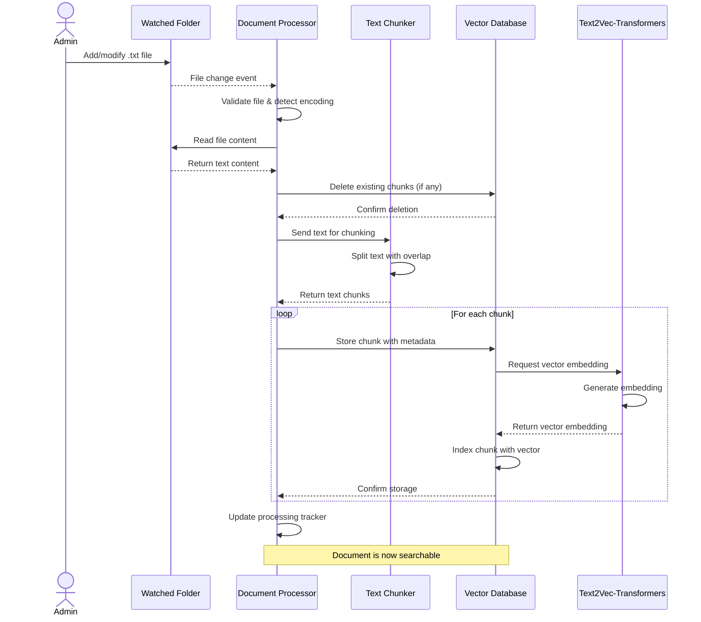
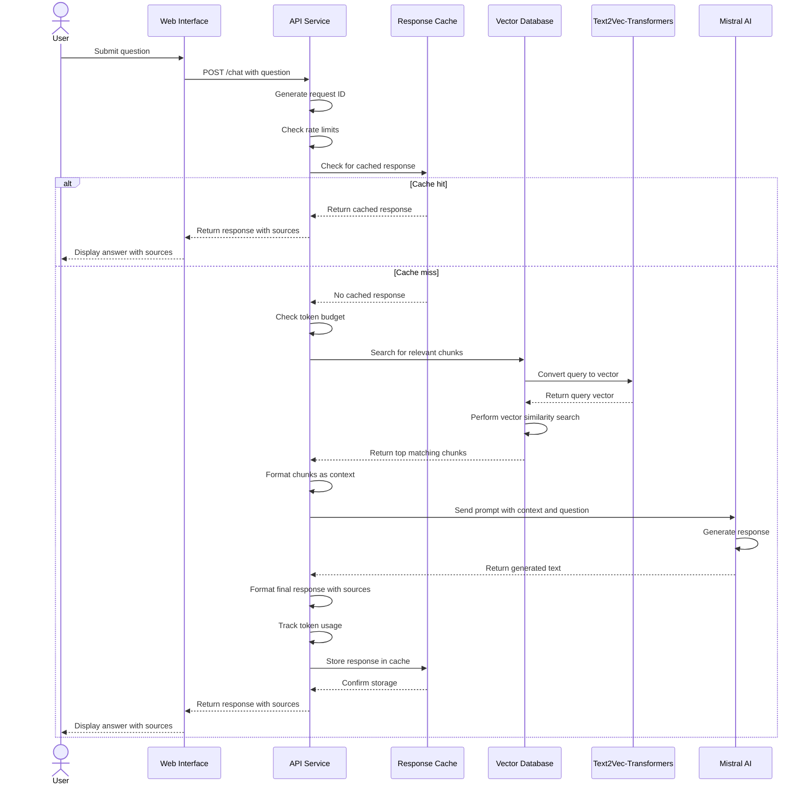

# Project Documentation

# Project Structure
```
doc_chat/
├── api/
│   ├── Dockerfile
│   ├── chat_logger.py
│   ├── main.py
│   ├── privacy_notice.html
│   ├── requirements.txt
├── docs/
│   ├── components/
│   ├── diagrams/
│   │   ├── architecture-diagram.svg
│   │   ├── document-processing-sequence.mermaid
│   │   ├── query-processing-sequence.mermaid
│   │   ├── simplified-architecture.svg
│   ├── temp/
│   │   ├── chat_with_your_data.md
│   │   ├── docker_debugging_notes.md
│   │   ├── llm-comparison.md
│   │   ├── prompt_engineering.md
│   │   ├── requirements-table.md
│   │   ├── todo.md
│   │   ├── weviate_mistral_api.md
│   ├── workflows/
│   │   ├── document-processing.md
│   │   ├── query-processing.md
│   ├── architecture.md
│   ├── deployment-guide.md
│   ├── developer-guide.md
│   ├── privacy-notice.md
│   ├── user-guide.md
├── processor/
│   ├── Dockerfile
│   ├── processor.py
│   ├── requirements.txt
├── tests/
│   ├── quickstart_locally_hosted/
│   │   ├── docker-compose.yml
│   │   ├── quickstart_check_readiness.py
│   │   ├── quickstart_create_collection.py
│   │   ├── quickstart_import.py
│   │   ├── quickstart_neartext_query.py
│   │   ├── quickstart_rag.py
│   ├── direct_weaviate_check.py
│   ├── document_storage_verification.py
├── web-production/
│   ├── html/
│   │   ├── index.html
│   │   ├── script.js
│   │   ├── style.css
│   ├── nginx/
│   │   ├── default.conf
│   │   ├── generate password
│   │   ├── mime.types
│   │   ├── nginx.conf
│   ├── Dockerfile
│   ├── entrypoint.sh
├── web-prototype/
│   ├── Dockerfile
│   ├── app.py
│   ├── requirements.txt
├── LICENSE
├── README.md
├── docker-compose.yml
├── start-production.ps1
├── start.ps1
```

# api\Dockerfile
```text
FROM python:3.9-slim

WORKDIR /app

COPY requirements.txt .
RUN pip install --no-cache-dir -r requirements.txt

COPY *.py .
COPY *.html .

CMD ["uvicorn", "main:app", "--host", "0.0.0.0", "--port", "8000"]
```


# api\chat_logger.py
```python
import os
import json
import uuid
import logging
from datetime import datetime, timedelta
from pathlib import Path
from typing import Optional, Dict, Any, List

logger = logging.getLogger(__name__)

class ChatLogger:
    """
    Privacy-compliant chat logger for research purposes.
    Implements GDPR requirements including opt-in logging, log rotation,
    anonymization, and deletion capabilities.
    
    Logs are saved to a local folder within the project.
    """
    
    def __init__(self, log_dir: str = "chat_data"):
        """
        Initialize the chat logger with privacy controls.
        
        Args:
            log_dir: Directory where logs will be stored
        """
        self.log_dir = Path(log_dir)
        self.enabled = os.getenv("ENABLE_CHAT_LOGGING", "false").lower() == "true"
        self.anonymize = os.getenv("ANONYMIZE_CHAT_LOGS", "true").lower() == "true"
        self.retention_days = int(os.getenv("LOG_RETENTION_DAYS", "30"))
        
        if self.enabled:
            self.log_dir.mkdir(exist_ok=True, parents=True)
            self.log_file = self.log_dir / f"chat_log_{datetime.now().strftime('%Y%m%d')}.jsonl"
            logger.info(f"Chat logging enabled. Logs will be saved to {self.log_file}")
            logger.info(f"Log anonymization: {self.anonymize}, Retention period: {self.retention_days} days")
            
            # Run initial rotation to clean up old logs
            self._rotate_logs()
        else:
            logger.info("Chat logging is disabled")
    
    def log_interaction(self, query: str, response: Dict[str, Any], 
                        request_id: Optional[str] = None, 
                        user_id: Optional[str] = None,
                        metadata: Optional[Dict[str, Any]] = None) -> bool:
        """
        Log a chat interaction to the log file with privacy controls.
        
        Args:
            query: The user's query
            response: The system's response
            request_id: Unique ID for the request
            user_id: Optional user identifier (will be anonymized if anonymization is enabled)
            metadata: Optional additional metadata about the interaction
            
        Returns:
            bool: Whether logging was successful
        """
        if not self.enabled:
            return False
            
        # Apply anonymization if enabled
        if self.anonymize and user_id:
            # Create a deterministic but anonymized ID
            anon_id = str(uuid.uuid5(uuid.NAMESPACE_OID, user_id))
            user_id = f"anon_{anon_id[-12:]}"
        
        # Create log entry
        log_entry = {
            "timestamp": datetime.now().isoformat(),
            "request_id": request_id or str(uuid.uuid4()),
            "user_id": user_id,  # Will be None if not provided or anonymized if enabled
            "query": query,
            "response": {
                "answer": response.get("answer"),
                "sources": self._anonymize_sources(response.get("sources", []))
            }
        }
        
        # Add metadata if provided
        if metadata:
            log_entry["metadata"] = metadata
        
        try:
            # Make sure log directory exists
            self.log_dir.mkdir(exist_ok=True, parents=True)
            
            # Write to log file
            with open(self.log_file, 'a', encoding='utf-8') as f:
                f.write(json.dumps(log_entry) + "\n")
            
            # Handle log rotation if needed
            self._rotate_logs()
            return True
        except Exception as e:
            logger.error(f"Error logging chat interaction: {str(e)}")
            return False

    def _anonymize_sources(self, sources: List[Dict[str, Any]]) -> List[Dict[str, Any]]:
        """
        Anonymize potentially sensitive information in document sources.
        """
        if not self.anonymize:
            return sources
            
        # Create a copy to avoid modifying the original
        anonymized_sources = []
        
        for source in sources:
            # Create a copy of the source
            anon_source = source.copy()
            
            # Anonymize metadata if present
            if 'metadata' in anon_source:
                metadata = anon_source['metadata']
                
                # Remove any potentially sensitive fields
                if 'creators' in metadata:
                    # Keep creator types but remove specific names
                    anon_creators = []
                    for creator in metadata['creators']:
                        anon_creator = {'creatorType': creator.get('creatorType', 'unknown')}
                        anon_creators.append(anon_creator)
                    metadata['creators'] = anon_creators
            
            anonymized_sources.append(anon_source)
            
        return anonymized_sources

    def _rotate_logs(self) -> None:
        """
        Implement log rotation by deleting logs older than the retention period.
        """
        if not self.enabled or self.retention_days <= 0:
            return
            
        try:
            # Calculate cutoff date
            cutoff_date = datetime.now() - timedelta(days=self.retention_days)
            
            # Check all log files in the directory
            for log_file in self.log_dir.glob("chat_log_*.jsonl"):
                try:
                    # Extract date from filename
                    date_str = log_file.stem.replace("chat_log_", "")
                    file_date = datetime.strptime(date_str, "%Y%m%d")
                    
                    # Delete if older than retention period
                    if file_date < cutoff_date:
                        logger.info(f"Deleting old log file: {log_file}")
                        log_file.unlink()
                except (ValueError, OSError) as e:
                    logger.warning(f"Error processing log file {log_file}: {str(e)}")
        except Exception as e:
            logger.error(f"Error during log rotation: {str(e)}")
    
    def delete_user_data(self, user_id: str) -> bool:
        """
        Delete all log entries related to a specific user ID (GDPR right to erasure).
        
        Args:
            user_id: The user ID to remove from logs
            
        Returns:
            bool: Whether the deletion was successful
        """
        if not self.enabled or not user_id:
            return False
            
        success = True
        
        try:
            # Process each log file
            for log_file in self.log_dir.glob("chat_log_*.jsonl"):
                try:
                    # Create a temporary file
                    temp_file = log_file.with_suffix(".tmp")
                    
                    # If anonymization is enabled, calculate the anonymized ID
                    target_id = user_id
                    if self.anonymize:
                        anon_id = str(uuid.uuid5(uuid.NAMESPACE_OID, user_id))
                        target_id = f"anon_{anon_id[-12:]}"
                    
                    # Filter out entries for this user
                    with open(log_file, 'r', encoding='utf-8') as input_file, \
                         open(temp_file, 'w', encoding='utf-8') as output_file:
                        for line in input_file:
                            try:
                                entry = json.loads(line.strip())
                                if entry.get("user_id") != target_id:
                                    output_file.write(line)
                            except json.JSONDecodeError:
                                # Keep lines that can't be parsed
                                output_file.write(line)
                    
                    # Replace original with filtered version
                    temp_file.replace(log_file)
                    
                except Exception as e:
                    logger.error(f"Error processing file {log_file} during user data deletion: {str(e)}")
                    success = False
            
            logger.info(f"Completed deletion of user data for user ID: {user_id}")
            return success
            
        except Exception as e:
            logger.error(f"Error during user data deletion: {str(e)}")
            return False
            
    def get_log_files(self, start_date: Optional[str] = None, 
                    end_date: Optional[str] = None) -> List[Path]:
        """
        Get list of log files, optionally filtered by date range.
        
        Args:
            start_date: Start date in YYYYMMDD format (inclusive)
            end_date: End date in YYYYMMDD format (inclusive)
            
        Returns:
            List[Path]: Paths to the log files
        """
        if not self.enabled:
            return []
            
        # Convert strings to date objects if provided
        start_date_obj = None
        end_date_obj = None
        
        if start_date:
            try:
                start_date_obj = datetime.strptime(start_date, "%Y%m%d")
            except ValueError:
                logger.error(f"Invalid start date format: {start_date}. Use YYYYMMDD.")
                return []
                
        if end_date:
            try:
                end_date_obj = datetime.strptime(end_date, "%Y%m%d")
            except ValueError:
                logger.error(f"Invalid end date format: {end_date}. Use YYYYMMDD.")
                return []
        
        matching_files = []
        
        # Find matching log files
        for log_file in self.log_dir.glob("chat_log_*.jsonl"):
            try:
                # Extract date from filename
                date_str = log_file.stem.replace("chat_log_", "")
                file_date = datetime.strptime(date_str, "%Y%m%d")
                
                # Check if file is within date range
                if (start_date_obj and file_date < start_date_obj) or \
                   (end_date_obj and file_date > end_date_obj):
                    continue
                
                matching_files.append(log_file)
                
            except ValueError as e:
                logger.warning(f"Error processing log file {log_file}: {str(e)}")
        
        return matching_files
```


# api\main.py
```python
import os
import re
import json
import time
import uuid
import logging
import hashlib
import pathlib
from datetime import datetime
from collections import deque
from functools import lru_cache
from typing import Optional
from pydantic import BaseModel, Field, field_validator

from fastapi import FastAPI, HTTPException, Header, BackgroundTasks
from fastapi.responses import HTMLResponse
from pydantic import BaseModel
import weaviate
from weaviate.config import AdditionalConfig, Timeout
from dotenv import load_dotenv
from mistralai import Mistral
from tenacity import retry, stop_after_attempt, wait_exponential
from chat_logger import ChatLogger

# Configuration
load_dotenv()
logging.basicConfig(level=logging.INFO, format='%(asctime)s - %(levelname)s - %(message)s')
logger = logging.getLogger(__name__)

# Environment variables and settings
WEAVIATE_URL = os.getenv("WEAVIATE_URL", "http://weaviate:8080")
MISTRAL_API_KEY = os.getenv("MISTRAL_API_KEY", "")
if not MISTRAL_API_KEY and os.path.exists("/run/secrets/mistral_api_key"):
    with open("/run/secrets/mistral_api_key", "r") as f:
        MISTRAL_API_KEY = f.read().strip()
MISTRAL_MODEL = os.getenv("MISTRAL_MODEL", "mistral-tiny")
DAILY_TOKEN_BUDGET = int(os.getenv("MISTRAL_DAILY_TOKEN_BUDGET", "10000"))
MAX_REQUESTS_PER_MINUTE = int(os.getenv("MISTRAL_MAX_REQUESTS_PER_MINUTE", "10"))

# Global state tracking
token_usage = {
    "count": 0,
    "reset_date": datetime.now().strftime("%Y-%m-%d")
}
request_timestamps = deque(maxlen=MAX_REQUESTS_PER_MINUTE)
response_cache = {}  # Dictionary to store cached responses

# Initialize chat logger
chat_logger = None

# Models
class Query(BaseModel):
    question: str = Field(..., min_length=3, max_length=1000)
    
    @field_validator('question')
    @classmethod
    def validate_question_content(cls, v: str) -> str:
        # 1. Check for script injection patterns
        dangerous_patterns = [
            '<script>', 'javascript:', 'onload=', 'onerror=', 'onclick=',
            'ondblclick=', 'onmouseover=', 'onmouseout=', 'onfocus=', 'onblur=',
            'oninput=', 'onchange=', 'onsubmit=', 'onreset=', 'onselect=',
            'onkeydown=', 'onkeypress=', 'onkeyup=', 'ondragenter=', 'ondragleave=',
            'data:text/html', 'vbscript:', 'expression(', 'document.cookie',
            'document.write', 'window.location', 'eval(', 'exec('
        ]
        
        for pattern in dangerous_patterns:
            if pattern.lower() in v.lower():
                raise ValueError(f'Potentially unsafe input detected: {pattern}')
        
        # 2. Check for SQL injection patterns - Fixed regex
        sql_patterns = [
            'SELECT', 'INSERT', 'UPDATE', 'DELETE', 'DROP', 'UNION',
            'FROM', 'WHERE', '1=1', 'OR 1=1', 'OR TRUE', '--'
        ]
        
        # Count SQL keywords manually to avoid regex issues
        sql_count = 0
        for pattern in sql_patterns:
            # Check for whole words only
            if re.search(r'\b' + re.escape(pattern) + r'\b', v.upper()):
                sql_count += 1
        
        # Allow a few keywords as they might be in natural language
        if sql_count >= 3:
            raise ValueError('Potential SQL injection pattern detected')
        
        # 3. Check for command injection patterns
        cmd_patterns = [
            ';', '&&', '||', '`', '$(',  # Command chaining in bash/shell
            '| ', '>>', '>', '<', 'ping ', 'wget ', 'curl ', 
            'chmod ', 'rm -', 'sudo ', '/etc/', '/bin/'
        ]
        
        for pattern in cmd_patterns:
            if pattern in v:
                raise ValueError(f'Potential command injection pattern detected: {pattern}')
        
        # 4. Check for excessive special characters (might indicate an attack)
        special_char_count = sum(1 for char in v if char in '!@#$%^&*()+={}[]|\\:;"\'<>?/~`')
        if special_char_count > len(v) * 0.3:  # If more than 30% are special characters
            raise ValueError('Too many special characters in input')
            
        # 5. Check for extremely repetitive patterns (DoS attempts)
        if re.search(r'(.)\1{20,}', v):  # Same character repeated 20+ times
            raise ValueError('Input contains excessive repetition')
            
        return v

    @field_validator('question')
    @classmethod
    def normalize_question(cls, v: str) -> str:
        # Trim excessive whitespace
        v = re.sub(r'\s+', ' ', v).strip()
        
        # Ensure the question ends with a question mark if it looks like a question
        question_starters = ['who', 'what', 'when', 'where', 'why', 'how', 'is', 'are', 'can', 'could', 'do', 'does']
        if any(v.lower().startswith(starter) for starter in question_starters) and not v.endswith('?'):
            v += '?'
            
        return v
    
# Utility functions
def check_token_budget(estimated_tokens):
    """Check if we have enough budget for this request"""
    # Reset counter if it's a new day
    today = datetime.now().strftime("%Y-%m-%d")
    if token_usage["reset_date"] != today:
        token_usage["count"] = 0
        token_usage["reset_date"] = today
        logger.info(f"Token budget reset for new day: {today}")
    
    # Check if this request would exceed our budget
    if token_usage["count"] + estimated_tokens > DAILY_TOKEN_BUDGET:
        return False
    return True

def update_token_usage(tokens_used):
    """Update the token usage tracker"""
    token_usage["count"] += tokens_used
    logger.info(f"Token usage: {token_usage['count']}/{DAILY_TOKEN_BUDGET} for {token_usage['reset_date']}")

def check_rate_limit():
    """Check if we're within rate limits"""
    now = time.time()
    
    # Clean old timestamps (older than 1 minute)
    while request_timestamps and now - request_timestamps[0] > 60:
        request_timestamps.popleft()
    
    # Check if we've hit the limit
    if len(request_timestamps) >= MAX_REQUESTS_PER_MINUTE:
        return False
    
    # Add current timestamp and allow request
    request_timestamps.append(now)
    return True

# Error handling utilities
class MistralAPIError(Exception):
    """Custom exception for Mistral API errors"""
    def __init__(self, message, error_type=None, is_transient=False):
        self.message = message
        self.error_type = error_type
        self.is_transient = is_transient
        super().__init__(self.message)

class WeaviateError(Exception):
    """Custom exception for Weaviate errors"""
    def __init__(self, message, error_type=None, is_transient=False):
        self.message = message
        self.error_type = error_type
        self.is_transient = is_transient
        super().__init__(self.message)

def handle_api_error(e, request_id=None):
    """
    Handle API errors with appropriate response and logging
    
    Args:
        e: The exception
        request_id: Request ID for logging
    
    Returns:
        Appropriate error response
    """
    log_prefix = f"[{request_id}] " if request_id else ""
    
    if isinstance(e, MistralAPIError):
        error_type = e.error_type or "mistral_api_error"
        logger.error(f"{log_prefix}Mistral API error: {str(e)}")
        return {
            "answer": f"I encountered an issue while generating a response: {str(e)}",
            "sources": [],
            "error": error_type
        }
    elif isinstance(e, WeaviateError):
        error_type = e.error_type or "weaviate_error" 
        logger.error(f"{log_prefix}Weaviate error: {str(e)}")
        return {
            "answer": "I encountered an issue while searching the knowledge base.",
            "sources": [],
            "error": error_type
        }
    else:
        logger.error(f"{log_prefix}Unexpected error: {str(e)}")
        import traceback
        logger.error(traceback.format_exc())
        return {
            "answer": "I encountered an unexpected error. Please try again later.",
            "sources": [],
            "error": "unexpected_error"
        }
def get_cached_response(query_hash, model):
    """
    Get a response from cache if it exists
    
    Args:
        query_hash: Hash of the query and context
        model: Model name used for generation
    
    Returns:
        Cached response or None if not found
    """
    cache_key = f"{query_hash}_{model}"
    cached_item = response_cache.get(cache_key)
    
    # If we have a cached item and it's not expired
    if cached_item:
        # Check if the cache is still valid (cached for less than 1 hour)
        cache_time = cached_item.get("timestamp", 0)
        if time.time() - cache_time < 3600:  # 1 hour cache validity
            logger.info(f"Cache hit for key: {cache_key[:10]}...")
            return cached_item.get("response")
        else:
            # Cache expired
            logger.info(f"Cache expired for key: {cache_key[:10]}...")
            del response_cache[cache_key]
    
    return None

def set_cached_response(query_hash, model, response):
    """
    Store a response in the cache
    
    Args:
        query_hash: Hash of the query and context
        model: Model name used for generation
        response: The response to cache
    """
    cache_key = f"{query_hash}_{model}"
    
    # Store the response with a timestamp
    response_cache[cache_key] = {
        "response": response,
        "timestamp": time.time()
    }
    
    # Limit cache size to 100 entries
    if len(response_cache) > 100:
        # Remove oldest entry (simple approach)
        oldest_key = None
        oldest_time = float('inf')
        
        for key, data in response_cache.items():
            if data["timestamp"] < oldest_time:
                oldest_time = data["timestamp"]
                oldest_key = key
        
        if oldest_key:
            del response_cache[oldest_key]
            logger.info(f"Removed oldest cache entry: {oldest_key[:10]}...")

@retry(stop=stop_after_attempt(3), wait=wait_exponential(multiplier=1, min=2, max=10))
def call_mistral_with_retry(client, model, messages, temperature):
    """Call Mistral API with retry logic for transient errors"""
    try:
        return client.chat.complete(
            model=model,
            messages=messages,
            temperature=temperature,
        )
    except Exception as e:
        error_message = str(e).lower()
        is_transient = any(term in error_message for term in [
            "rate limit", "timeout", "connection", "too many requests", 
            "server error", "503", "502", "504"
        ])
        
        if is_transient:
            logger.warning(f"Temporary error calling Mistral API: {str(e)}. Retrying...")
            raise  # Will trigger retry
        else:
            error_type = "authentication" if "auth" in error_message else "model_error"
            raise MistralAPIError(f"Error calling Mistral API: {str(e)}", 
                                 error_type=error_type, 
                                 is_transient=False)

# Initialize clients
# Weaviate client initialization
client = None
try:
    # Parse the URL to get components
    use_https = WEAVIATE_URL.startswith("https://")
    host_part = WEAVIATE_URL.replace("http://", "").replace("https://", "")
    
    # Handle port if specified
    if ":" in host_part:
        host, port = host_part.split(":")
        port = int(port)
    else:
        host = host_part
        port = 443 if use_https else 80
    
    # Connect to Weaviate using the same method as the processor
    client = weaviate.connect_to_custom(
        http_host=host,
        http_port=port,
        http_secure=use_https,
        grpc_host=host,
        grpc_port=50051,  # Default gRPC port
        grpc_secure=use_https,
        additional_config=AdditionalConfig(
            timeout=Timeout(init=60, query=30, insert=30)
        )
    )
    logger.info(f"Connected to Weaviate at {WEAVIATE_URL}")
except Exception as e:
    logger.error(f"Failed to connect to Weaviate: {str(e)}")

# Mistral client initialization
mistral_client = None
if MISTRAL_API_KEY:
    try:
        mistral_client = Mistral(api_key=MISTRAL_API_KEY)
        logger.info("Mistral client initialized, using model: " + MISTRAL_MODEL)
    except Exception as e:
        logger.error(f"Failed to initialize Mistral client: {str(e)}")

# FastAPI app with lifespan
from contextlib import asynccontextmanager

@asynccontextmanager
async def lifespan(app: FastAPI):
    """Handle startup and shutdown events"""
    # Startup validation
    logger.info("Performing startup validation...")

    # Initialize the chat logger
    global chat_logger
    log_dir = os.getenv("CHAT_LOG_DIR", "chat_data")
    chat_logger = ChatLogger(log_dir=log_dir)
    logger.info(f"Chat logger initialized in {log_dir}")
    
    # Validate Weaviate connection
    if not client:
        logger.error("CRITICAL: Weaviate client is not initialized")
    elif not client.is_ready():
        logger.error("CRITICAL: Weaviate is not ready")
    else:
        # Check if DocumentChunk collection exists
        try:
            if client.collections.exists("DocumentChunk"):
                collection = client.collections.get("DocumentChunk")
                logger.info(f"Weaviate: DocumentChunk collection exists")
                
                # Check if there's any data
                try:
                    # Get count using aggregate API
                    count = collection.aggregate.over_all().total_count
                    logger.info(f"Weaviate: DocumentChunk contains {count} objects")
                except Exception as e:
                    logger.warning(f"Could not get document count: {str(e)}")
            else:
                logger.warning("Weaviate: DocumentChunk collection does not exist - system may not find any documents")
        except Exception as e:
            logger.error(f"Error checking DocumentChunk collection: {str(e)}")
    
    # Validate Mistral API connection
    if not mistral_client:
        logger.error("CRITICAL: Mistral API client is not initialized")
    else:
        # Try a simple test query to validate API key and connectivity
        try:
            test_response = mistral_client.chat.complete(
                model=MISTRAL_MODEL,
                messages=[{"role": "user", "content": "Hello"}],
                max_tokens=5
            )
            logger.info(f"Mistral API: Connection successful, using model {MISTRAL_MODEL}")
        except Exception as e:
            logger.error(f"CRITICAL: Mistral API test failed: {str(e)}")
    
    # Log configuration
    logger.info(f"Configuration: DAILY_TOKEN_BUDGET={DAILY_TOKEN_BUDGET}, MAX_REQUESTS_PER_MINUTE={MAX_REQUESTS_PER_MINUTE}")
    logger.info("Startup validation complete")
    
    yield  # Here the app runs
    
    # Shutdown logic
    logger.info("Shutting down application...")
    # Close any open connections, etc.

# Create FastAPI app with lifespan
app = FastAPI(title="EU-Compliant RAG API", lifespan=lifespan)

# Basic endpoints
@app.get("/")
async def root():
    return {"message": "EU-Compliant RAG API is running"}

@app.get("/status")
async def status():
    """Check the status of the API and its connections."""
    weaviate_status = "connected" if client and client.is_ready() else "disconnected"
    
    return {
        "api": "running",
        "weaviate": weaviate_status,
        "mistral_api": "configured" if mistral_client else "not configured"
    }

# Document search endpoints
@app.post("/search")
async def search_documents(query: Query):
    """Search for relevant document chunks without LLM generation."""
    if not client:
        raise HTTPException(status_code=503, detail="Weaviate connection not available")
    
    try:
        # Search Weaviate for relevant chunks
        collection = client.collections.get("DocumentChunk")
        
        search_result = collection.query.near_text(
            query=query.question,
            limit=5,
            return_properties=["content", "filename", "chunkId", "metadataJson"]
        )
        
        # Format results
        results = []
        for obj in search_result.objects:
            results.append(obj.properties)
        
        return {
            "query": query.question,
            "results": results
        }
        
    except Exception as e:
        logger.error(f"Error in search: {str(e)}")
        raise HTTPException(status_code=500, detail=f"Internal server error: {str(e)}")

@app.get("/documents/count")
async def count_documents():
    """Count the number of unique documents indexed in the system."""
    if not client:
        raise HTTPException(status_code=503, detail="Weaviate connection not available")
    
    try:
        # Get the collection
        collection = client.collections.get("DocumentChunk")
        
        # Get all unique filenames
        query_result = collection.query.fetch_objects(
            return_properties=["filename"],
            limit=10000  # Use a reasonably high limit
        )
        
        # Count unique filenames
        unique_filenames = set()
        for obj in query_result.objects:
            unique_filenames.add(obj.properties["filename"])
        
        return {
            "count": len(unique_filenames),
            "documents": list(unique_filenames)
        }
        
    except Exception as e:
        logger.error(f"Error counting documents: {str(e)}")
        raise HTTPException(status_code=500, detail=f"Internal server error: {str(e)}")

@app.get("/statistics")
async def get_document_statistics():
    """
    Get comprehensive statistics about documents in the system.
    Returns counts, document metadata, and processing information.
    """
    if not client:
        raise HTTPException(status_code=503, detail="Weaviate connection not available")
    
    try:
        # Get the DocumentChunk collection
        collection = client.collections.get("DocumentChunk")
        
        # 1. Get all objects to gather statistics
        # Limited to 10,000 for practicality - adjust if needed
        query_result = collection.query.fetch_objects(
            return_properties=["filename", "chunkId", "content"],
            limit=10000
        )
        
        if not query_result.objects:
            return {
                "document_count": 0,
                "chunk_count": 0,
                "message": "No documents found in the system"
            }
        
        # 2. Calculate basic statistics
        document_chunks = {}
        total_content_length = 0
        
        for obj in query_result.objects:
            filename = obj.properties["filename"]
            chunk_id = obj.properties["chunkId"]
            content = obj.properties["content"]
            
            # Track chunks per document
            if filename not in document_chunks:
                document_chunks[filename] = []
            document_chunks[filename].append(chunk_id)
            
            # Track total content length
            total_content_length += len(content)
        
        # 3. Prepare document details
        documents = []
        for filename, chunks in document_chunks.items():
            documents.append({
                "filename": filename,
                "chunk_count": len(chunks),
                "first_chunk": min(chunks),
                "last_chunk": max(chunks)
            })
        
        # Sort documents by filename
        documents.sort(key=lambda x: x["filename"])
        
        # 4. Calculate summary statistics
        document_count = len(document_chunks)
        chunk_count = len(query_result.objects)
        avg_chunks_per_doc = chunk_count / max(document_count, 1)
        avg_chunk_length = total_content_length / max(chunk_count, 1)
        
        # 5. Compile and return the statistics
        return {
            "summary": {
                "document_count": document_count,
                "chunk_count": chunk_count,
                "avg_chunks_per_document": round(avg_chunks_per_doc, 2),
                "avg_chunk_length": round(avg_chunk_length, 2),
                "total_content_length": total_content_length,
            },
            "documents": documents
        }
        
    except Exception as e:
        logger.error(f"Error retrieving document statistics: {str(e)}")
        import traceback
        logger.error(traceback.format_exc())
        raise HTTPException(status_code=500, detail=f"Internal server error: {str(e)}")  

# Chat endpoint
@app.post("/chat")
async def chat(
    query: Query, 
    background_tasks: BackgroundTasks,
    user_id: Optional[str] = Header(None)
):
    """RAG-based chat endpoint that queries documents and generates a response."""
    request_id = str(uuid.uuid4())[:8]  # Generate a short request ID for tracing
    
    logger.info(f"[{request_id}] Chat request received: {query.question[:50] + '...' if len(query.question) > 50 else query.question}")

    # Check rate limit first
    if not check_rate_limit():
        return {
            "answer": "The system is currently processing too many requests. Please try again in a minute.",
            "sources": [],
            "error": "rate_limited"
        }    

    if not client:
        logger.error(f"[{request_id}] Weaviate connection not available")
        raise HTTPException(status_code=503, detail="Weaviate connection not available")
    
    if not mistral_client:
        logger.error(f"[{request_id}] Mistral API client not configured")
        raise HTTPException(status_code=503, detail="Mistral API client not configured")
    
    try:
        # Get the collection
        collection = client.collections.get("DocumentChunk")
        
        # Search Weaviate for relevant chunks using v4 API
        search_result = collection.query.near_text(
            query=query.question,
            limit=3,
            return_properties=["content", "filename", "chunkId", "metadataJson"]
        )
        
        # Check if we got any results
        if len(search_result.objects) == 0:
            return {
                "answer": "I couldn't find any relevant information to answer your question.",
                "sources": []
            }
        
        # Log search results
        logger.info(f"[{request_id}] Retrieved {len(search_result.objects)} relevant chunks")        
        
        # Format context from chunks
        context = "\n\n".join([obj.properties["content"] for obj in search_result.objects])
        logger.info(f"[{request_id}] Context size: {len(context)} characters")

        # Create a hash of the query and context to use as cache key
        query_text = query.question.strip().lower()
        context_hash = hashlib.md5(context.encode()).hexdigest()
        cache_key = f"{query_text}_{context_hash}"
        
        # Check cache first
        cached_result = get_cached_response(cache_key, MISTRAL_MODEL)
        if cached_result:
            logger.info(f"[{request_id}] Cache hit! Returning cached response")
            return cached_result

        # Estimate tokens (very roughly - ~4 chars per token)
        estimated_prompt_tokens = (len(query.question) + len(context)) // 4
        estimated_response_tokens = 500  # Conservative estimate
        total_estimated_tokens = estimated_prompt_tokens + estimated_response_tokens
        
        # Check if we have budget
        if not check_token_budget(total_estimated_tokens):
            return {
                "answer": "I'm sorry, the daily query limit has been reached to control costs. Please try again tomorrow.",
                "sources": [],
                "error": "budget_exceeded"
            }
        
        # Log generation attempt
        logger.info(f"[{request_id}] Sending request to Mistral API using model: {MISTRAL_MODEL}")
        
        start_time = time.time()        

        # Format sources for citation
        sources = []
        for obj in search_result.objects:
            source = {
                "filename": obj.properties["filename"], 
                "chunkId": obj.properties["chunkId"]
            }
            
            # Parse metadata JSON if it exists
            if "metadataJson" in obj.properties and obj.properties["metadataJson"]:
                try:
                    metadata = json.loads(obj.properties["metadataJson"])
                    source["metadata"] = metadata
                except json.JSONDecodeError:
                    logger.warning(f"Failed to parse metadata JSON for {obj.properties['filename']}")
            
            sources.append(source)
        
        # Use Mistral client to generate response
        messages = [
            {"role": "system", "content": "You are a helpful assistant that answers questions based on the provided document context. Stick to the information in the context. If you don't know the answer, say so."},
            {"role": "user", "content": f"Context:\n{context}\n\nQuestion: {query.question}"}
        ]
        
        chat_response = call_mistral_with_retry(
            client=mistral_client,
            model=MISTRAL_MODEL,
            messages=messages,
            temperature=0.7,
        )
        
        answer = chat_response.choices[0].message.content

        generation_time = time.time() - start_time
        
        # Log success and timing
        logger.info(f"[{request_id}] Mistral response received in {generation_time:.2f}s")
        logger.info(f"[{request_id}] Answer length: {len(answer)} characters")     

        # Track actual usage (if available in Mistral response)
        tokens_used = 0
        if hasattr(chat_response, 'usage') and chat_response.usage:
            tokens_used = chat_response.usage.total_tokens
        else:
            # Fall back to estimation
            tokens_used = total_estimated_tokens
        
        update_token_usage(tokens_used)           

        # Cache the result before returning
        result = {"answer": answer, "sources": sources}
        set_cached_response(cache_key, MISTRAL_MODEL, result)

        # Log the interaction in the background, using background_tasks to avoid delaying the response
        if chat_logger and chat_logger.enabled:
            metadata = {
                "timestamp": datetime.now().isoformat(),
                "request_id": request_id
            }
            
            background_tasks.add_task(
                chat_logger.log_interaction,
                query=query.question,
                response=result,
                request_id=request_id,
                user_id=user_id,
                metadata=metadata
            )
            
        return result
            
    except Exception as e:
        return handle_api_error(e, request_id)
    
@app.get("/privacy", response_class=HTMLResponse)
async def privacy_notice():
    """Serve the privacy notice."""
    try:
        privacy_path = pathlib.Path("privacy_notice.html")
        if privacy_path.exists():
            return privacy_path.read_text(encoding="utf-8")
        else:
            logger.warning("privacy_notice.html not found, serving fallback notice")
            return """
            <!DOCTYPE html>
            <html>
                <head>
                    <title>Privacy Notice</title>
                    <style>
                        body { font-family: Arial, sans-serif; max-width: 800px; margin: 0 auto; padding: 20px; }
                    </style>
                </head>
                <body>
                    <h1>Chat Logging Privacy Notice</h1>
                    <p>When enabled, this system logs interactions for research purposes.</p>
                    <p>All data is processed in accordance with GDPR. Logs are automatically deleted after 30 days.</p>
                    <p>Please contact the system administrator for more information or to request deletion of your data.</p>
                </body>
            </html>
            """
    except Exception as e:
        logger.error(f"Error serving privacy notice: {str(e)}")
        return "<h1>Privacy Notice</h1><p>Error loading privacy notice.</p>"        
    

# Main entry point
if __name__ == "__main__":
    import uvicorn
    uvicorn.run(app, host="0.0.0.0", port=8000)
```


# api\privacy_notice.html
```text
<!DOCTYPE html>
<html lang="en">
<head>
    <meta charset="UTF-8">
    <meta name="viewport" content="width=device-width, initial-scale=1.0">
    <title>Chat Logging Privacy Notice</title>
    <style>
        body {
            font-family: Arial, sans-serif;
            line-height: 1.6;
            max-width: 800px;
            margin: 0 auto;
            padding: 20px;
            color: #333;
        }
        h1 {
            color: #2c3e50;
            border-bottom: 2px solid #3498db;
            padding-bottom: 10px;
        }
        h2 {
            color: #3498db;
            margin-top: 30px;
            border-left: 4px solid #3498db;
            padding-left: 10px;
        }
        ul {
            margin-bottom: 20px;
        }
        .footer {
            margin-top: 40px;
            padding-top: 20px;
            border-top: 1px solid #eee;
            font-size: 0.9em;
            color: #777;
        }
        .highlight {
            background-color: #f8f9fa;
            border-left: 4px solid #4caf50;
            padding: 10px 15px;
            margin: 20px 0;
        }
        @media print {
            body {
                color: #000;
                font-size: 12pt;
            }
            h1, h2 {
                color: #000;
            }
        }
    </style>
</head>
<body>
    <h1>Chat Logging Privacy Notice</h1>
    
    <div class="highlight">
        <p><strong>Summary:</strong> When enabled, this system logs anonymized chat interactions for research purposes. Logs are automatically deleted after 30 days, and you can request earlier deletion of your data at any time.</p>
    </div>
    
    <h2>Introduction</h2>
    <p>The Document Chat System may collect and process interaction data for research and service improvement purposes. This privacy notice explains how we handle this data in compliance with GDPR and other applicable privacy regulations.</p>
    
    <h2>Data Collection</h2>
    <p>When enabled, the system logs the following information:</p>
    <ul>
        <li><strong>Date and time</strong> of interactions</li>
        <li><strong>Questions asked</strong> to the system</li>
        <li><strong>Responses provided</strong> by the system</li>
        <li><strong>Document references</strong> used to generate answers</li>
        <li><strong>Anonymized session identifiers</strong> to link related interactions</li>
        <li><strong>System performance metrics</strong></li>
    </ul>
    
    <h2>Legal Basis for Processing</h2>
    <p>We process this data based on:</p>
    <ul>
        <li>Our legitimate interest in improving the system's accuracy and performance</li>
        <li>Your consent, which you may withdraw at any time</li>
        <li>Research purposes (statistical and scientific analysis)</li>
    </ul>
    
    <h2>How We Use This Data</h2>
    <p>The collected data is used to:</p>
    <ul>
        <li>Analyze common question patterns</li>
        <li>Improve answer accuracy and relevance</li>
        <li>Identify missing information in our document collection</li>
        <li>Fix technical issues and optimize system performance</li>
        <li>Conduct research on information retrieval and question-answering systems</li>
    </ul>
    
    <h2>Data Retention</h2>
    <ul>
        <li>Chat logs are retained for a maximum of 30 days by default</li>
        <li>After this period, logs are automatically deleted</li>
        <li>You may request earlier deletion of your data at any time</li>
    </ul>
    
    <h2>Data Security and Access</h2>
    <ul>
        <li>All logs are stored securely with access restricted to authorized administrators</li>
        <li>Logs are stored locally on the system's secured servers</li>
        <li>We implement appropriate technical and organizational measures to protect your data</li>
    </ul>
    
    <h2>Anonymization</h2>
    <p>By default, when logging is enabled:</p>
    <ul>
        <li>User identifiers are anonymized through cryptographic hashing</li>
        <li>IP addresses are not stored or are anonymized</li>
        <li>Personal information in queries may still be recorded; avoid including sensitive data in your questions</li>
    </ul>
    
    <div class="highlight">
        <p><strong>Important:</strong> The system may record the content of your questions. Please do not include personal data, sensitive information, or confidential details in your queries.</p>
    </div>
    
    <h2>Your Rights</h2>
    <p>Under GDPR and similar regulations, you have the right to:</p>
    <ul>
        <li><strong>Access</strong> the data we hold about you</li>
        <li>Request <strong>correction</strong> of inaccurate data</li>
        <li>Request <strong>deletion</strong> of your data</li>
        <li><strong>Object to</strong> or <strong>restrict</strong> the processing of your data</li>
        <li><strong>Withdraw consent</strong> for data collection at any time</li>
    </ul>
    
    <h2>How to Exercise Your Rights</h2>
    <p>To exercise any of these rights, please contact the system administrator. We will respond to your request within 30 days.</p>
    
    <h2>Changes to This Privacy Notice</h2>
    <p>We may update this privacy notice from time to time. Any changes will be posted with a revised effective date.</p>
    
    <div class="footer">
        <p>Effective Date: March 9, 2025</p>
        <p>Document version: 1.0</p>
    </div>
</body>
</html>
```


# api\requirements.txt
```cmake
fastapi==0.115.11
uvicorn==0.34.0
python-dotenv==1.0.1
weaviate-client==4.11.1
mistralai==1.5.0
tenacity==8.0.1
```


# docs\diagrams\architecture-diagram.svg
```text
<svg xmlns="http://www.w3.org/2000/svg" viewBox="0 0 800 650">
  <!-- Background -->
  <rect width="800" height="600" fill="#f8f9fa" rx="0" ry="0"/>
  
  <!-- Host Machine Container -->
  <rect x="50" y="80" width="700" height="480" fill="#e9ecef" rx="10" ry="10" stroke="#6c757d" stroke-width="2" stroke-dasharray="5,5"/>
  <text x="120" y="100" font-family="Arial" font-size="16" font-weight="bold">Host Machine</text>
  
  <!-- Watched Folder -->
  <rect x="100" y="130" width="180" height="100" fill="#ffd166" rx="5" ry="5" stroke="#e09f3e" stroke-width="2"/>
  <text x="190" y="170" font-family="Arial" font-size="16" font-weight="bold" text-anchor="middle">Watched Folder</text>
  <text x="190" y="190" font-family="Arial" font-size="12" text-anchor="middle">/data</text>
  <text x="190" y="210" font-family="Arial" font-size="12" text-anchor="middle">Text Files (.txt)</text>
  
  <!-- Document Processor Service -->
  <rect x="400" y="130" width="200" height="100" fill="#118ab2" rx="5" ry="5"/>
  <text x="500" y="170" font-family="Arial" font-size="16" font-weight="bold" text-anchor="middle" fill="white">Document Processor</text>
  <text x="500" y="190" font-family="Arial" font-size="12" text-anchor="middle" fill="white">Watches folder with Watchdog</text>
  <text x="500" y="210" font-family="Arial" font-size="12" text-anchor="middle" fill="white">Chunks text + indexes</text>

  <!-- Docker Environment Container -->
  <rect x="70" y="250" width="660" height="290" fill="#dee2e6" rx="10" ry="10" stroke="#6c757d" stroke-width="2"/>
  <text x="215" y="270" font-family="Arial" font-size="16" font-weight="bold">Docker Environment</text>

  <!-- Weaviate Vector DB -->
  <rect x="100" y="300" width="180" height="100" fill="#adb5bd" rx="5" ry="5"/>
  <text x="190" y="350" font-family="Arial" font-size="16" font-weight="bold" text-anchor="middle" fill="white">Weaviate</text>
  <text x="190" y="370" font-family="Arial" font-size="12" text-anchor="middle" fill="white">Vector Database (Dutch)</text>
  <text x="190" y="390" font-family="Arial" font-size="12" text-anchor="middle" fill="white">Port 8080</text>
  
  <!-- Text2vec Embeddings -->
  <rect x="100" y="420" width="180" height="80" fill="#adb5bd" rx="5" ry="5"/>
  <text x="190" y="455" font-family="Arial" font-size="14" font-weight="bold" text-anchor="middle" fill="white">Text2Vec-Transformers</text>
  <text x="190" y="475" font-family="Arial" font-size="12" text-anchor="middle" fill="white">Embedding Model</text>
  
  <!-- API Service -->
  <rect x="320" y="300" width="180" height="100" fill="#6c757d" rx="5" ry="5"/>
  <text x="410" y="350" font-family="Arial" font-size="16" font-weight="bold" text-anchor="middle" fill="white">FastAPI Service</text>
  <text x="410" y="370" font-family="Arial" font-size="12" text-anchor="middle" fill="white">RAG Implementation</text>
  <text x="410" y="390" font-family="Arial" font-size="12" text-anchor="middle" fill="white">Port 8000</text>
  
  <!-- Web Interface - Split into Prototype and Production -->
  <rect x="320" y="420" width="85" height="100" fill="#6c757d" rx="5" ry="5"/>
  <text x="362" y="455" font-family="Arial" font-size="12" font-weight="bold" text-anchor="middle" fill="white">Prototype</text>
  <text x="362" y="470" font-family="Arial" font-size="12" text-anchor="middle" fill="white">Streamlit</text>
  <text x="362" y="485" font-family="Arial" font-size="12" text-anchor="middle" fill="white">Port 8501</text>
  
  <rect x="415" y="420" width="85" height="100" fill="#6c757d" rx="5" ry="5"/>
  <text x="457" y="455" font-family="Arial" font-size="12" font-weight="bold" text-anchor="middle" fill="white">Production</text>
  <text x="457" y="470" font-family="Arial" font-size="12" text-anchor="middle" fill="white">Nginx</text>
  <text x="457" y="485" font-family="Arial" font-size="12" text-anchor="middle" fill="white">Port 80</text>
  
  <!-- Mistral AI (replaced Ollama) -->
  <rect x="540" y="300" width="160" height="220" fill="#073b4c" rx="5" ry="5"/>
  <text x="620" y="350" font-family="Arial" font-size="16" font-weight="bold" text-anchor="middle" fill="white">Mistral AI</text>
  <text x="620" y="370" font-family="Arial" font-size="12" text-anchor="middle" fill="white">EU-based LLM Provider</text>
  <text x="620" y="390" font-family="Arial" font-size="12" text-anchor="middle" fill="white">(French)</text>
  <text x="620" y="410" font-family="Arial" font-size="12" text-anchor="middle" fill="white">GDPR Compliant</text>
  
  <!-- Deployment label -->
  <rect x="540" y="520" width="160" height="30" fill="#20c997" rx="5" ry="5"/>
  <text x="620" y="540" font-family="Arial" font-size="12" font-weight="bold" text-anchor="middle">Production: Hetzner (German)</text>
  
  <!-- Connections -->
  <!-- Folder to Processor -->
  <line x1="280" y1="180" x2="400" y2="180" stroke="#212529" stroke-width="2"/>
  <polygon points="395,175 405,180 395,185" fill="#212529"/>
  
  <!-- Processor to Weaviate -->
  <line x1="500" y1="230" x2="190" y2="300" stroke="#212529" stroke-width="2"/>
  <polygon points="192,294 185,304 197,299" fill="#212529"/>
  
  <!-- Weaviate to API -->
  <line x1="280" y1="350" x2="320" y2="350" stroke="#212529" stroke-width="2"/>
  <polygon points="315,345 325,350 315,355" fill="#212529"/>
  
  <!-- API to Web Prototype -->
  <line x1="410" y1="400" x2="362" y2="420" stroke="#212529" stroke-width="2"/>
  <polygon points="359,415 365,425 368,415" fill="#212529"/>
  
  <!-- API to Web Production -->
  <line x1="410" y1="400" x2="457" y2="420" stroke="#212529" stroke-width="2"/>
  <polygon points="454,415 460,425 463,415" fill="#212529"/>
  
  <!-- API to Mistral -->
  <line x1="500" y1="350" x2="540" y2="350" stroke="#212529" stroke-width="2"/>
  <polygon points="535,345 545,350 535,355" fill="#212529"/>
  
  <!-- Text2Vec to Weaviate -->
  <line x1="190" y1="420" x2="190" y2="400" stroke="#212529" stroke-width="2"/>
  <polygon points="185,405 190,395 195,405" fill="#212529"/>
  
  <!-- Admin -->
  <circle cx="40" cy="180" r="20" fill="#6c757d"/>
  <line x1="40" y1="200" x2="40" y2="230" stroke="#6c757d" stroke-width="2"/>
  <line x1="20" y1="210" x2="60" y2="210" stroke="#6c757d" stroke-width="2"/>
  <line x1="20" y1="250" x2="40" y2="230" stroke="#6c757d" stroke-width="2"/>
  <line x1="60" y1="250" x2="40" y2="230" stroke="#6c757d" stroke-width="2"/>
  
  <text x="40" y="280" font-family="Arial" font-size="14" text-anchor="middle">Admin</text>
  
  <!-- Admin to Folder arrow -->
  <line x1="60" y1="180" x2="100" y2="180" stroke="#212529" stroke-width="2"/>
  <polygon points="95,175 105,180 95,185" fill="#212529"/>
  
  <!-- End Users -->
  <circle cx="410" cy="570" r="20" fill="#6c757d"/>
  <line x1="410" y1="590" x2="410" y2="610" stroke="#6c757d" stroke-width="2"/>
  <line x1="390" y1="600" x2="430" y2="600" stroke="#6c757d" stroke-width="2"/>
  <line x1="390" y1="630" x2="410" y2="610" stroke="#6c757d" stroke-width="2"/>
  <line x1="430" y1="630" x2="410" y2="610" stroke="#6c757d" stroke-width="2"/>
  
  <text x="410" y="650" font-family="Arial" font-size="14" text-anchor="middle">End Users</text>
  
  <!-- End Users to Web Interfaces -->
  <line x1="390" y1="570" x2="362" y2="520" stroke="#212529" stroke-width="2"/>
  <polygon points="359,525 365,515 367,525" fill="#212529"/>
  
  <line x1="430" y1="570" x2="457" y2="520" stroke="#212529" stroke-width="2"/>
  <polygon points="454,525 460,515 463,525" fill="#212529"/>
  
  <!-- Legend -->
  <rect x="630" y="90" width="100" height="120" fill="white" rx="5" ry="5" stroke="#6c757d" stroke-width="1"/>
  <text x="680" y="110" font-family="Arial" font-size="12" font-weight="bold" text-anchor="middle">Legend</text>
  
  <rect x="640" y="120" width="15" height="15" fill="#ffd166"/>
  <text x="680" y="132" font-family="Arial" font-size="10">Data Source</text>
  
  <rect x="640" y="145" width="15" height="15" fill="#118ab2"/>
  <text x="680" y="157" font-family="Arial" font-size="10">Processor</text>
  
  <rect x="640" y="170" width="15" height="15" fill="#adb5bd"/>
  <text x="680" y="182" font-family="Arial" font-size="10">Storage</text>
  
  <rect x="640" y="195" width="15" height="15" fill="#073b4c"/>
  <text x="680" y="207" font-family="Arial" font-size="10">AI Service</text>
  
  <!-- Key Features Box -->
  <rect x="600" y="220" width="140" height="70" fill="white" rx="5" ry="5" stroke="#6c757d" stroke-width="1"/>
  <text x="670" y="235" font-family="Arial" font-size="10" font-weight="bold" text-anchor="middle">Key Features</text>
  <text x="670" y="250" font-family="Arial" font-size="9" text-anchor="middle">• EU Data Sovereignty</text>
  <text x="670" y="265" font-family="Arial" font-size="9" text-anchor="middle">• GDPR Compliance</text>
  <text x="670" y="280" font-family="Arial" font-size="9" text-anchor="middle">• Folder-based ingest</text>
</svg>

```


# docs\diagrams\document-processing-sequence.mermaid
```text
sequenceDiagram
    actor Admin
    participant Folder as Watched Folder
    participant Processor as Document Processor
    participant Chunker as Text Chunker
    participant Weaviate as Vector Database
    participant Embedder as Text2Vec-Transformers
    
    Admin->>Folder: Add/modify .txt file
    Folder-->>Processor: File change event
    
    Processor->>Processor: Validate file & detect encoding
    
    Processor->>Folder: Read file content
    Folder-->>Processor: Return text content
    
    Processor->>Weaviate: Delete existing chunks (if any)
    Weaviate-->>Processor: Confirm deletion
    
    Processor->>Chunker: Send text for chunking
    Chunker->>Chunker: Split text with overlap
    Chunker-->>Processor: Return text chunks
    
    loop For each chunk
        Processor->>Weaviate: Store chunk with metadata
        Weaviate->>Embedder: Request vector embedding
        Embedder->>Embedder: Generate embedding
        Embedder-->>Weaviate: Return vector embedding
        Weaviate->>Weaviate: Index chunk with vector
        Weaviate-->>Processor: Confirm storage
    end
    
    Processor->>Processor: Update processing tracker
    
    Note over Processor,Weaviate: Document is now searchable

```


# docs\diagrams\query-processing-sequence.mermaid
```text
sequenceDiagram
    actor User
    participant WebUI as Web Interface
    participant API as API Service
    participant Cache as Response Cache
    participant Weaviate as Vector Database
    participant Embedder as Text2Vec-Transformers
    participant Mistral as Mistral AI

    User->>WebUI: Submit question
    WebUI->>API: POST /chat with question
    
    API->>API: Generate request ID
    API->>API: Check rate limits
    
    API->>Cache: Check for cached response
    alt Cache hit
        Cache-->>API: Return cached response
        API-->>WebUI: Return response with sources
        WebUI-->>User: Display answer with sources
    else Cache miss
        Cache-->>API: No cached response
        
        API->>API: Check token budget
        
        API->>Weaviate: Search for relevant chunks
        Weaviate->>Embedder: Convert query to vector
        Embedder-->>Weaviate: Return query vector
        Weaviate->>Weaviate: Perform vector similarity search
        Weaviate-->>API: Return top matching chunks
        
        API->>API: Format chunks as context
        
        API->>Mistral: Send prompt with context and question
        Mistral->>Mistral: Generate response
        Mistral-->>API: Return generated text
        
        API->>API: Format final response with sources
        API->>API: Track token usage
        
        API->>Cache: Store response in cache
        Cache-->>API: Confirm storage
        
        API-->>WebUI: Return response with sources
        WebUI-->>User: Display answer with sources
    end

```


# docs\diagrams\simplified-architecture.svg
```text
<svg xmlns="http://www.w3.org/2000/svg" viewBox="0 0 800 600">
  <!-- Background -->
  <rect width="800" height="600" fill="#f8f9fa" rx="10" ry="10"/>
  
  <!-- Title -->
  <text x="400" y="40" font-family="Arial" font-size="24" font-weight="bold" text-anchor="middle">Simplified RAG System with Folder-Based Document Ingestion</text>
  
  <!-- Host Machine Container -->
  <rect x="50" y="80" width="700" height="480" fill="#e9ecef" rx="10" ry="10" stroke="#6c757d" stroke-width="2" stroke-dasharray="5,5"/>
  <text x="120" y="100" font-family="Arial" font-size="16" font-weight="bold">Host Machine</text>
  
  <!-- Watched Folder -->
  <rect x="100" y="130" width="180" height="100" fill="#ffd166" rx="5" ry="5" stroke="#e09f3e" stroke-width="2"/>
  <text x="190" y="170" font-family="Arial" font-size="16" font-weight="bold" text-anchor="middle">Watched Folder</text>
  <text x="190" y="190" font-family="Arial" font-size="12" text-anchor="middle">/docs</text>
  <text x="190" y="210" font-family="Arial" font-size="12" text-anchor="middle">Text Files (.txt)</text>
  
  <!-- Document Processor Service -->
  <rect x="400" y="130" width="200" height="100" fill="#118ab2" rx="5" ry="5"/>
  <text x="500" y="170" font-family="Arial" font-size="16" font-weight="bold" text-anchor="middle" fill="white">Document Processor</text>
  <text x="500" y="190" font-family="Arial" font-size="12" text-anchor="middle" fill="white">Watches folder for changes</text>
  <text x="500" y="210" font-family="Arial" font-size="12" text-anchor="middle" fill="white">Chunks text + indexes</text>

  <!-- Docker Environment Container -->
  <rect x="70" y="250" width="660" height="290" fill="#dee2e6" rx="10" ry="10" stroke="#6c757d" stroke-width="2"/>
  <text x="215" y="270" font-family="Arial" font-size="16" font-weight="bold">Docker Environment</text>

  <!-- Weaviate Vector DB -->
  <rect x="100" y="300" width="180" height="100" fill="#adb5bd" rx="5" ry="5"/>
  <text x="190" y="350" font-family="Arial" font-size="16" font-weight="bold" text-anchor="middle" fill="white">Weaviate</text>
  <text x="190" y="370" font-family="Arial" font-size="12" text-anchor="middle" fill="white">Vector Database</text>
  <text x="190" y="390" font-family="Arial" font-size="12" text-anchor="middle" fill="white">Port 8080</text>
  
  <!-- Text2vec Embeddings -->
  <rect x="100" y="420" width="180" height="80" fill="#adb5bd" rx="5" ry="5"/>
  <text x="190" y="455" font-family="Arial" font-size="14" font-weight="bold" text-anchor="middle" fill="white">Text2Vec</text>
  <text x="190" y="475" font-family="Arial" font-size="12" text-anchor="middle" fill="white">Embedding Model</text>
  
  <!-- API Service -->
  <rect x="320" y="300" width="180" height="100" fill="#6c757d" rx="5" ry="5"/>
  <text x="410" y="350" font-family="Arial" font-size="16" font-weight="bold" text-anchor="middle" fill="white">Query API</text>
  <text x="410" y="370" font-family="Arial" font-size="12" text-anchor="middle" fill="white">RAG Implementation</text>
  <text x="410" y="390" font-family="Arial" font-size="12" text-anchor="middle" fill="white">Port 8000</text>
  
  <!-- Web Interface -->
  <rect x="320" y="420" width="180" height="100" fill="#6c757d" rx="5" ry="5"/>
  <text x="410" y="470" font-family="Arial" font-size="16" font-weight="bold" text-anchor="middle" fill="white">Web Interface</text>
  <text x="410" y="490" font-family="Arial" font-size="12" text-anchor="middle" fill="white">Port 80/443</text>
  
  <!-- Ollama -->
  <rect x="540" y="300" width="160" height="220" fill="#073b4c" rx="5" ry="5"/>
  <text x="620" y="350" font-family="Arial" font-size="16" font-weight="bold" text-anchor="middle" fill="white">Ollama</text>
  <text x="620" y="370" font-family="Arial" font-size="12" text-anchor="middle" fill="white">LLM Provider</text>
  <text x="620" y="390" font-family="Arial" font-size="12" text-anchor="middle" fill="white">Port 11434</text>
  <text x="620" y="410" font-family="Arial" font-size="12" text-anchor="middle" fill="white">Llama Models</text>
  
  <!-- Connections -->
  <!-- Folder to Processor -->
  <line x1="280" y1="180" x2="400" y2="180" stroke="#212529" stroke-width="2"/>
  <polygon points="395,175 405,180 395,185" fill="#212529"/>
  
  <!-- Processor to Weaviate -->
  <line x1="500" y1="230" x2="190" y2="300" stroke="#212529" stroke-width="2"/>
  <polygon points="192,294 185,304 197,299" fill="#212529"/>
  
  <!-- Weaviate to API -->
  <line x1="280" y1="350" x2="320" y2="350" stroke="#212529" stroke-width="2"/>
  <polygon points="315,345 325,350 315,355" fill="#212529"/>
  
  <!-- API to Web -->
  <line x1="410" y1="400" x2="410" y2="420" stroke="#212529" stroke-width="2"/>
  <polygon points="405,415 410,425 415,415" fill="#212529"/>
  
  <!-- API to Ollama -->
  <line x1="500" y1="350" x2="540" y2="350" stroke="#212529" stroke-width="2"/>
  <polygon points="535,345 545,350 535,355" fill="#212529"/>
  
  <!-- Text2Vec to Weaviate -->
  <line x1="190" y1="420" x2="190" y2="400" stroke="#212529" stroke-width="2"/>
  <polygon points="185,405 190,395 195,405" fill="#212529"/>
  
  <!-- Admin -->
  <circle cx="40" cy="180" r="20" fill="#6c757d"/>
  <line x1="40" y1="200" x2="40" y2="230" stroke="#6c757d" stroke-width="2"/>
  <line x1="20" y1="210" x2="60" y2="210" stroke="#6c757d" stroke-width="2"/>
  <line x1="20" y1="250" x2="40" y2="230" stroke="#6c757d" stroke-width="2"/>
  <line x1="60" y1="250" x2="40" y2="230" stroke="#6c757d" stroke-width="2"/>
  
  <text x="40" y="280" font-family="Arial" font-size="14" text-anchor="middle">Admin</text>
  
  <!-- Admin to Folder arrow -->
  <line x1="60" y1="180" x2="100" y2="180" stroke="#212529" stroke-width="2"/>
  <polygon points="95,175 105,180 95,185" fill="#212529"/>
  
  <!-- End Users -->
  <circle cx="410" cy="570" r="20" fill="#6c757d"/>
  <line x1="410" y1="590" x2="410" y2="610" stroke="#6c757d" stroke-width="2"/>
  <line x1="390" y1="600" x2="430" y2="600" stroke="#6c757d" stroke-width="2"/>
  <line x1="390" y1="630" x2="410" y2="610" stroke="#6c757d" stroke-width="2"/>
  <line x1="430" y1="630" x2="410" y2="610" stroke="#6c757d" stroke-width="2"/>
  
  <text x="410" y="560" font-family="Arial" font-size="14" text-anchor="middle">End Users</text>
  
  <!-- End Users to Web Interface -->
  <line x1="410" y1="570" x2="410" y2="520" stroke="#212529" stroke-width="2"/>
  <polygon points="405,525 410,515 415,525" fill="#212529"/>
</svg>

```


# docs\temp\chat_with_your_data.md
```markdown
# Chat with your data solutions

RAG is currently popular because it balances effectiveness, cost, and implementation complexity. Each alternative has specific trade-offs around data size limits, training requirements, and maintenance complexity. Alternatively, fine-tuning an LLM directly on your data is an option.

# RAG Implementation Options Comparison

| Aspect | Self-Hosted | Cloud Services | Hybrid |
|--------|-------------|----------------|---------|
| **Data Privacy** | Maximum control, data stays on premises, compliance-friendly | Data leaves premises, requires vendor agreements, potential compliance issues | Data processing on premises, only queries to cloud LLM |
| **Setup Complexity** | High - requires infrastructure setup, software installation, integration | Low - minimal setup, managed services | Medium - local infrastructure needed but reduced complexity |
| **Maintenance** | High - regular updates, monitoring, troubleshooting required | Low - vendor managed updates and maintenance | Medium - split responsibility between local and cloud components |
| **Scalability** | Limited by local hardware (10-100 concurrent users) | High (1000+ users), automatic scaling | Depends on local infrastructure, typically medium (100-500 users) |
| **Initial Cost** | High - hardware, setup labor, software licenses | Low - usually pay-as-you-go | Medium - some hardware costs, reduced setup complexity |
| **Per-Query Cost** | Low - mainly power and maintenance | Medium to High ($0.01-0.10 per query) | Medium - split between local costs and API fees |
| **Example Solutions** | LocalGPT, custom LlamaIndex implementation | Azure AI Search, Amazon Kendra | Hybrid LangChain with cloud LLM |
| **Best For** | High privacy requirements, technical teams, cost-sensitive at scale | Quick deployment, scalability needs, limited IT resources | Balance of control and convenience, moderate scale |


# RAG Solutions Deployment Options

| Solution | Type | Description |
|----------|------|-------------|
| **Self-Hosted Solutions** |
| LocalGPT | Self-hosted | Complete local RAG implementation with local LLMs |
| LlamaIndex | Self-hosted | Framework for building custom RAG pipelines |
| Chroma | Self-hosted | Vector database with RAG capabilities |
| Weaviate | Self-hosted/Cloud | Vector database, can be self-hosted or cloud |
| Qdrant | Self-hosted/Cloud | Vector database with both deployment options |
| txtai | Self-hosted | Lightweight semantic search engine |
| **Cloud Services** |
| Azure AI Search | Cloud | Microsoft's enterprise search with RAG |
| Amazon Kendra | Cloud | AWS enterprise search solution |
| Pinecone | Cloud | Managed vector database service |
| Supabase | Cloud | PostgreSQL-based vector search |
| Zilliz | Cloud | Cloud-native vector database platform |
| Google Vertex AI Search | Cloud | Google's enterprise search solution |
| **Hybrid/SaaS Solutions** |
| Embedchain | Hybrid | No-code RAG platform |
| GPTCache | Hybrid | Caching layer for LLM responses |
| Vectara | Hybrid | Enterprise search with flexible deployment |
| LangChain | Hybrid | Framework supporting various deployments |


# European/independent options

European Cloud Providers:
- Mistral AI (French) - Offers AI/LLM services
- OVHcloud (French) - Enterprise cloud with AI capabilities
- T-Systems (German) - Enterprise solutions
- Scaleway (French) - Cloud infrastructure

Independent Vector DB/Search:
- Weaviate (Dutch company)
- Qdrant (Originally Russian, now EU-based)
- Milvus (Open source, can self-host)

These typically offer:
- GDPR compliance
- EU data sovereignty
- Transparent pricing
- Open source components

For maximum independence, consider self-hosting using open source tools like Weaviate or Qdrant combined with local LLMs or European LLM providers.


# The basic workflow would be:
1. Load documents into Weaviate
2. Weaviate chunks and creates embeddings
3. Connect to Mistral API for LLM responses
4. Query system finds relevant chunks using vector search
5. Mistral LLM generates answers based on retrieved context

Benefits:
- EU-based solution
- GDPR compliant
- Self-hosted data control
- Good documentation/community
- Scales well with large documents


```


# docs\temp\docker_debugging_notes.md
```markdown


```bash
docker-compose config    
```

```bash
docker-compose ps  
```

Stop all running containers
```bash
docker-compose down
```

List all Docker volumes to find the Weaviate data volume
```bash
docker volume ls
```

Remove the Weaviate data volume
```bash
docker volume rm doc_chat_weaviate_data
```

Completely clean up Docker resources related to this project:
```bash
docker-compose down --volumes --remove-orphans
docker system prune -f
```

Rebuild and restart a container, e.g. the processor:
```bash
docker-compose stop processor
docker-compose build processor
docker-compose up -d processor
```

Check the logs to see if it's processing the existing files (--follow gives real-time logs):

```bash
docker logs doc_chat-processor-1 --follow
```

Check if the processor environment variables are correct:
```bash
docker inspect doc_chat-processor-1 | Select-String "DATA_FOLDER"
```

List the contents of the data directory as seen by the container:
```bash
docker exec doc_chat-processor-1 ls -la /data
```

Print the current working directory in the container
```bash
docker exec doc_chat-processor-1 pwd
```

Check the environment variables to see what DATA_FOLDER is set to
```bash
docker exec doc_chat-processor-1 printenv | findstr DATA_FOLDER
```

Check if the processor container can read a specific file
```bash
docker exec doc_chat-processor-1 cat /data/gdpr_info.txt
```


```


# docs\temp\llm-comparison.md
```markdown
| Feature | Local Llama (via Ollama) | Mistral AI (French) |
|---------|------------------------|---------------------|
| **EU Compliance** |
| Data Location | All data stays local | EU-based company with EU data centers |
| GDPR Compliance | Inherently compliant (self-hosted) | Built with GDPR compliance |
| Data Sovereignty | Complete control | EU-based, subject to EU laws |
| **Technical Aspects** |
| Performance | Limited by local hardware | High-performance cloud infrastructure |
| Dutch Language Support | Varies by model version | Generally good multilingual support |
| Latency | No network latency, but depends on hardware | Network latency, but faster processing |
| Offline Usage | Fully offline capable | Requires internet connection |
| **Operational Considerations** |
| Hardware Requirements | Significant local resources needed | Minimal local resources |
| Maintenance | Self-maintained | Managed service |
| Scalability | Limited by hardware | Easily scalable |
| Updates | Manual updates required | Automatic updates |
| **Cost Structure** |
| Pricing Model | One-time hardware cost | Pay-per-use or subscription |
| Budget Predictability | Predictable (fixed costs) | Variable based on usage |
| Long-term Cost | Higher upfront, lower ongoing | Lower upfront, potentially higher ongoing |
| **Integration & Support** |
| API Documentation | Open source documentation | Commercial documentation |
| Support | Community support | Commercial support |
| Integration Complexity | Requires more integration work | Well-documented API |
| **Pros & Cons Summary** |
| Pros | • Complete data control<br>• No ongoing API costs<br>• No dependency on third parties<br>• No internet requirement | • Better performance<br>• Lower hardware requirements<br>• Managed service<br>• Always updated<br>• EU-based company |
| Cons | • Higher hardware requirements<br>• Potentially lower performance<br>• Manual maintenance<br>• Limited by local resources | • Ongoing costs<br>• Internet dependency<br>• Less direct control over data<br>• Subject to service changes |
| **Recommended For** | • Maximum data privacy requirements<br>• Fixed budget constraints<br>• Environments with limited internet | • Better performance needs<br>• Limited local hardware<br>• Scalability requirements<br>• Ease of maintenance priority |

```


# docs\temp\prompt_engineering.md
```markdown


Improve the prompt engineering for Mistral AI:

Refine the system prompt in the chat endpoint
Adjust temperature and other generation parameters
```


# docs\temp\requirements-table.md
```markdown
| Requirement ID | Category | Description | Priority | Notes |
|--------------|----------|-------------|----------|-------|
| **Deployment Requirements** |
| DEP-1 | Environment | System should be deployable in an academic setting | High | |
| DEP-2 | Platform | Solution should be platform-independent | High | |
| DEP-3 | Hosting | System should be deployable to cloud services | High | |
| DEP-4 | Scale | Support approximately 1000 pages of text documents | Medium | |
| DEP-5 | Containerization | Use Docker for containerization and deployment | High | |
| DEP-6 | Deployment Ease | Easy deployment and testing process | High | |
| DEP-7 | Scalability | Scalable to hundreds of users | Medium | |
| DEP-8 | Implementation | Simple Python-based deployment | Medium | |
| DEP-9 | Evolution | Simple prototype-to-production path | Medium | |
| **Document Management Requirements** |
| DOC-1 | Access Control | Only admins can add or modify documents | High | |
| DOC-2 | Ingestion | Documents added by placing text files in a watched folder | High | |
| DOC-3 | Format | Focus on text files (.txt) as primary format | High | |
| DOC-4 | External Processing | PDF and other formats handled as separate concern | Medium | |
| DOC-5 | Update Frequency | Support infrequent updates (monthly/bimonthly) | Low | |
| **User Interface Requirements** |
| UI-1 | Access | Provide open access web interface (no authentication) | Medium | |
| UI-2 | Interaction | Chat-based interface for document queries | High | |
| UI-3 | References | Display source references for answers | High | |
| UI-4 | Usability | Simple, intuitive interface for academic users | Medium | |
| **RAG Implementation Requirements** |
| RAG-1 | Vector Database | Use Weaviate for document storage and retrieval | High | |
| RAG-2 | Text Processing | Chunk documents for better retrieval | High | |
| RAG-3 | LLM Integration | Use locally installed Ollama with Llama models | High | |
| RAG-4 | Context Creation | Format retrieved chunks as context for LLM | High | |
| RAG-5 | Response Generation | Generate natural language responses from context | High | |
| **Language Support Requirements** |
| LANG-1 | Primary Language | Support Dutch as primary language | High | |
| LANG-2 | Future Support | Architecture should allow adding English later | Medium | |
| **Maintenance Requirements** |
| MAINT-1 | Monitoring | Include basic system monitoring capabilities | Medium | |
| MAINT-2 | Logging | Implement comprehensive logging | Medium | |
| MAINT-3 | Documentation | Provide maintenance documentation | High | |
| MAINT-4 | System Health | Include health check endpoints | Low | |
| **Architecture Requirements** |
| ARCH-1 | Components | Modular component-based architecture | High | |
| ARCH-2 | Data Privacy | All components run locally, no data leaves system | High | |
| ARCH-3 | Documentation | Mermaid diagrams for system visualization | Medium | |
| ARCH-4 | Extensibility | Support future enhancements and integrations | Medium | |
| ARCH-5 | Open Source | Use open source components wherever possible | High | |
| ARCH-6 | Self-hosting | Self-hostable components for maximum control | High | |
| ARCH-7 | Document Handling | Ability to scale well with large documents | Medium | |
| **EU Compliance Requirements** |
| EU-1 | Data Sovereignty | Full EU data sovereignty | High | |
| EU-2 | GDPR | GDPR compliant architecture and processes | High | |
| EU-3 | EU-based Services | EU-based solution components where cloud services are used | High | |
| EU-4 | Transparency | Transparent pricing and data handling | Medium | |

```


# docs\temp\todo.md
```markdown
### Security Enhancements
- [ ] Add basic authentication for web interface
- [ ] Implement request validation
- [ ] Add API key rotation mechanism
- [ ] Set up proper CORS policies
- [ ] Add content filtering for document ingestion

Immediate Priorities

Implement Authentication:

Add basic authentication for the web interface and API
Implement JWT or API key-based authentication for programmatic access

Network Security:

Place your system behind a reverse proxy (like Nginx with properly configured security headers)
Use a web application firewall (WAF) to filter malicious requests
Restrict access to internal components like Weaviate to your application network only


Input Validation:

Implement strict input validation for all API endpoints
Add content filtering for document ingestion


Secure Deployment:

Use secrets management solutions rather than environment variables
Implement regular security updates for all components
Enable Docker content trust to verify container images


## Prototype Improvements
- [ ] Improve chunking strategy
- [ ] Fix any UI issues in the Streamlit interface
- [ ] Enhance the document chunking strategy
- [ ] Adjust vector search parameters for better retrieval
- [ ] Improve prompt engineering for Mistral AI

### Production Web Interface
- [ ] Complete the web-production folder implementation
- [ ] Create HTML/JS frontend with modern UI components
- [ ] Set up Nginx configuration for static files and API proxying
- [ ] Implement responsive design for mobile compatibility
- [ ] Add proper error handling for network issues
- [ ] creat a startup bash script

### Document Management Enhancements
- [ ] Add support for additional file formats (PDF, DOCX)
- [ ] Implement better chunking strategies for improved retrieval
- [ ] Create a document management panel for admins
- [ ] Implement versioning for document updates

### Deployment & Operations
- [ ] Create deployment scripts for Hetzner (German cloud provider)
- [ ] Set up monitoring and alerting
- [ ] Implement automated backups for Weaviate data
- [ ] Create system health dashboard
- [ ] Document production deployment process

### User Experience Improvements
- [ ] Enhance source citation format with page numbers
- [ ] Add filtering options for documents by category/date
- [ ] Implement conversation memory and history export
- [ ] Add feedback mechanism for incorrect answers
- [ ] Create user preference settings (dark mode, etc.)

### Performance Optimization
- [ ] Optimize chunk size and retrieval parameters
- [ ] Implement batching for document processing
- [ ] Add rate limiting and request queuing
- [ ] Optimize embedding model for Dutch language

### Integration Options
- [ ] Add email notification functionality
- [ ] Create webhook support for external systems
- [ ] Develop a simple plugin system
- [ ] Add export capabilities for chat logs
- [ ] Create an embeddable widget for other sites
```


# docs\temp\weviate_mistral_api.md
```markdown
Mistral Generative AI with Weaviate
Weaviate's integration with Mistral's APIs allows you to access their models' capabilities directly from Weaviate.

Configure a Weaviate collection to use a generative AI model with Mistral. Weaviate will perform retrieval augmented generation (RAG) using the specified model and your Mistral API key.

More specifically, Weaviate will perform a search, retrieve the most relevant objects, and then pass them to the Mistral generative model to generate outputs.

RAG integration illustration

Requirements
Weaviate configuration
Your Weaviate instance must be configured with the Mistral generative AI integration (generative-mistral) module.

For Weaviate Cloud (WCD) users
For self-hosted users
API credentials
You must provide a valid Mistral API key to Weaviate for this integration. Go to Mistral to sign up and obtain an API key.

Provide the API key to Weaviate using one of the following methods:

Set the MISTRAL_APIKEY environment variable that is available to Weaviate.
Provide the API key at runtime, as shown in the examples below.
Python API v4
JS/TS API v3
import weaviate
from weaviate.classes.init import Auth
import os

# Recommended: save sensitive data as environment variables
mistral_key = os.getenv("MISTRAL_APIKEY")
headers = {
    "X-Mistral-Api-Key": mistral_key,
}

client = weaviate.connect_to_weaviate_cloud(
    cluster_url=weaviate_url,                       # `weaviate_url`: your Weaviate URL
    auth_credentials=Auth.api_key(weaviate_key),      # `weaviate_key`: your Weaviate API key
    headers=headers
)

# Work with Weaviate

client.close()

py docs  API docs
Configure collection
Generative model integration mutability
A collection's generative model integration configuration is mutable from v1.25.23, v1.26.8 and v1.27.1. See this section for details on how to update the collection configuration.

Configure a Weaviate index as follows to use a Mistral generative model:

Python API v4
JS/TS API v3
from weaviate.classes.config import Configure

client.collections.create(
    "DemoCollection",
    generative_config=Configure.Generative.mistral()
    # Additional parameters not shown
)

py docs  API docs
Select a model
You can specify one of the available models for Weaviate to use, as shown in the following configuration example:

Python API v4
JS/TS API v3
from weaviate.classes.config import Configure

client.collections.create(
    "DemoCollection",
    generative_config=Configure.Generative.mistral(
        model="mistral-large-latest"
    )
    # Additional parameters not shown
)

py docs  API docs
You can specify one of the available models for Weaviate to use. The default model is used if no model is specified.

Generative parameters
Configure the following generative parameters to customize the model behavior.

Python API v4
JS/TS API v3
from weaviate.classes.config import Configure

client.collections.create(
    "DemoCollection",
    generative_config=Configure.Generative.mistral(
        # # These parameters are optional
        # model="mistral-large",
        # temperature=0.7,
        # max_tokens=500,
    )
)

py docs  API docs
For further details on model parameters, see the Mistral API documentation.

Runtime parameters
You can provide the API key as well as some optional parameters at runtime through additional headers in the request. The following headers are available:

X-Mistral-Api-Key: The Mistral API key.
X-Mistral-Baseurl: The base URL to use (e.g. a proxy) instead of the default Mistral URL.
Any additional headers provided at runtime will override the existing Weaviate configuration.

Provide the headers as shown in the API credentials examples above.

Retrieval augmented generation
After configuring the generative AI integration, perform RAG operations, either with the single prompt or grouped task method.

Single prompt
Single prompt RAG integration generates individual outputs per search result

To generate text for each object in the search results, use the single prompt method.

The example below generates outputs for each of the n search results, where n is specified by the limit parameter.

When creating a single prompt query, use braces {} to interpolate the object properties you want Weaviate to pass on to the language model. For example, to pass on the object's title property, include {title} in the query.

Python API v4
JS/TS API v3
collection = client.collections.get("DemoCollection")

response = collection.generate.near_text(
    query="A holiday film",  # The model provider integration will automatically vectorize the query
    single_prompt="Translate this into French: {title}",
    limit=2
)

for obj in response.objects:
    print(obj.properties["title"])
    print(f"Generated output: {obj.generated}")  # Note that the generated output is per object


py docs  API docs
Grouped task
Grouped task RAG integration generates one output for the set of search results

To generate one text for the entire set of search results, use the grouped task method.

In other words, when you have n search results, the generative model generates one output for the entire group.

Python API v4
JS/TS API v3
collection = client.collections.get("DemoCollection")

response = collection.generate.near_text(
    query="A holiday film",  # The model provider integration will automatically vectorize the query
    grouped_task="Write a fun tweet to promote readers to check out these films.",
    limit=2
)

print(f"Generated output: {response.generated}")  # Note that the generated output is per query
for obj in response.objects:
    print(obj.properties["title"])


py docs  API docs
References
Available models
open-mistral-7b (aka mistral-tiny-2312) (default)
open-mixtral-8x7b (aka mistral-small-2312)
mistral-tiny
mistral-small
mistral-small-latest (aka mistral-small-2402)
mistral-medium
mistral-medium-latest (aka mistral-medium-2312)
mistral-large-latest (aka mistral-large-2402)
Further resources


Mistral Embeddings with Weaviate
Weaviate's integration with Mistral's APIs allows you to access their models' capabilities directly from Weaviate.

Configure a Weaviate vector index to use an Mistral embedding model, and Weaviate will generate embeddings for various operations using the specified model and your Mistral API key. This feature is called the vectorizer.

At import time, Weaviate generates text object embeddings and saves them into the index. For vector and hybrid search operations, Weaviate converts text queries into embeddings.

Embedding integration illustration

Requirements
Weaviate configuration
Your Weaviate instance must be configured with the Mistral vectorizer integration (text2vec-mistral) module.

For Weaviate Cloud (WCD) users
For self-hosted users
API credentials
You must provide a valid Mistral API key to Weaviate for this integration. Go to Mistral to sign up and obtain an API key.

Provide the API key to Weaviate using one of the following methods:

Set the MISTRAL_APIKEY environment variable that is available to Weaviate.
Provide the API key at runtime, as shown in the examples below.
Python API v4
JS/TS API v3
Go
import weaviate
from weaviate.classes.init import Auth
import os

# Recommended: save sensitive data as environment variables
mistral_key = os.getenv("MISTRAL_APIKEY")
headers = {
    "X-Mistral-Api-Key": mistral_key,
}

client = weaviate.connect_to_weaviate_cloud(
    cluster_url=weaviate_url,                       # `weaviate_url`: your Weaviate URL
    auth_credentials=Auth.api_key(weaviate_key),      # `weaviate_key`: your Weaviate API key
    headers=headers
)

# Work with Weaviate

client.close()

py docs  API docs
Configure the vectorizer
Configure a Weaviate index as follows to use an Mistral embedding model:

Python API v4
JS/TS API v3
Go
from weaviate.classes.config import Configure

client.collections.create(
    "DemoCollection",
    vectorizer_config=[
        Configure.NamedVectors.text2vec_mistral(
            name="title_vector",
            source_properties=["title"],
        )
    ],
    # Additional parameters not shown
)

py docs  API docs
Select a model
You can specify one of the available models for the vectorizer to use, as shown in the following configuration examples.

Python API v4
JS/TS API v3
Go
from weaviate.classes.config import Configure

client.collections.create(
    "DemoCollection",
    vectorizer_config=[
        Configure.NamedVectors.text2vec_mistral(
            name="title_vector",
            source_properties=["title"],
            model="mistral-embed"
        )
    ],
    # Additional parameters not shown
)

py docs  API docs
The default model is used if no model is specified.

Vectorization behavior
Runtime parameters
You can provide the API key as well as some optional parameters at runtime through additional headers in the request. The following headers are available:

X-Mistral-Api-Key: The Mistral API key.
X-Mistral-Baseurl: The base URL to use (e.g. a proxy) instead of the default Mistral URL.
Any additional headers provided at runtime will override the existing Weaviate configuration.

Provide the headers as shown in the API credentials examples above.

Data import
After configuring the vectorizer, import data into Weaviate. Weaviate generates embeddings for text objects using the specified model.

Python API v4
JS/TS API v3
Go
source_objects = [
    {"title": "The Shawshank Redemption", "description": "A wrongfully imprisoned man forms an inspiring friendship while finding hope and redemption in the darkest of places."},
    {"title": "The Godfather", "description": "A powerful mafia family struggles to balance loyalty, power, and betrayal in this iconic crime saga."},
    {"title": "The Dark Knight", "description": "Batman faces his greatest challenge as he battles the chaos unleashed by the Joker in Gotham City."},
    {"title": "Jingle All the Way", "description": "A desperate father goes to hilarious lengths to secure the season's hottest toy for his son on Christmas Eve."},
    {"title": "A Christmas Carol", "description": "A miserly old man is transformed after being visited by three ghosts on Christmas Eve in this timeless tale of redemption."}
]

collection = client.collections.get("DemoCollection")

with collection.batch.dynamic() as batch:
    for src_obj in source_objects:
        # The model provider integration will automatically vectorize the object
        batch.add_object(
            properties={
                "title": src_obj["title"],
                "description": src_obj["description"],
            },
            # vector=vector  # Optionally provide a pre-obtained vector
        )
        if batch.number_errors > 10:
            print("Batch import stopped due to excessive errors.")
            break

failed_objects = collection.batch.failed_objects
if failed_objects:
    print(f"Number of failed imports: {len(failed_objects)}")
    print(f"First failed object: {failed_objects[0]}")


py docs  API docs
Re-use existing vectors
If you already have a compatible model vector available, you can provide it directly to Weaviate. This can be useful if you have already generated embeddings using the same model and want to use them in Weaviate, such as when migrating data from another system.

Searches
Once the vectorizer is configured, Weaviate will perform vector and hybrid search operations using the specified Mistral model.

Embedding integration at search illustration

Vector (near text) search
When you perform a vector search, Weaviate converts the text query into an embedding using the specified model and returns the most similar objects from the database.

The query below returns the n most similar objects from the database, set by limit.

Python API v4
JS/TS API v3
Go
collection = client.collections.get("DemoCollection")

response = collection.query.near_text(
    query="A holiday film",  # The model provider integration will automatically vectorize the query
    limit=2
)

for obj in response.objects:
    print(obj.properties["title"])


py docs  API docs
Hybrid search
What is a hybrid search?
A hybrid search performs a vector search and a keyword (BM25) search, before combining the results to return the best matching objects from the database.

When you perform a hybrid search, Weaviate converts the text query into an embedding using the specified model and returns the best scoring objects from the database.

The query below returns the n best scoring objects from the database, set by limit.

Python API v4
JS/TS API v3
Go
collection = client.collections.get("DemoCollection")

response = collection.query.hybrid(
    query="A holiday film",  # The model provider integration will automatically vectorize the query
    limit=2
)

for obj in response.objects:
    print(obj.properties["title"])


py docs  API docs
References
Available models
As of September 2024, the only available model is mistral-embed.

Further resources
Other integrations
Mistral generative models + Weaviate.
Code examples
Once the integrations are configured at the collection, the data management and search operations in Weaviate work identically to any other collection. See the following model-agnostic examples:

The how-to: manage data guides show how to perform data operations (i.e. create, update, delete).
The how-to: search guides show how to perform search operations (i.e. vector, keyword, hybrid) as well as retrieval augmented generation.
```


# docs\workflows\document-processing.md
```markdown
# Document Processing Workflow

This document explains how the system processes text files from ingestion to indexing.

## Overview

The document processing workflow is designed to be simple and automated. Administrators only need to place text files in a designated folder, and the system handles the rest.

```
User adds text file → File detection → Text chunking → Vector embedding → Storage in database
```

### Sequence Diagram

The following sequence diagram illustrates the document processing workflow:



## Detailed Workflow

### 1. File Detection

The system uses the Python `watchdog` library to monitor a designated folder for changes:

- New files: Processed and indexed
- Modified files: Re-processed and re-indexed
- Deleted files: Removed from the index
- Metadata files: Associated with corresponding text files

The processor tracks file modification times to avoid redundant processing.

### 2. Text Preprocessing

When a text file is detected:

1. File encoding is detected automatically
2. Text content is read into memory
3. Any existing chunks for this file are deleted from the database

### 2a. Metadata Processing

When a text file is detected:

1. The processor checks for a corresponding `.metadata.json` file
2. If found, the metadata is parsed and validated
3. Metadata is associated with all chunks from that document

Valid metadata files must:
- Have the same base name as the text file
- Use the `.metadata.json` extension
- Contain properly formatted JSON

### 3. Text Chunking

Text is split into manageable chunks for more precise retrieval:

- Default chunk size: 1,000 characters
- Default overlap: 200 characters
- Chunking attempts to preserve paragraph boundaries where possible

The chunking strategy balances:
- Small enough chunks for precise retrieval
- Large enough chunks for sufficient context
- Overlapping content to avoid missing information at boundaries

### 4. Vector Database Storage

Each chunk is stored in Weaviate with:

- **content**: The actual text content
- **filename**: Source document name
- **chunkId**: Sequential number within the document
- **metadataJson**: Document metadata as a JSON string

A consistent UUID is generated for each chunk based on filename and chunk ID, ensuring that updates to existing files replace the correct chunks.

### 5. Embedding Generation

The Text2Vec-Transformers module in Weaviate automatically generates vector embeddings for each chunk, which are used for semantic similarity searches.

## Handling Errors

The processor includes several error handling mechanisms:

- File encoding detection attempts multiple encodings
- Processing errors for one file don't stop the entire workflow
- Failed processing attempts are logged with detailed error information
- The system continues monitoring even after errors

## Monitoring and Logs

The processor logs detailed information about its operations:

- File detection events
- Processing steps and timing
- Chunk statistics
- Errors and warnings

These logs can be viewed with:

```bash
docker-compose logs -f processor
```

## Document Verification

To verify that documents are properly processed and stored, you can:

1. Check the API statistics endpoint: `http://localhost:8000/statistics`
2. Run the `document_storage_verification.py` script in the `tests` directory
3. Query the system about content from your documents

## Performance Considerations

- Processing time scales with document size
- The default chunk size works well for most documents
- Very large files (>1MB) may take longer to process
- The system is designed to handle documents in the background without blocking user queries
```


# docs\workflows\query-processing.md
```markdown
# Query Processing Workflow

This document explains how the system processes user queries and generates responses.

## Overview

The Query Processing workflow follows the Retrieval-Augmented Generation (RAG) pattern:

```
User query → Vector search → Context formation → LLM generation → Response with sources
```

### Sequence Diagram

The following sequence diagram illustrates the document processing workflow:



## Detailed Workflow

### 1. User Query Submission

The workflow begins when a user submits a question through the web interface. The query is sent to the API's `/chat` endpoint as a JSON payload.

### 2. API Processing

When the API receives a query:

1. A unique request ID is generated for tracing
2. Rate limit checks are performed
3. Token budget availability is verified
4. Cache is checked for identical previous queries

### 3. Vector Search

If the query passes initial checks:

1. The query is vectorized (automatically by Weaviate)
2. A semantic similarity search finds the most relevant document chunks
3. The top 3 most relevant chunks are retrieved (default setting)

### 4. Context Formation

The retrieved chunks are formatted into a context prompt:

```
Context:
[Content of chunk 1]

[Content of chunk 2]

[Content of chunk 3]

Question: [Original user query]
```

### 5. LLM Generation

The context and query are sent to Mistral AI:

1. A system prompt establishes the assistant's role
2. The formatted context and query are sent as user message
3. Temperature is set to 0.7 (balanced creativity/consistency)
4. Token usage is tracked for budget management

### 6. Response Formation

When the LLM generates a response:

1. The answer is extracted
2. Source information is added, including:
   - Filenames and chunk IDs
   - Document metadata (title, authors, date, etc.)
3. The complete response is sent back to the frontend
4. The response is cached for future identical queries

### 7. User Presentation

The web interface:

1. Displays the generated answer
2. Shows source citations with metadata:
   - Basic citation: filename and chunk ID
   - Enhanced citation: title, authors, publication details
3. Adds the interaction to the conversation history

## Error Handling

The system includes robust error handling:

- **Rate limiting**: If too many requests arrive, users receive a friendly message
- **Token budget**: If the daily budget is exceeded, users are informed
- **API errors**: Transient errors trigger automatic retries
- **Timeouts**: Long-running requests have appropriate timeouts

## Caching Mechanism

To improve performance and reduce API costs:

- Responses are cached for 1 hour
- Cache keys combine the query text and context hash
- Cache size is limited to 100 entries
- Oldest entries are removed when the cache is full

## Budget Management

The system carefully manages Mistral API usage:

- Daily token budget is configurable (default: 10,000 tokens)
- Token usage is reset daily
- Requests are estimated and checked against remaining budget
- Actual usage is tracked after completion

## Performance Optimization

To optimize performance:

- Rate limiting prevents API overload
- Response caching reduces duplicate work
- Context is limited to the most relevant chunks
- Token usage is carefully balanced against response quality

## Monitoring and Logging

Each step of the process is logged with the request ID:

- Query reception
- Vector search results
- Context formation
- LLM generation timing
- Token usage
- Cache hits/misses
- Errors and retries

These logs provide valuable insights for debugging and optimization.
```


# docs\architecture.md
```markdown
# System Architecture

This document provides a comprehensive overview of the EU-Compliant Document Chat system architecture.

## System Overview

The system is designed as a modular, containerized application that allows users to query documents using natural language. It follows a Retrieval-Augmented Generation (RAG) pattern, where:

1. Documents are processed and stored as vector embeddings
2. User queries are vectorized and used to retrieve relevant document chunks
3. Retrieved chunks are sent to an LLM along with the original query to generate an informed response
4. Responses include source citations to maintain transparency

## Technology Stack

| Component | Technology | Purpose |
|-----------|------------|---------|
| **Vector Database** | Weaviate | Stores and searches document embeddings |
| **Text Embeddings** | text2vec-transformers | Converts text to vector embeddings |
| **LLM Provider** | Mistral AI | Generates responses based on retrieved context |
| **Backend API** | FastAPI | Handles requests, orchestrates RAG process |
| **Document Processor** | Python/watchdog | Monitors and processes new text documents |
| **Prototype Frontend** | Streamlit | Provides user chat interface |
| **Production Frontend** | HTML/JS + Nginx | Lightweight production web interface |
| **Containerization** | Docker | Packages all components for deployment |
| **Production Hosting** | Hetzner | EU-based cloud provider for production |

## Core Components

### Document Processor

- **Purpose**: Monitors folder for new text files, chunks text, and indexes in vector database
- **Technology**: Python with watchdog library
- **Location**: Runs in dedicated container, watches mounted volume

### Vector Database

- **Purpose**: Stores document chunks as vector embeddings for semantic search
- **Technology**: Weaviate (Dutch company, GDPR compliant)
- **Features**: Vector search, metadata filtering, scalable storage

### API Service

- **Purpose**: Orchestrates the RAG workflow, connecting frontend, database, and LLM
- **Technology**: FastAPI (Python)
- **Key Features**: Token budget management, rate limiting, caching, error handling

### Language Model

- **Purpose**: Generates natural language responses based on retrieved context
- **Technology**: Mistral AI (French company, GDPR compliant)
- **Security**: API-based access, no data retention

### Web Interface

- **Prototype**: Streamlit-based interface for development and testing
- **Production**: Nginx serving static HTML/JS application
- **Features**: Chat interface, source citations, system status information

### Chat Logger

- **Purpose**: Enables privacy-compliant logging of chat interactions for research purposes
- **Technology**: Python with JSONL file storage
- **Features**: Anonymization, automatic rotation, GDPR compliance
- **Location**: Integrated with API service, logs stored in mounted volume

## Data Flow

1. **Document Ingestion**:
   - Admin adds text and metadata json files to watched folder
   - System checks for corresponding `.metadata.json` files
   - Processor detects changes, reads files and metadata
   - Text is chunked and stored in Weaviate with metadata
   - Embeddings are generated by text2vec-transformers

2. **Query Processing**:
   - User submits question through web interface
   - API receives query and converts to vector embedding
   - Weaviate performs similarity search
   - Top relevant chunks are retrieved
   - Chunks are formatted as context
   - Context and query are sent to Mistral AI
   - Response is generated and returned with sources
   
## Metadata Support
The system includes bibliographic metadata support for academic and research documents:
   - **Storage**: Document metadata is stored alongside content as JSON
   - **Formats**: Support for various document types (journal articles, books, etc.)
   - **Display**: Metadata is shown with source citations in responses
   - **Flexibility**: Schema accommodates various metadata fields without rigid structure
   - **Integration**: Compatible with Zotero-style bibliographic data

## Security and Compliance

- All components run within Docker environment
- Data remains within system boundaries
- All providers are EU-based
- Built-in rate limiting and token budget controls
- Stateless design with minimal data retention
- **Docker Secrets** for secure credentials management
- Chat logging is disabled by default and opt-in only
- All user identifiers are anonymized when logging is enabled
- Automatic deletion of logs after configurable retention period (default: 30 days)
- Clear user notification when logging is active

## Deployment Architecture

The system is deployed as Docker containers, making it portable across environments. For production, it's hosted on Hetzner (German cloud provider) to maintain EU data sovereignty.


## Class Structure

For developers who need to understand the code organization, the system follows this class structure:

[Reference to detailed class diagram in diagrams folder]

## Future Architecture Considerations

- Scaling vector database for larger document collections
- Adding authentication for multi-tenant usage
- Implementing finer-grained permission controls
- Supporting additional document formats (PDF, DOCX)
- Adding a feedback loop for response quality improvement
```


# docs\deployment-guide.md
```markdown
# Deployment Guide

This guide provides instructions for deploying the EU-Compliant Document Chat system in various environments.

## Local Deployment

### Prerequisites

- **Windows users**: Update Windows Subsystem for Linux
  ```bash
  wsl --update
  ```
- Docker and Docker Compose installed (See [Get Docker](https://docs.docker.com/get-started/get-docker/))
- At least 4GB of available RAM
- Mistral AI API key ([Sign up here](https://console.mistral.ai/))

### Steps

1. **Clone the repository**:
   ```bash
   git clone https://github.com/ducroq/doc-chat.git
   cd doc-chat
   ```

2. **Configure environment variables**:
   Create a `.env` file in the root directory with:
   ```
   # Core Configuration
   WEAVIATE_URL=http://weaviate:8080
   MISTRAL_API_KEY=your_api_key_here
   MISTRAL_MODEL=mistral-tiny
   MISTRAL_DAILY_TOKEN_BUDGET=10000
   MISTRAL_MAX_REQUESTS_PER_MINUTE=10
   
   # Chat Logging Configuration (for research purposes)
   ENABLE_CHAT_LOGGING=false        # Set to 'true' to enable logging
   ANONYMIZE_CHAT_LOGS=true         # Controls anonymization of identifiers
   LOG_RETENTION_DAYS=30            # Days to keep logs before deletion
   ```

3. **Create chat_data directory** (if you plan to use logging):
   ```bash
   mkdir -p chat_data
   ```

4. **Start the system**:
   
   On Windows:
   ```powershell
   .\start.ps1
   ```
   
   On Linux/macOS:
   ```bash
   docker-compose up -d
   ```

5. **Access the interfaces**:
   - Web interface: http://localhost:8501
   - API documentation: http://localhost:8000/docs
   - Weaviate console: http://localhost:8080
   - Privacy notice: http://localhost:8000/privacy

6. **Add documents**:
   Place .txt files in the `data/` directory.

## Production Deployment (E.g. Hetzner)

### Prerequisites

- Domain name (optional, for HTTPS)
- Hetzner Cloud account
- SSH key registered with Hetzner

### Server Sizing

Recommended server configuration:
- CX31 (4 vCPU, 8GB RAM)
- Ubuntu 22.04
- 40GB SSD (minimum)

### Setup Steps

1. **Create server**:
   Create a new server in Hetzner Cloud with the recommended configuration.

2. **Install Docker**:
   ```bash
   ssh root@your-server-ip
   apt update && apt upgrade -y
   apt install -y docker.io docker-compose
   ```

3. **Clone repository**:
   ```bash
   git clone https://github.com/ducroq/doc-chat.git
   cd doc-chat
   ```

4. **Configure environment variables**:
   ```bash
   nano .env
   ```
   Add the following content:
   ```
   # Core Configuration
   WEAVIATE_URL=http://weaviate:8080
   MISTRAL_API_KEY=your_api_key_here
   MISTRAL_MODEL=mistral-small
   MISTRAL_DAILY_TOKEN_BUDGET=50000
   MISTRAL_MAX_REQUESTS_PER_MINUTE=10
   
   # Chat Logging Configuration (for research purposes)
   ENABLE_CHAT_LOGGING=false        # Set to 'true' when needed for research
   ANONYMIZE_CHAT_LOGS=true         # Keep enabled for GDPR compliance
   LOG_RETENTION_DAYS=30            # Adjust based on your data policy
   ```

5. **Create directories for persistence**:
   ```bash
   mkdir -p data chat_data
   chmod 777 data chat_data  # Ensure Docker can write to these directories
   ```

6. **Adjust docker-compose.yml** (optional):
   For production, replace the prototype web interface with the production one:
   ```bash
   nano docker-compose.yml
   ```
   Comment out the `web-prototype` service and uncomment the `web-production` service.
   
   Make sure the volume mounts include chat_data:
   ```yaml
   api:
     # ... other configuration ...
     volumes:
       - ./chat_data:/app/chat_data
   ```

7. **Start the system**:
   ```bash
   docker-compose up -d
   ```

8. **Set up a domain** (optional):
   To use HTTPS, set up DNS to point to your server's IP address, then install Certbot for SSL:
   ```bash
   apt install -y certbot python3-certbot-nginx
   certbot --nginx -d yourdomain.com
   ```

9. **Create a data volume** (recommended):
   For data persistence:
   ```bash
   docker volume create doc_chat_data
   ```
   Update your docker-compose.yml to use this volume for the data directory.

## Backup and Maintenance

### Backup Weaviate Data

```bash
# Stop the containers
docker-compose down

# Backup the Weaviate data volume
docker run --rm -v weaviate_data:/data -v $(pwd)/backups:/backups ubuntu tar -czvf /backups/weaviate_backup_$(date +%Y%m%d).tar.gz /data

# Backup chat logs if enabled
tar -czvf backups/chat_logs_backup_$(date +%Y%m%d).tar.gz chat_data/

# Restart the containers
docker-compose up -d
```

### Update the System

```bash
# Pull latest changes
git pull

# Rebuild and restart
docker-compose down
docker-compose build
docker-compose up -d
```

### Managing Chat Logs

```bash
# Enable chat logging (edit .env file)
sed -i 's/ENABLE_CHAT_LOGGING=false/ENABLE_CHAT_LOGGING=true/' .env
docker-compose restart api web-prototype

# Disable chat logging
sed -i 's/ENABLE_CHAT_LOGGING=true/ENABLE_CHAT_LOGGING=false/' .env
docker-compose restart api web-prototype

# Delete all chat logs (if needed for GDPR compliance)
rm -rf chat_data/chat_log_*.jsonl
```

## Monitoring

### Viewing Logs

```bash
# All services
docker-compose logs -f

# Specific service
docker-compose logs -f api

# Check chat logs directory
ls -la chat_data/
```

### Health Checks

```bash
# Check API status
curl http://localhost:8000/status

# Check document count
curl http://localhost:8000/documents/count

# Detailed statistics
curl http://localhost:8000/statistics
```

## Research and Analytics

### Working with Chat Logs

When `ENABLE_CHAT_LOGGING` is set to `true`, the system will log chat interactions to JSONL files in the `chat_data` directory:

```
chat_data/
  chat_log_20250309.jsonl
  chat_log_20250310.jsonl
```

These logs can be processed for research purposes:

```bash
# Simple analysis example using jq (install with: apt install jq)
cat chat_data/chat_log_20250309.jsonl | jq '.query' | sort | uniq -c | sort -nr

# Count interactions by day
find chat_data/ -name "chat_log_*.jsonl" | xargs wc -l

# Extract all questions to a CSV file
echo "date,question" > questions.csv
for f in chat_data/chat_log_*.jsonl; do
  date=$(basename $f | sed 's/chat_log_\(.*\)\.jsonl/\1/')
  cat $f | jq -r --arg date "$date" '.query | $date + "," + .'  >> questions.csv
done
```

Remember that any research using these logs must comply with GDPR and your organization's data policies.

## Troubleshooting

### Common Issues

1. **Weaviate not starting**:
   - Check RAM availability
   - Verify port 8080 is not in use
   - Check logs: `docker-compose logs weaviate`

2. **Document processor not detecting files**:
   - Ensure files are .txt format
   - Check permissions on data directory
   - Verify processor logs: `docker-compose logs processor`

3. **API connection errors**:
   - Confirm Mistral API key is valid
   - Check network connectivity
   - Verify token budget hasn't been exhausted

4. **Chat logging issues**:
   - Check if the chat_data directory exists and is writable
   - Verify environment variables are set correctly
   - Look for errors in API logs: `docker-compose logs api | grep "chat_logger"`
   - Make sure comments in .env file are on separate lines from values

### Restarting Services

```bash
# Restart a specific service
docker-compose restart api

# Reset Weaviate data (caution: deletes all indexed documents)
docker-compose down
docker volume rm doc_chat_weaviate_data
docker-compose up -d
```

## Security and Privacy Considerations

- Keep your Mistral API key secure
- Limit access to the server using firewall rules
- Consider implementing authentication for production
- Regularly update the system and dependencies
- Monitor logs for unusual activity
- Only enable chat logging when necessary for research
- Ensure users are informed when logging is active (UI warning)
- Process log data in compliance with GDPR
- Delete logs after they are no longer needed
- Maintain the privacy notice at `/privacy` endpoint
```


# docs\developer-guide.md
```markdown
# Developer Guide

This guide provides technical information for developers who want to understand, modify, or extend the EU-Compliant Document Chat system.

## Architecture Overview

The system follows a modular architecture with several key components:

1. **Document Processor**: Monitors a folder for text files, chunks text, and indexes in Weaviate
2. **Vector Database**: Weaviate stores document chunks with vector embeddings
3. **API Service**: FastAPI-based service that handles queries and orchestrates the RAG workflow
4. **Web Interface**: Streamlit prototype and production web frontend
5. **LLM Integration**: Mistral AI provides language model capabilities

For a visual representation, refer to the architecture diagrams in the `docs/diagrams` directory.

## Development Environment Setup

### Prerequisites

- Python 3.9+
- Docker and Docker Compose
- Git
- Mistral AI API key

### Local Development Setup

1. **Clone the repository**:
   ```bash
   git clone https://github.com/ducroq/doc-chat.git
   cd doc-chat
   ```

2. **Set up environment**:
   ```bash
   # Create a virtual environment (optional but recommended)
   python -m venv venv
   source venv/bin/activate  # On Windows: venv\Scripts\activate
   
   # Install dependencies for local development
   pip install -r api/requirements.txt
   pip install -r processor/requirements.txt
   pip install -r web-prototype/requirements.txt
   ```

3. **Configure environment variables**:
   Create a `.env` file with:
   ```
   WEAVIATE_URL=http://weaviate:8080
   MISTRAL_MODEL=mistral-tiny
   MISTRAL_DAILY_TOKEN_BUDGET=10000
   MISTRAL_MAX_REQUESTS_PER_MINUTE=10
   ENABLE_CHAT_LOGGING=false
   ANONYMIZE_CHAT_LOGS=true
   LOG_RETENTION_DAYS=30
   CHAT_LOG_DIR=chat_data
   ```

4. **Run with Docker Compose**:
   ```bash
   docker-compose up -d
   ```

### Secure Secrets Management with Docker Secrets

For improved security, use Docker Secrets instead of environment variables for sensitive information:

1. **Create a secrets directory and files**:
   ```bash
   mkdir -p ./secrets
   echo "your_mistral_api_key_here" > ./secrets/mistral_api_key.txt
   chmod 600 ./secrets/mistral_api_key.txt   


### Direct Component Development

If you want to develop or debug individual components:

#### API Service
```bash
cd api
uvicorn main:app --reload --host 0.0.0.0 --port 8000
```

#### Document Processor
```bash
cd processor
python processor.py
```

#### Web Prototype
```bash
cd web-prototype
streamlit run app.py
```

## Key Components and Code Structure

### Document Processor (`processor.py`)

The processor is responsible for:
- Watching a folder for new/modified/deleted text files
- Chunking text into manageable segments
- Creating vector embeddings via Weaviate
- Tracking processed files to avoid redundant processing

Key classes:
- `DocumentStorage`: Handles interaction with Weaviate
- `ProcessingTracker`: Tracks processed files and their timestamps
- `DocumentProcessor`: Processes text files into chunks
- `TextFileHandler`: Watches folder and triggers processing

### API Service (`main.py`)

The API service provides:
- RESTful endpoints for queries and search
- RAG implementation using Weaviate and Mistral AI
- Rate limiting and token budget management
- Response caching for performance
- Chat logging for research purposes

Key endpoints:
- `/status`: Check system status
- `/search`: Search documents without LLM generation
- `/chat`: Full RAG endpoint with LLM-generated responses
- `/privacy`: Serves the privacy notice
- `/documents/count` and `/statistics`: System information

### Vector Database Schema

The system uses a single Weaviate collection:

```
DocumentChunk
├─ content: text
├─ filename: text
├─ chunkId: int
└─ metadataJson: text
```

### Chat Logger (`chat_logger.py`)

The chat logger provides privacy-compliant logging for research:
- Anonymization of user identifiers
- Automatic log rotation
- GDPR-compliant retention policies
- Transparent data handling

## Workflows and Processes

### Document Processing Workflow

1. Admin adds `.txt` file to watched folder
2. Processor detects file change
3. Text is chunked into segments
4. Chunks are stored in Weaviate with metadata
5. Vector embeddings are generated automatically by Weaviate

See `docs/workflows/document-processing.md` for detailed sequence diagram.

### Query Processing Workflow

1. User submits question through interface
2. API converts query to vector embedding
3. Weaviate performs similarity search
4. Relevant chunks are retrieved
5. Context and query are sent to Mistral AI
6. Response is generated and returned with sources

See `docs/workflows/query-processing.md` for detailed sequence diagram.


## Secrets Management

The system uses Docker Secrets for managing sensitive credentials:

### How It Works

1. Secrets are stored in files in the `./secrets/` directory
2. Docker mounts these as in-memory files in containers
3. The application reads these files to access credentials

### Working with Secrets

When developing locally:

```bash
# Create the secrets directory
mkdir -p ./secrets

# Add your API key
echo "your_mistral_api_key_here" > ./secrets/mistral_api_key.txt

# Secure the file
chmod 600 ./secrets/mistral_api_key.txt
```

## Adding New Features

### Adding New Document Types

To add support for new document types (PDF, DOCX, etc.):

1. Create a new processor in the `processor.py` file:
   ```python
   def process_pdf(file_path):
       # PDF processing code
       # Return text content
   ```

2. Update the file event handler to detect new file types:
   ```python
   def on_created(self, event):
       if event.src_path.endswith('.pdf'):
           # Process PDF
   ```

### Modifying the Web Interface

The web interface uses Streamlit for prototyping:

1. Edit `web-prototype/app.py` to modify the prototype interface
2. For production changes, update the files in `web-production/`

### Extending API Capabilities

To add new API endpoints:

1. Add new route to `main.py`:
   ```python
   @app.get("/new-endpoint")
   async def new_endpoint():
       # Implementation
       return {"result": "data"}
   ```

2. Update documentation to reflect new capabilities

## Testing

### Testing Document Processing

1. Add a test file to the `data/` directory
2. Check processor logs:
   ```bash
   docker-compose logs -f processor
   ```
3. Verify document count via API:
   ```bash
   curl http://localhost:8000/documents/count
   ```

### Testing Search Functionality

Use the direct search endpoint to test vector search:
```bash
curl -X POST http://localhost:8000/search \
  -H "Content-Type: application/json" \
  -d '{"question":"What is GDPR?"}'
```

### Testing RAG Capabilities

Use the chat endpoint to test full RAG functionality:
```bash
curl -X POST http://localhost:8000/chat \
  -H "Content-Type: application/json" \
  -d '{"question":"Explain how the document processor works"}'
```

## Chat Logger Component

The system includes a privacy-focused chat logging component for research:

### Key Files
- `api/chat_logger.py`: Core logging implementation
- `api/main.py`: Integration with API service
- `privacy_notice.html`: User-facing privacy information

### Configuration

Logging is controlled via environment variables:
- `ENABLE_CHAT_LOGGING`: Master switch (default: false)
- `ANONYMIZE_CHAT_LOGS`: Controls anonymization (default: true)
- `LOG_RETENTION_DAYS`: Automatic deletion period (default: 30)
- `CHAT_LOG_DIR`: Storage location (default: chat_data)

### Log Format

Logs are stored as JSONL files with daily rotation:
```json
{
  "timestamp": "2025-03-09T08:53:44.295",
  "request_id": "abc12345",
  "user_id": "anon_123456789abc",
  "query": "What is GDPR?",
  "response": {
    "answer": "GDPR is...",
    "sources": [...]
  }
}
```

## Deployment and CI/CD

### Docker Build

Build all components:
```bash
docker-compose build
```

Build specific component:
```bash
docker-compose build api
```

### Production Deployment

See `docs/deployment-guide.md` for complete production deployment instructions.

## Troubleshooting

### Common Issues

1. **Weaviate connection issues**:
   - Check if Weaviate container is running
   - Verify network connectivity between containers
   - Ensure schema was created successfully

2. **Document processing failures**:
   - Check file encodings (UTF-8 is recommended)
   - Verify file permissions are correct
   - Look for specific errors in processor logs

3. **API errors**:
   - Verify Mistral API key is valid
   - Check token budget and rate limits
   - Monitor API logs for specific error messages

### Debugging Tools

1. **Container logs**:
   ```bash
   docker-compose logs -f [service_name]
   ```

2. **API documentation**:
   Access Swagger UI at `http://localhost:8000/docs`

3. **Weaviate console**:
   Access at `http://localhost:8080`

4. **Test scripts**:
   Use the scripts in the `tests/` directory to verify system functionality

## Contributing

When contributing to this project:

1. Ensure all code follows the established patterns
2. Document new features and changes
3. Update diagrams when modifying the architecture
4. Add tests for new functionality
5. Maintain GDPR compliance and data privacy standards

For detailed contribution guidelines, see the CONTRIBUTING.md file (if available).
```


# docs\privacy-notice.md
```markdown
# Chat Logging Privacy Notice

## Introduction

The Document Chat System may collect and process interaction data for research and service improvement purposes. This privacy notice explains how we handle this data in compliance with GDPR and other applicable privacy regulations.

## Data Collection

When enabled, the system logs the following information:

- **Date and time** of interactions
- **Questions asked** to the system
- **Responses provided** by the system
- **Document references** used to generate answers
- **Anonymized session identifiers** to link related interactions
- **System performance metrics**

## Legal Basis for Processing

We process this data based on:

- Our legitimate interest in improving the system's accuracy and performance
- Your consent, which you may withdraw at any time
- Research purposes (statistical and scientific analysis)

## How We Use This Data

The collected data is used to:

- Analyze common question patterns
- Improve answer accuracy and relevance
- Identify missing information in our document collection
- Fix technical issues and optimize system performance
- Conduct research on information retrieval and question-answering systems

## Data Retention

- Chat logs are retained for a maximum of 30 days by default
- After this period, logs are automatically deleted
- You may request earlier deletion of your data at any time

## Data Security and Access

- All logs are stored securely with access restricted to authorized administrators
- Logs are stored locally on the system's secured servers
- We implement appropriate technical and organizational measures to protect your data

## Anonymization

By default, when logging is enabled:

- User identifiers are anonymized through cryptographic hashing
- IP addresses are not stored or are anonymized
- Personal information in queries may still be recorded; avoid including sensitive data in your questions

## Your Rights

Under GDPR and similar regulations, you have the right to:

- **Access** the data we hold about you
- Request **correction** of inaccurate data
- Request **deletion** of your data
- **Object to** or **restrict** the processing of your data
- **Withdraw consent** for data collection at any time

## How to Exercise Your Rights

To exercise any of these rights, please contact the system administrator at [CONTACT_EMAIL]. We will respond to your request within 30 days.

## Changes to This Privacy Notice

We may update this privacy notice from time to time. Any changes will be posted with a revised effective date.

## Effective Date

This privacy notice is effective as of [DATE].

---

*This document should be customized to reflect your organization's specific practices and contact information before deployment.*

```


# docs\user-guide.md
```markdown
# User Guide

This guide explains how to use the EU-Compliant Document Chat system to interact with your documents.

## Introduction

The Document Chat system allows you to ask questions about text documents in natural language. The system will search through your documents and provide relevant answers with source citations.

## Accessing the System

Access the web interface through your browser:

- **Development environment**: http://localhost:8501
- **Production environment**: http://your-domain.com (or IP address)

The interface has a clean, chat-based design that's intuitive to use.

## Asking Questions

1. **Type your question** in the input field at the bottom of the screen
2. **Press Enter** or click the send button
3. The system will process your question and provide an answer

### Example Questions

Good questions are specific and relate to content in the documents:

- "What are the key features of the RAG system?"
- "How does the document processor handle text chunking?"
- "What authentication methods are supported?"
- "Explain the token budget management"

## Understanding Responses

The system provides:

1. **Answer**: Generated text that addresses your question
2. **Sources**: References to the specific documents and chunks used to generate the answer, including document metadata

Example response:

```
The document processor chunks text into segments of approximately 1000 characters with 200 character overlap. This chunking strategy balances the need for chunks that are small enough for precise retrieval but large enough to provide adequate context.

Sources:
- processor.py (Chunk 3) - Technical Documentation [codeDocumentation] by System Team (2024)
- docs/document_processing.md (Chunk 2) - Text Processing Algorithm [journalArticle] by Smith, J. et al. (2023)
```

### Source Citations with Metadata
Source citations help you:
- Verify the information is correct
- Find more context in the original documents
- Understand where the answer is coming from
- Identify the document type, authors, and publication details

## Conversation History

Your conversation history is preserved during your session. You can:

- Scroll up to view previous questions and answers
- Ask follow-up questions that reference previous answers
- Start a new session by refreshing the page

## System Status

The sidebar shows the status of system components:

- ✅ API Service: Connected
- ✅ Vector Database: Connected
- ✅ LLM Service: Configured

If you see any ❌ error indicators, the system may not be fully operational.

## Best Practices

### For Better Results

1. **Be specific**: Ask clear, focused questions
2. **Use natural language**: You don't need special syntax
3. **Check sources**: Review the cited documents for more context
4. **Ask follow-ups**: If an answer is incomplete, ask for more details

### When You Don't Get Good Results

If the system doesn't provide a good answer:

1. **Rephrase your question**: Try asking in a different way
2. **Be more specific**: Add more details to your question
3. **Verify content exists**: Make sure the information is in your documents
4. **Check system status**: Ensure all components are working

## Limitations

The system has some limitations to be aware of:

- **Only knows what's in your documents**: It doesn't have general knowledge
- **Text files only**: Currently only processes .txt files
- **May not connect concepts**: Sometimes misses connections between different documents
- **Response rate limits**: There are limits on how many questions can be asked per minute
- **Token budget**: There's a daily limit on total usage

## Troubleshooting

### Common Issues

1. **Slow responses**: During peak times or with complex questions, responses may take longer
2. **Error messages**: If you see an error, try again after a short wait
3. **Incorrect answers**: Always verify with the source documents
4. **"I don't know" responses**: The information may not be in the documents

### Reporting Problems

If you encounter persistent issues:

1. Note the specific question that caused the problem
2. Capture any error messages
3. Contact your system administrator

## Privacy & Data Protection

The EU-Compliant Document Chat system is designed with privacy in mind:

- All data processing occurs within the system boundaries
- No user queries or document data are stored long-term
- The system uses EU-based service providers (Weaviate, Mistral AI)
- Complies with GDPR and other EU data protection regulations

Your conversations are not used to train AI models and are not shared with third parties.
```


# processor\Dockerfile
```text
FROM python:3.9-slim

WORKDIR /app

COPY requirements.txt .
RUN pip install --no-cache-dir -r requirements.txt

COPY processor.py .

CMD ["python", "processor.py"]
```


# processor\processor.py
```python
import os
import json
import time
import logging
import uuid
import glob
from watchdog.observers import Observer
from watchdog.events import FileSystemEventHandler
import weaviate
from weaviate.config import AdditionalConfig, Timeout
from weaviate.classes.config import Configure, DataType
from dotenv import load_dotenv

# Configure logging
logging.basicConfig(level=logging.INFO, 
                    format='%(asctime)s - %(levelname)s - %(message)s')
logger = logging.getLogger(__name__)

# Load environment variables
load_dotenv()

# ------------ Utility Functions ------------

def chunk_text(text, max_chunk_size=1000, overlap=200):
    """
    Split text into overlapping chunks of approximately max_chunk_size characters.
    """
    # Simple paragraph-based chunking
    # Could we improve this by more intelligently splitting chunks?
    # What about using a transformer model to split text into meaningful chunks
    paragraphs = text.split('\n\n')
    chunks = []
    current_chunk = ""
    
    for paragraph in paragraphs:
        # If adding this paragraph would exceed max_chunk_size,
        # save the current chunk and start a new one with overlap
        if len(current_chunk) + len(paragraph) > max_chunk_size and current_chunk:
            chunks.append(current_chunk)
            
            # Find a good overlap point - ideally at a paragraph boundary
            overlap_text = current_chunk[-overlap:] if len(current_chunk) > overlap else current_chunk
            current_chunk = overlap_text + "\n\n" + paragraph
        else:
            if current_chunk:
                current_chunk += "\n\n" + paragraph
            else:
                current_chunk = paragraph
    
    # Add the last chunk if it's not empty
    if current_chunk:
        chunks.append(current_chunk)
    
    return chunks

def detect_file_encoding(file_path):
    """
    Validate that a file is a readable text file and return the correct encoding.
    Returns (is_valid, encoding or error_message)
    """
    # Expanded list of encodings to try
    encodings = ['utf-8', 'utf-8-sig', 'latin1', 'cp1252', 'utf-16', 'utf-16-le', 'utf-16-be']
    
    # Check if file exists
    if not os.path.exists(file_path):
        return False, "File does not exist"
    
    # Try to read with each encoding
    for encoding in encodings:
        try:
            with open(file_path, 'r', encoding=encoding) as file:
                # Try to read a sample to verify encoding works
                sample = file.read(100)
                return True, encoding
        except UnicodeDecodeError:
            continue
        except Exception as e:
            return False, f"Error reading file: {str(e)}"
    
    return False, "Could not decode with any supported encoding"

def connect_with_retry(weaviate_url, max_retries=10, retry_delay=5):
    """Connect to Weaviate with retry mechanism."""
    # Parse the URL to get components
    use_https = weaviate_url.startswith("https://")
    host_part = weaviate_url.replace("http://", "").replace("https://", "")
    
    # Handle port if specified
    if ":" in host_part:
        host, port = host_part.split(":")
        port = int(port)
    else:
        host = host_part
        port = 443 if use_https else 80
    
    retries = 0
    last_exception = None
    
    while retries < max_retries:
        try:
            logger.info(f"Connecting to Weaviate (attempt {retries+1}/{max_retries})...")
            
            # Connect to Weaviate
            client = weaviate.connect_to_custom(
                http_host=host,
                http_port=port,
                http_secure=use_https,
                grpc_host=host,
                grpc_port=50051, # Default gRPC port
                grpc_secure=use_https,
                additional_config=AdditionalConfig(
                    timeout=Timeout(init=60, query=60, insert=60)
                )
            )
            
            # Verify connection
            if client.is_ready():
                logger.info("Successfully connected to Weaviate")
                return client
            else:
                logger.warning("Weaviate client not ready yet")
        except Exception as e:
            last_exception = e
            logger.warning(f"Connection attempt {retries+1} failed: {str(e)}")
        
        # Wait before retry
        logger.info(f"Waiting {retry_delay} seconds before retry...")
        time.sleep(retry_delay)
        retries += 1
    
    # If we get here, all retries failed
    raise Exception(f"Failed to connect to Weaviate after {max_retries} attempts. Last error: {str(last_exception)}")

# ------------ Document Storage Class ------------

class DocumentStorage:
    def __init__(self, weaviate_client):
        """Initialize storage with a Weaviate client connection."""
        self.client = weaviate_client
        
    def setup_schema(self):
        """Set up the Weaviate schema for document chunks."""
        start_time = time.time()
        logger.info("Setting up Weaviate schema for document chunks")
        
        try:
            # Check if the collection already exists
            if not self.client.collections.exists("DocumentChunk"):
                logger.info("DocumentChunk collection does not exist, creating new collection")
                creation_start = time.time()
                # Collection doesn't exist, create it            
                self.client.collections.create(
                    name="DocumentChunk",
                    vectorizer_config=Configure.Vectorizer.text2vec_transformers(),
                    properties=[
                        weaviate.classes.config.Property(
                            name="content",
                            data_type=DataType.TEXT
                        ),
                        weaviate.classes.config.Property(
                            name="filename", 
                            data_type=DataType.TEXT
                        ),
                        weaviate.classes.config.Property(
                            name="chunkId", 
                            data_type=DataType.INT
                        ),
                        weaviate.classes.config.Property(
                            name="metadataJson", 
                            data_type=DataType.TEXT
                        )
                    ]
                )
                creation_time = time.time() - creation_start
                logger.info(f"DocumentChunk collection created in Weaviate (took {creation_time:.2f}s)")
            else:
                logger.info("DocumentChunk collection already exists in Weaviate")
                
            setup_time = time.time() - start_time
            logger.info(f"Schema setup complete in {setup_time:.2f}s")
        except Exception as e:
            logger.error(f"Error setting up Weaviate schema: {str(e)}")
            import traceback
            logger.error(traceback.format_exc())

    def delete_chunks(self, filename):
        """Delete all chunks associated with a specific filename."""
        start_time = time.time()
        logger.info(f"Deleting chunks for file: {filename}")
        
        try:
            # Get the collection
            collection = self.client.collections.get("DocumentChunk")
            
            # Create a proper filter for Weaviate 4.x
            from weaviate.classes.query import Filter
            where_filter = Filter.by_property("filename").equal(filename)
            
            # Delete using the filter
            deletion_start = time.time()
            result = collection.data.delete_many(
                where=where_filter
            )
            deletion_time = time.time() - deletion_start
            
            # Log the result
            if hasattr(result, 'successful'):
                logger.info(f"Deleted {result.successful} existing chunks for {filename} in {deletion_time:.2f}s")
            else:
                logger.info(f"No existing chunks found for {filename} ({deletion_time:.2f}s)")
                
            total_time = time.time() - start_time
            logger.debug(f"Total chunk deletion process took {total_time:.2f}s")
                
        except Exception as e:
            logger.error(f"Error deleting existing chunks: {str(e)}")

    def store_chunk(self, content, filename, chunk_id, metadata=None):
        """Store a document chunk in Weaviate with metadata as a JSON string."""
        start_time = time.time()
        chunk_size = len(content)
        logger.debug(f"Storing chunk {chunk_id} from {filename} (size: {chunk_size} chars)")
        
        try:
            properties = {
                "content": content,
                "filename": filename,
                "chunkId": chunk_id
            }
            
            # Add metadata as a JSON string if provided
            if metadata and isinstance(metadata, dict):
                try:
                    properties["metadataJson"] = json.dumps(metadata)
                    logger.debug(f"Added metadata to chunk {chunk_id} from {filename}")
                except Exception as e:
                    logger.error(f"Error serializing metadata for {filename}, chunk {chunk_id}: {str(e)}")
            
            # Create a UUID based on filename and chunk_id for consistency
            obj_uuid = str(uuid.uuid5(uuid.NAMESPACE_DNS, f"{filename}_{chunk_id}"))

            # Get the DocumentChunk collection
            collection = self.client.collections.get("DocumentChunk")
            
            # First, try to delete the object if it exists
            try:
                collection.data.delete_by_id(obj_uuid)
                logger.debug(f"Deleted existing object with ID {obj_uuid}")
            except Exception as delete_error:
                # It's okay if the object doesn't exist yet
                logger.debug(f"Object with ID {obj_uuid} not found for deletion (expected for new chunks)")
            
            # Now insert the object
            insert_start = time.time()
            collection.data.insert(
                properties=properties,
                uuid=obj_uuid
            )
            insert_time = time.time() - insert_start
            
            total_time = time.time() - start_time
            logger.debug(f"Stored chunk {chunk_id} from {filename} (size: {chunk_size} chars) in {total_time:.3f}s (insert: {insert_time:.3f}s)")
        except Exception as e:
            logger.error(f"Error storing chunk {chunk_id} from {filename}: {str(e)}")
                
    def get_chunks(self, query, limit=3):
        """
        Retrieve chunks relevant to a query.
        Returns a list of chunk objects.
        """
        try:
            collection = self.client.collections.get("DocumentChunk")
            results = collection.query.near_text(
                query=query,
                limit=limit,
                return_properties=["content", "filename", "chunkId"]
            )
            
            return results.objects
        except Exception as e:
            logger.error(f"Error retrieving chunks: {str(e)}")
            return []

# ------------ Processing Tracker Class ------------

class ProcessingTracker:
    def __init__(self, tracker_file_path="processed_files.json"):
        """
        Initialize a tracker that keeps record of processed files.
        
        Args:
            tracker_file_path: Path to the JSON file storing processing records
        """
        logger.info(f"Initializing file processing tracker at {tracker_file_path}")
        self.tracker_file_path = tracker_file_path
        self.processed_files = self._load_tracker()
        logger.info(f"Tracker initialized with {len(self.processed_files)} previously processed files")

    def _load_tracker(self):
        """Load the tracker file or create it if it doesn't exist."""
        if os.path.exists(self.tracker_file_path):
            try:
                logger.info(f"Loading existing tracker file from {self.tracker_file_path}")
                with open(self.tracker_file_path, 'r') as f:
                    data = json.load(f)
                    logger.info(f"Successfully loaded tracker with {len(data)} records")
                    return data
            except Exception as e:
                logger.error(f"Error loading tracker file: {str(e)}")
                return {}
        logger.info("No existing tracker file found, starting with empty tracking")
        return {}

    def _save_tracker(self):
        """Save the tracker data to file."""
        try:
            # Ensure directory exists
            os.makedirs(os.path.dirname(self.tracker_file_path), exist_ok=True)
            
            with open(self.tracker_file_path, 'w') as f:
                json.dump(self.processed_files, f, indent=2)
                
            logger.debug(f"Saved processing tracker to {self.tracker_file_path}")
        except Exception as e:
            logger.error(f"Error saving tracker file: {str(e)}")
    
    def should_process_file(self, file_path):
        """
        Determine if a file should be processed based on modification time.
        Returns True if file is new or modified since last processing.
        """
        try:
            file_mod_time = os.path.getmtime(file_path)
            file_key = os.path.basename(file_path)
            
            logger.debug(f"Checking if file needs processing: {file_key}")
            
            # If file not in tracker or has been modified, process it
            if file_key not in self.processed_files:
                logger.info(f"File {file_key} not in tracker, will be processed")
                return True
            
            last_mod_time = self.processed_files[file_key]['last_modified']
            time_diff = file_mod_time - last_mod_time
            
            if time_diff > 0:
                logger.info(f"File {file_key} has been modified since last processing " +
                        f"({time.strftime('%Y-%m-%d %H:%M:%S', time.localtime(file_mod_time))} vs. " +
                        f"{time.strftime('%Y-%m-%d %H:%M:%S', time.localtime(last_mod_time))})")
                return True
            else:
                logger.debug(f"File {file_key} unchanged since last processing, skipping")
                return False
        except Exception as e:
            logger.error(f"Error checking file status: {str(e)}")
            # If in doubt, process the file
            return True

    def mark_as_processed(self, file_path):
        """Mark a file as processed with current timestamps."""
        try:
            file_mod_time = os.path.getmtime(file_path)
            file_key = os.path.basename(file_path)
            process_time = time.time()
            
            self.processed_files[file_key] = {
                'path': file_path,
                'last_modified': file_mod_time,
                'last_processed': process_time,
                'last_processed_human': time.strftime('%Y-%m-%d %H:%M:%S', time.localtime(process_time))
            }
            self._save_tracker()
            logger.info(f"Marked {file_key} as processed (last modified: {time.strftime('%Y-%m-%d %H:%M:%S', time.localtime(file_mod_time))})")
        except Exception as e:
            logger.error(f"Error marking file as processed: {str(e)}")            
    
    def remove_file(self, filename):
        """Remove a file from the tracking record."""
        try:
            if filename in self.processed_files:
                logger.info(f"Removing {filename} from processing tracker")
                del self.processed_files[filename]
                self._save_tracker()
                return True
            return False
        except Exception as e:
            logger.error(f"Error removing file from tracker: {str(e)}")
            return False
    
    def get_all_tracked_files(self):
        """Return a list of all tracked filenames."""
        return list(self.processed_files.keys())
    
    def clear_tracking_data(self):
        """Clear all tracking data."""
        try:
            self.processed_files = {}
            self._save_tracker()
            logger.info("Cleared all file tracking data")
            return True
        except Exception as e:
            logger.error(f"Error clearing tracking data: {str(e)}")
            return False

# ------------ Document Processor Class ------------

class DocumentProcessor:
    def __init__(self, storage, chunk_size=1000, chunk_overlap=200):
        """
        Initialize a document processor that reads and chunks text files.
        
        Args:
            storage: DocumentStorage instance for storing document chunks
            chunk_size: Maximum size of each text chunk
            chunk_overlap: Amount of overlap between consecutive chunks
        """
        self.storage = storage
        self.chunk_size = chunk_size
        self.chunk_overlap = chunk_overlap
    
    def process_file(self, file_path):
        """
        Process a text file: read, chunk, and store in vector database.
        
        Args:
            file_path: Path to the text file to process
            
        Returns:
            bool: True if processing was successful, False otherwise
        """
        start_time = time.time()
        
        # Log file size for context
        try:
            file_size = os.path.getsize(file_path)
            logger.info(f"Processing file: {file_path} (size: {file_size/1024:.1f} KB)")
        except Exception as e:
            logger.info(f"Processing file: {file_path} (size unknown: {str(e)})")
        
        # Validate file and get encoding
        encoding_start = time.time()
        is_valid, result = detect_file_encoding(file_path)
        encoding_time = time.time() - encoding_start
        
        if not is_valid:
            logger.error(f"Error processing file {file_path}: {result}")
            return False
        
        # Result is the encoding if valid
        encoding = result
        logger.info(f"File validated, using encoding: {encoding} (detection took {encoding_time:.2f}s)")
        
        try:
            read_start = time.time()
            with open(file_path, 'r', encoding=encoding) as file:
                content = file.read()
            read_time = time.time() - read_start
            logger.info(f"File read complete in {read_time:.2f}s. Content length: {len(content)} characters")
            
            # Get the filename without the path
            filename = os.path.basename(file_path)

            # Check for associated metadata file
            metadata = None
            base_name = os.path.splitext(filename)[0]
            metadata_path = os.path.join(os.path.dirname(file_path), f"{base_name}.metadata.json")
            
            if os.path.exists(metadata_path):
                try:
                    with open(metadata_path, 'r', encoding='utf-8') as meta_file:
                        metadata = json.load(meta_file)
                    logger.info(f"Loaded metadata from {metadata_path}")
                except Exception as e:
                    logger.error(f"Error loading metadata from {metadata_path}: {str(e)}")
            
            # Delete existing chunks for this file if any
            deletion_start = time.time()
            self.storage.delete_chunks(filename)
            deletion_time = time.time() - deletion_start
            logger.info(f"Previous chunks deletion completed in {deletion_time:.2f}s")
            
            # Split the content into chunks
            chunk_start = time.time()
            chunks = chunk_text(content, self.chunk_size, self.chunk_overlap)
            chunk_time = time.time() - chunk_start
            
            avg_chunk_size = sum(len(c) for c in chunks) / max(len(chunks), 1)
            logger.info(f"Text chunking complete in {chunk_time:.2f}s. Created {len(chunks)} chunks with avg size of {avg_chunk_size:.1f} chars")
            
            # Store each chunk in Weaviate
            storage_start = time.time()
            for i, chunk_content in enumerate(chunks):
                chunk_store_start = time.time()
                self.storage.store_chunk(chunk_content, filename, i, metadata)
                if i % 5 == 0 and i > 0:  # Log progress every 5 chunks
                    logger.info(f"Stored {i}/{len(chunks)} chunks from {filename}")
            
            storage_time = time.time() - storage_start
            logger.info(f"All chunks stored successfully in {storage_time:.2f}s")
            
            total_time = time.time() - start_time
            logger.info(f"File {filename} processed successfully in total time: {total_time:.2f}s")
            return True
                
        except Exception as e:
            logger.error(f"Error processing file {file_path}: {str(e)}")
            import traceback
            logger.error(traceback.format_exc())
            return False
    
    def process_directory(self, directory_path, tracker=None):
        """
        Process all text files in a directory.
        
        Args:
            directory_path: Path to the directory containing text files
            tracker: Optional ProcessingTracker to track processed files
            
        Returns:
            dict: Statistics about the processing (total, processed, failed)
        """
        start_time = time.time()
        logger.info(f"Scanning for files in {directory_path}")
        text_files = glob.glob(os.path.join(directory_path, "*.txt"))
        logger.info(f"Found {len(text_files)} text files")
        
        stats = {
            "total": len(text_files),
            "processed": 0,
            "skipped": 0,
            "failed": 0
        }
        
        for i, file_path in enumerate(text_files):
            logger.info(f"Processing file {i+1}/{len(text_files)}: {os.path.basename(file_path)}")
            # If tracker is provided, check if file needs processing
            if tracker and not tracker.should_process_file(file_path):
                logger.info(f"Skipping already processed file: {file_path}")
                stats["skipped"] += 1
                continue
                
            # Process the file
            success = self.process_file(file_path)
            
            # Update tracking and stats
            if success:
                stats["processed"] += 1
                if tracker:
                    tracker.mark_as_processed(file_path)
            else:
                stats["failed"] += 1
        
        process_time = time.time() - start_time
        logger.info(f"Directory processing complete in {process_time:.2f}s. Stats: {stats}")
        return stats

# ------------ File Watcher Class ------------

class TextFileHandler(FileSystemEventHandler):
    def __init__(self, document_processor, tracker=None):
        """
        Initialize a file system event handler for text files.
        
        Args:
            document_processor: DocumentProcessor instance to process files
            tracker: Optional ProcessingTracker to track processed files
        """
        logger.info("Initializing TextFileHandler for watching text files")
        self.processor = document_processor
        self.tracker = tracker
        self.stats = {
            "created": 0,
            "modified": 0,
            "deleted": 0,
            "processed": 0,
            "failed": 0
        }
        self.start_time = time.time()
        logger.info(f"TextFileHandler initialized with {'tracking enabled' if tracker else 'no tracking'}")

    def on_created(self, event):
        """Handle file creation events."""
        if event.is_directory or not event.src_path.endswith('.txt'):
            return
        
        event_time = time.time()
        file_size = os.path.getsize(event.src_path) if os.path.exists(event.src_path) else "unknown"
        logger.info(f"New text file detected: {event.src_path} (size: {file_size} bytes)")
        
        # Process the new file
        self.stats["created"] += 1
        success = self.processor.process_file(event.src_path)
        
        # Update tracker if processing was successful
        if success:
            self.stats["processed"] += 1
            if self.tracker:
                self.tracker.mark_as_processed(event.src_path)
        else:
            self.stats["failed"] += 1
            
        process_time = time.time() - event_time
        logger.info(f"Creation event processed in {process_time:.2f}s (success: {success})")
        
        # Log overall statistics periodically
        self._log_stats()

    def on_modified(self, event):
        """Handle file modification events."""
        if event.is_directory or not event.src_path.endswith('.txt'):
            return
        
        event_time = time.time()
        file_size = os.path.getsize(event.src_path) if os.path.exists(event.src_path) else "unknown"
        logger.info(f"Text file modified: {event.src_path} (size: {file_size} bytes)")
        
        # Process the modified file
        self.stats["modified"] += 1
        success = self.processor.process_file(event.src_path)
        
        # Update tracker if processing was successful
        if success:
            self.stats["processed"] += 1
            if self.tracker:
                self.tracker.mark_as_processed(event.src_path)
        else:
            self.stats["failed"] += 1
            
        process_time = time.time() - event_time
        logger.info(f"Modification event processed in {process_time:.2f}s (success: {success})")
        
        # Log overall statistics periodically
        self._log_stats()

    def on_deleted(self, event):
        """Handle file deletion events."""
        if event.is_directory or not event.src_path.endswith('.txt'):
            return
        
        event_time = time.time()
        logger.info(f"Text file deleted: {event.src_path}")
        
        # Get the filename without the path
        filename = os.path.basename(event.src_path)
        
        # Delete the chunks from storage
        self.stats["deleted"] += 1
        self.processor.storage.delete_chunks(filename)
        
        # Update tracker if available
        tracker_updated = False
        if self.tracker:
            tracker_updated = self.tracker.remove_file(filename)
            
        process_time = time.time() - event_time
        logger.info(f"Deletion event processed in {process_time:.2f}s (tracker updated: {tracker_updated})")
        
        # Log overall statistics periodically
        self._log_stats()
    
    def process_existing_files(self, data_folder):
        """
        Process existing text files in the specified folder.
        
        Args:
            data_folder: Path to the folder containing text files
            
        Returns:
            dict: Processing statistics
        """
        logger.info(f"Processing existing files in {data_folder}")
        return self.processor.process_directory(data_folder, self.tracker)
    
    def _log_stats(self):
        """Log current statistics about file processing."""
        current_time = time.time()
        uptime = current_time - self.start_time
        
        # Log statistics every hour or after every 10 operations
        total_ops = sum(self.stats.values())
        if total_ops % 10 == 0 or (uptime // 3600) > ((uptime - 60) // 3600):
            logger.info(f"TextFileHandler statistics - Uptime: {uptime//3600:.0f}h {(uptime%3600)//60:.0f}m {uptime%60:.0f}s")
            logger.info(f"Events processed: created={self.stats['created']}, modified={self.stats['modified']}, " +
                    f"deleted={self.stats['deleted']}, successful={self.stats['processed']}, failed={self.stats['failed']}")

    def start_watching(self, data_folder, process_existing=True):
        """
        Start watching a folder for file changes.
        
        Args:
            data_folder: Path to the folder to watch
            process_existing: Whether to process existing files before watching
            
        Returns:
            Observer: The started watchdog observer
        """
        watch_start = time.time()
        logger.info(f"Starting to watch folder: {data_folder} (process existing: {process_existing})")
        
        # Process existing files if requested
        if process_existing:
            stats = self.process_existing_files(data_folder)
            logger.info(f"Processed existing files summary: total={stats['total']}, " +
                    f"processed={stats['processed']}, skipped={stats['skipped']}, failed={stats['failed']}")
        
        # Set up watchdog for future changes
        observer_start = time.time()
        observer = Observer()
        observer.schedule(self, data_folder, recursive=False)
        observer.start()
        
        watch_time = time.time() - watch_start
        logger.info(f"Now watching folder {data_folder} for changes (setup took {watch_time:.2f}s)")
        
        # Start regular stats logging
        self._start_stats_logging()
        
        return observer

    def _start_stats_logging(self):
        """Set up a background thread to log statistics periodically."""
        def log_stats_thread():
            while True:
                time.sleep(3600)  # Log stats every hour
                self._log_stats()
        
        import threading
        stats_thread = threading.Thread(target=log_stats_thread, daemon=True)
        stats_thread.start()
        logger.info("Started periodic statistics logging")

# ------------ Main Function ------------

def main():
    # Connect to Weaviate
    weaviate_url = os.getenv("WEAVIATE_URL", "http://localhost:8080")
    data_folder = os.getenv("DATA_FOLDER", "/data")
    
    try:
        logger.info(f"Connecting to Weaviate at {weaviate_url}")
        client = connect_with_retry(weaviate_url)
        logger.info("Successfully connected to Weaviate")
        
        # Create storage, processor, and file handler instances
        storage = DocumentStorage(client)
        storage.setup_schema()
        
        tracker = ProcessingTracker(os.path.join(data_folder, ".processed_files.json"))
        processor = DocumentProcessor(storage)
        
        handler = TextFileHandler(processor, tracker)
        observer = handler.start_watching(data_folder, process_existing=True)
        
        # Keep the main thread running
        try:
            while True:
                time.sleep(1)
        except KeyboardInterrupt:
            logger.info("Stopping the file watcher")
            observer.stop()
        observer.join()
        
    except Exception as e:
        logger.error(f"Error initializing the processor: {str(e)}")
        import traceback
        logger.error(traceback.format_exc())

if __name__ == "__main__":
    main()
```


# processor\requirements.txt
```cmake
watchdog==6.0.0
weaviate-client==4.11.1
python-dotenv==1.0.1
uuid==1.30

```


# tests\quickstart_locally_hosted\docker-compose.yml
```yaml
---
services:
  weaviate:
    command:
    - --host
    - 0.0.0.0
    - --port
    - '8080'
    - --scheme
    - http
    image: cr.weaviate.io/semitechnologies/weaviate:1.29.0
    ports:
    - 8080:8080
    - 50051:50051
    volumes:
    - weaviate_data:/var/lib/weaviate
    restart: on-failure:0
    environment:
      QUERY_DEFAULTS_LIMIT: 25
      AUTHENTICATION_ANONYMOUS_ACCESS_ENABLED: 'true'
      PERSISTENCE_DATA_PATH: '/var/lib/weaviate'
      ENABLE_API_BASED_MODULES: 'true'
      ENABLE_MODULES: 'text2vec-ollama,generative-ollama'
      CLUSTER_HOSTNAME: 'node1'
volumes:
  weaviate_data:
...
```


# tests\quickstart_locally_hosted\quickstart_check_readiness.py
```python
# Check if we can connect to the Weaviate instance.
import weaviate

client = weaviate.connect_to_local()

print(client.is_ready())  # Should print: `True`

client.close()  # Free up resources
```


# tests\quickstart_locally_hosted\quickstart_create_collection.py
```python
# Define a Weviate collection, which is a set of objects that share the same data structure, 
# like a table in relational databases or a collection in NoSQL databases. 
# A collection also includes additional configurations that define how the data objects are stored and indexed.
# This script creates a collection with the name "Question" and configures it to use the Ollama embedding and generative models.
# If you prefer a different model provider integration, or prefer to import your own vectors, use a different configuration.

import weaviate
from weaviate.classes.config import Configure

client = weaviate.connect_to_local()

questions = client.collections.create(
    name="Question",
    vectorizer_config=Configure.Vectorizer.text2vec_ollama(     # Configure the Ollama embedding integration
        api_endpoint="http://host.docker.internal:11434",       # Allow Weaviate from within a Docker container to contact your Ollama instance
        model="nomic-embed-text",                               # The model to use
    ),
    generative_config=Configure.Generative.ollama(              # Configure the Ollama generative integration
        api_endpoint="http://host.docker.internal:11434",       # Allow Weaviate from within a Docker container to contact your Ollama instance
        model="llama3.2",                                       # The model to use
    )
)

client.close()  # Free up resources
```


# tests\quickstart_locally_hosted\quickstart_import.py
```python
# We can now add data to our collection.
# This scripts loads objects, and adds objects to the target collection (Question) using a batch process.
# (Batch imports) are the most efficient way to add large amounts of data, as it sends multiple objects in a single request. 
# 
import weaviate
import requests, json

client = weaviate.connect_to_local()

resp = requests.get(
    "https://raw.githubusercontent.com/weaviate-tutorials/quickstart/main/data/jeopardy_tiny.json"
)
data = json.loads(resp.text)

questions = client.collections.get("Question")

with questions.batch.dynamic() as batch:
    for d in data:
        batch.add_object({
            "answer": d["Answer"],
            "question": d["Question"],
            "category": d["Category"],
        })
        if batch.number_errors > 10:
            print("Batch import stopped due to excessive errors.")
            break

failed_objects = questions.batch.failed_objects
if failed_objects:
    print(f"Number of failed imports: {len(failed_objects)}")
    print(f"First failed object: {failed_objects[0]}")

client.close()  # Free up resources
```


# tests\quickstart_locally_hosted\quickstart_neartext_query.py
```python
# Semantic search finds results based on meaning. This is called nearText in Weaviate.
# The following example searches for 2 objects whose meaning is most similar to that of biology.
# If you inspect the full response, you will see that the word biology does not appear anywhere.
#  Even so, Weaviate was able to return biology-related entries. 
# This is made possible by vector embeddings that capture meaning. 
# Under the hood, semantic search is powered by vectors, or vector embeddings.
import weaviate
import json

client = weaviate.connect_to_local()

questions = client.collections.get("Question")

response = questions.query.near_text(
    query="biology",
    limit=2
)

for obj in response.objects:
    print(json.dumps(obj.properties, indent=2))

client.close()  # Free up resources

```


# tests\quickstart_locally_hosted\quickstart_rag.py
```python
# Retrieval augmented generation (RAG), also called generative search, combines the power of generative AI models such as large language models (LLMs) with the up-to-date truthfulness of a database.
# RAG works by prompting a large language model (LLM) with a combination of a user query and data retrieved from a database.
import weaviate

client = weaviate.connect_to_local()

questions = client.collections.get("Question")

response = questions.generate.near_text(
    query="biology",
    limit=1,
    grouped_task="Write a tweet with emojis about these facts."
)

print(response.generated)  # Inspect the generated text

client.close()  # Free up resources

```


# tests\direct_weaviate_check.py
```python
import weaviate
import os
from dotenv import load_dotenv

# Load environment variables (if you have a .env file)
load_dotenv()

def check_weaviate_storage():
    """Check Weaviate directly to see if documents and embeddings are stored correctly"""
    print("🔍 Checking Weaviate storage directly...")
    
    try:
        # Connect to Weaviate
        client = weaviate.connect_to_local(port=8080)
        
        # Check if the client is ready
        if not client.is_ready():
            print("❌ Weaviate is not ready.")
            return
        
        print("✅ Connected to Weaviate successfully.")
        
        # Get collection info
        if not client.collections.exists("DocumentChunk"):
            print("❌ DocumentChunk collection does not exist.")
            return
        
        collection = client.collections.get("DocumentChunk")
        
        # Get collection stats
        print("\n1️⃣ Collection information:")
        try:
            objects_count = collection.aggregate.over_all().with_meta_count().do()
            print(f"Total stored chunks: {objects_count.total_count}")
        except Exception as e:
            print(f"Error getting aggregation: {str(e)}")
        
        # Get unique filenames
        print("\n2️⃣ Unique documents:")
        try:
            result = collection.query.fetch_objects(
                return_properties=["filename"],
                limit=1000  # Adjust as needed
            )
            
            unique_filenames = set()
            for obj in result.objects:
                unique_filenames.add(obj.properties["filename"])
            
            print(f"Number of unique documents: {len(unique_filenames)}")
            for filename in unique_filenames:
                print(f"- {filename}")
        except Exception as e:
            print(f"Error getting unique filenames: {str(e)}")
        
        # Check embedding vectors - get a sample
        print("\n3️⃣ Checking sample vectors:")
        try:
            # We'll get a sample chunk to check its vector
            sample = collection.query.fetch_objects(
                return_properties=["content", "filename", "chunkId"],
                include_vector=True,
                limit=1
            )
            
            if sample.objects:
                obj = sample.objects[0]
                vector = obj.vector
                
                print(f"Sample from: {obj.properties['filename']} (Chunk {obj.properties['chunkId']})")
                
                if vector:
                    vector_length = len(vector)
                    print(f"Vector exists with dimension: {vector_length}")
                    print(f"Vector sample (first 5 elements): {vector[:5]}")
                else:
                    print("❌ No vector found for this object.")
            else:
                print("No objects found in the collection.")
        except Exception as e:
            print(f"Error checking vectors: {str(e)}")
        
        # Test a simple nearest search
        print("\n4️⃣ Testing nearest neighbor search:")
        try:
            search_term = "RAG system architecture"
            print(f"Searching for: '{search_term}'")
            
            results = collection.query.near_text(
                query=search_term,
                limit=3,
                return_properties=["content", "filename", "chunkId"]
            )
            
            print(f"Found {len(results.objects)} results")
            for i, obj in enumerate(results.objects):
                print(f"\nResult {i+1}: {obj.properties['filename']} (Chunk {obj.properties['chunkId']})")
                # Truncate content for display
                content = obj.properties['content']
                if len(content) > 100:
                    content = content[:97] + "..."
                print(f"  {content}")
                
        except Exception as e:
            print(f"Error performing search: {str(e)}")
        
        print("\n✅ Weaviate check completed!")
        
    except Exception as e:
        print(f"❌ Error connecting to Weaviate: {str(e)}")
    finally:
        if 'client' in locals():
            client.close()

if __name__ == "__main__":
    check_weaviate_storage()
```


# tests\document_storage_verification.py
```python
import requests
import json
import time
from typing import Dict, List, Any

API_URL = "http://localhost:8000"  # Update if using a different address

def check_system_status() -> Dict[str, str]:
    """Check if all system components are running correctly"""
    try:
        response = requests.get(f"{API_URL}/status")
        response.raise_for_status()
        return response.json()
    except Exception as e:
        return {"error": str(e)}

def count_indexed_documents() -> int:
    """Count how many unique documents are indexed in the system"""
    # This is a demonstration - you'd need to add an endpoint 
    # to your API that provides this information
    try:
        response = requests.get(f"{API_URL}/documents/count")
        response.raise_for_status()
        return response.json().get("count", 0)
    except Exception:
        return -1  # Indicates error or endpoint doesn't exist

def test_vector_search(query: str) -> Dict[str, Any]:
    """Test vector search functionality with a specific query"""
    try:
        response = requests.post(
            f"{API_URL}/search",
            json={"question": query},
            timeout=10
        )
        response.raise_for_status()
        return response.json()
    except Exception as e:
        return {"error": str(e)}

def test_semantic_relationships(queries: List[str]) -> Dict[str, List]:
    """
    Test if semantically related queries return overlapping results,
    which indicates good vector embedding quality
    """
    results = {}
    all_filenames = set()
    
    for query in queries:
        search_result = test_vector_search(query)
        if "error" in search_result:
            results[query] = {"error": search_result["error"]}
            continue
            
        filenames = [obj.get("filename") for obj in search_result.get("results", [])]
        results[query] = filenames
        all_filenames.update(filenames)
    
    # Calculate overlap between results
    overlap_results = {}
    for i, query1 in enumerate(queries):
        overlaps = {}
        for j, query2 in enumerate(queries):
            if i != j:
                set1 = set(results[query1])
                set2 = set(results[query2])
                if set1 and set2:  # Ensure non-empty sets
                    overlap = len(set1.intersection(set2)) / len(set1.union(set2))
                    overlaps[query2] = f"{overlap:.2f}"
        overlap_results[query1] = overlaps
    
    return {
        "individual_results": results,
        "unique_documents": list(all_filenames),
        "semantic_overlaps": overlap_results
    }

def test_rag_quality(query: str) -> Dict[str, Any]:
    """Test RAG generation quality with a specific query"""
    try:
        response = requests.post(
            f"{API_URL}/chat",
            json={"question": query},
            timeout=30
        )
        response.raise_for_status()
        return response.json()
    except Exception as e:
        return {"error": str(e)}

def run_verification_tests():
    """Run a comprehensive set of verification tests"""
    print("🔍 Running verification tests for EU-compliant RAG system...")
    
    # Step 1: Check if all components are running
    print("\n1️⃣  Checking system status...")
    status = check_system_status()
    print(json.dumps(status, indent=2))
    
    if "api" not in status or status["api"] != "running":
        print("❌ API is not running. Verification cannot continue.")
        return
    
    # Step 2: Check document storage
    print("\n2️⃣  Testing vector search...")
    test_queries = [
        "What is gdpr?"
    ]
    
    for query in test_queries:
        print(f"\nQuery: '{query}'")
        result = test_vector_search(query)
        
        if "error" in result:
            print(f"❌ Error: {result['error']}")
            continue
            
        print(f"Found {len(result.get('results', []))} relevant chunks")
        for i, chunk in enumerate(result.get("results", [])[:2]):  # Show first 2 results
            print(f"Result {i+1}: {chunk.get('filename')} (Chunk {chunk.get('chunkId')})")
            # Truncate content for display
            content = chunk.get("content", "")
            if len(content) > 100:
                content = content[:97] + "..."
            print(f"  {content}")
    
    # Step 3: Test semantic relationships
    print("\n3️⃣  Testing semantic relationships...")
    semantic_queries = [
        "EU data regulations",
        "GDPR compliance",
        "European privacy laws",
        "Document processing", # Unrelated query for contrast
    ]
    
    semantic_results = test_semantic_relationships(semantic_queries)
    print("\nSemantic overlaps between queries (0.00 to 1.00):")
    for query, overlaps in semantic_results["semantic_overlaps"].items():
        print(f"Query: '{query}'")
        for other_query, score in overlaps.items():
            print(f"  - Overlap with '{other_query}': {score}")
    
    # Step 4: Test RAG generation
    print("\n4️⃣  Testing RAG generation...")
    rag_query = "What is the GDPR?"
    rag_result = test_rag_quality(rag_query)
    
    if "error" in rag_result:
        print(f"❌ Error: {rag_result['error']}")
    else:
        print(f"Query: '{rag_query}'")
        print("\nGenerated answer:")
        print(rag_result.get("answer", "No answer generated"))
        print("\nSources:")
        for source in rag_result.get("sources", []):
            print(f"- {source.get('filename')} (Chunk {source.get('chunkId')})")
    
    print("\n✅ Verification tests completed!")

if __name__ == "__main__":
    run_verification_tests()
```


# web-production\html\index.html
```text
<!DOCTYPE html>
<html lang="en">
<head>
    <title>Document Chat</title>
    <meta charset="UTF-8">
    <meta name="viewport" content="width=device-width, initial-scale=1.0">
    <link rel="stylesheet" href="style.css">
    <link rel="icon" href="data:image/svg+xml,<svg xmlns=%22http://www.w3.org/2000/svg%22 viewBox=%220 0 100 100%22><text y=%22.9em%22 font-size=%2290%22>📚</text></svg>">
    <script src="https://cdn.jsdelivr.net/npm/whatwg-fetch@3.6.2/dist/fetch.umd.min.js"></script>
    <script src="https://cdn.jsdelivr.net/npm/core-js-bundle@3.35.1/minified.js"></script>
</head>
<body>
    <div class="container">
        <h1>🇪🇺 Document Chat</h1>
        <div id="chat-container">
            <div id="chat-messages"></div>
            <div class="input-area">
                <input type="text" id="message-input" placeholder="Ask a question about your documents...">
                <button id="send-button">Send</button>
            </div>
        </div>
    </div>
    <div id="status-indicator" class="status-indicator">API Connected</div>
    
    <!-- Load configuration -->
    <script src="config.js"></script>
    
    <!-- Load main script -->
    <script src="script.js"></script>
</body>
</html>
```


# web-production\html\script.js
```text
document.addEventListener('DOMContentLoaded', () => {
    const chatMessages = document.getElementById('chat-messages');
    const messageInput = document.getElementById('message-input');
    const sendButton = document.getElementById('send-button');
    
    // Initialize config
    const config = window.config || { apiUrl: '/api' };
    const API_URL = config.apiUrl;
    
    function addMessage(content, isUser = false, sources = []) {
        const messageElement = document.createElement('div');
        messageElement.className = `message ${isUser ? 'user-message' : 'assistant-message'}`;
        
        // Main content
        const contentElement = document.createElement('div');
        contentElement.className = 'content';
        contentElement.innerHTML = content.replace(/\n/g, '<br>');
        messageElement.appendChild(contentElement);
        
        // Add sources if provided
        if (sources && sources.length > 0) {
            const sourcesElement = document.createElement('div');
            sourcesElement.className = 'sources';
            
            const sourcesTitle = document.createElement('div');
            sourcesTitle.textContent = 'Sources:';
            sourcesTitle.style.fontWeight = 'bold';
            sourcesElement.appendChild(sourcesTitle);
            
            sources.forEach(source => {
                const sourceText = document.createElement('div');
                let text = `• ${source.filename} (Chunk ${source.chunkId})`;
                
                // Add metadata if available
                if (source.metadata) {
                    const metadata = source.metadata;
                    if (metadata.title) {
                        text += ` - ${metadata.title}`;
                    }
                    if (metadata.itemType) {
                        text += ` [${metadata.itemType}]`;
                    }
                    
                    // Handle creators/authors
                    if (metadata.creators && metadata.creators.length > 0) {
                        const authors = metadata.creators
                            .filter(creator => creator.creatorType === 'author')
                            .map(creator => `${creator.lastName || ''}, ${creator.firstName || ''}`.trim())
                            .filter(name => name !== ', ');
                        
                        if (authors.length > 0) {
                            text += ` by ${authors.slice(0, 2).join(', ')}`;
                            if (authors.length > 2) {
                                text += ' et al.';
                            }
                        }
                    }
                    
                    // Add date if available
                    if (metadata.date) {
                        text += ` (${metadata.date})`;
                    }
                }
                
                sourceText.textContent = text;
                sourcesElement.appendChild(sourceText);
            });
            
            messageElement.appendChild(sourcesElement);
        }
        
        chatMessages.appendChild(messageElement);
        chatMessages.scrollTop = chatMessages.scrollHeight;
    }
    
    function addTypingIndicator() {
        const indicator = document.createElement('div');
        indicator.className = 'typing-indicator message assistant-message';
        indicator.id = 'typing-indicator';
        indicator.innerHTML = '<span></span><span></span><span></span>';
        chatMessages.appendChild(indicator);
        chatMessages.scrollTop = chatMessages.scrollHeight;
    }
    
    function removeTypingIndicator() {
        const indicator = document.getElementById('typing-indicator');
        if (indicator) {
            indicator.remove();
        }
    }
    
    function addErrorMessage(message) {
        const errorElement = document.createElement("div");
        errorElement.className = "error-message";
        errorElement.textContent = message;
        chatMessages.appendChild(errorElement);
        chatMessages.scrollTop = chatMessages.scrollHeight;
    }
    
    function sendMessage() {
        const message = messageInput.value.trim();
        if (!message) return;
        
        console.log("Sending message:", message);
        
        // Add user message to chat
        addMessage(message, true);
        
        // Clear input
        messageInput.value = "";
        
        // Show typing indicator
        addTypingIndicator();
        
        // Using regular promises instead of async/await to avoid the message channel error
        console.log("Sending request to:", `${API_URL}/chat`);
        
        // Set up the fetch request
        fetch(`${API_URL}/chat`, {
            method: "POST",
            headers: {
                "Content-Type": "application/json",
            },
            body: JSON.stringify({ question: message })
        })
        .then(response => {
            console.log("Response status:", response.status);
            
            if (!response.ok) {
                throw new Error(`Error: ${response.status} ${response.statusText}`);
            }
            
            return response.json();
        })
        .then(data => {
            console.log("Response data:", data);
            
            // Remove typing indicator
            removeTypingIndicator();
            
            // Add assistant response to chat
            if (data && data.answer) {
                addMessage(data.answer, false, data.sources || []);
            } else {
                throw new Error("Received an empty or invalid response");
            }
        })
        .catch(error => {
            console.error("Error sending message:", error);
            removeTypingIndicator();
            
            // Add different error messages based on the error type
            let errorMessage = "An error occurred. Please try again.";
            
            if (error.message.includes("timeout")) {
                errorMessage = "The request took too long to complete. The server might be busy processing your question.";
            } else if (error.message.includes("NetworkError")) {
                errorMessage = "Network error. Please check your connection and try again.";
            } else if (error.message.includes("SyntaxError") || error.message.includes("parse")) {
                errorMessage = "Received an invalid response from the server. The system might be temporarily overloaded.";
            } else if (error.message.includes("404")) {
                errorMessage = "API endpoint not found. Please contact the administrator.";
            } else if (error.message.includes("503")) {
                errorMessage = "The service is temporarily unavailable. Weaviate might still be initializing.";
            }
            
            addErrorMessage(`${errorMessage} (${error.message})`);
        });
    }
    
    // Health check for API
    function checkApiHealth() {
        try {
            fetch(`${API_URL}/status`, {
                method: "GET",
                headers: {
                    "Content-Type": "application/json"
                }
            })
            .then(response => {
                if (response.ok) {
                    console.log("API health check: OK");
                    const statusIndicator = document.getElementById('status-indicator');
                    if (statusIndicator) {
                        statusIndicator.className = 'status-indicator online';
                        statusIndicator.textContent = 'API Connected';
                    }
                    return true;
                } else {
                    console.warn("API health check: Failed", response.status);
                    const statusIndicator = document.getElementById('status-indicator');
                    if (statusIndicator) {
                        statusIndicator.className = 'status-indicator offline';
                        statusIndicator.textContent = 'API Offline';
                    }
                    return false;
                }
            })
            .catch(error => {
                console.error("API health check error:", error);
                const statusIndicator = document.getElementById('status-indicator');
                if (statusIndicator) {
                    statusIndicator.className = 'status-indicator offline';
                    statusIndicator.textContent = 'API Offline';
                }
                return false;
            });
        } catch (error) {
            console.error("API health check error:", error);
            return false;
        }
    }
    
    // Set up event listeners
    sendButton.addEventListener('click', sendMessage);
    
    messageInput.addEventListener('keypress', (e) => {
        if (e.key === 'Enter') {
            sendMessage();
        }
    });
    
    // Do a health check initially
    checkApiHealth();
    
    // Periodically check API health
    setInterval(checkApiHealth, 30000); // Check every 30 seconds
    
    // Add initial welcome message
    addMessage("Welcome to Document Chat! Ask a question about your documents.");
});
```


# web-production\html\style.css
```text
body {
    font-family: Arial, sans-serif;
    margin: 0;
    padding: 0;
    background-color: #f5f5f5;
}

.container {
    max-width: 800px;
    margin: 0 auto;
    padding: 20px;
}

h1 {
    color: #333;
    text-align: center;
    margin-bottom: 20px;
}

#chat-container {
    background-color: white;
    border-radius: 8px;
    box-shadow: 0 2px 10px rgba(0, 0, 0, 0.1);
    height: 600px;
    display: flex;
    flex-direction: column;
    position: relative;
}

#chat-messages {
    flex: 1;
    overflow-y: auto;
    padding: 20px;
    scroll-behavior: smooth;
}

.message {
    margin-bottom: 15px;
    padding: 10px 15px;
    border-radius: 8px;
    max-width: 80%;
    word-wrap: break-word;
    position: relative;
    animation: fadeIn 0.3s ease-in-out;
}

@keyframes fadeIn {
    from { opacity: 0; transform: translateY(10px); }
    to { opacity: 1; transform: translateY(0); }
}

.user-message {
    background-color: #e1f5fe;
    align-self: flex-end;
    margin-left: auto;
}

.assistant-message {
    background-color: #f1f1f1;
    align-self: flex-start;
}

.sources {
    font-size: 0.8em;
    margin-top: 10px;
    color: #666;
    padding: 5px;
    border-top: 1px solid #eee;
}

.input-area {
    display: flex;
    padding: 15px;
    border-top: 1px solid #eee;
    background-color: #f9f9f9;
    border-radius: 0 0 8px 8px;
}

#message-input {
    flex: 1;
    padding: 12px;
    border: 1px solid #ddd;
    border-radius: 4px;
    margin-right: 10px;
    font-size: 14px;
    transition: border-color 0.3s;
}

#message-input:focus {
    outline: none;
    border-color: #2196F3;
    box-shadow: 0 0 0 2px rgba(33, 150, 243, 0.2);
}

#send-button {
    padding: 10px 15px;
    background-color: #2196F3;
    color: white;
    border: none;
    border-radius: 4px;
    cursor: pointer;
    transition: background-color 0.3s;
    font-weight: bold;
}

#send-button:hover {
    background-color: #0b7dda;
}

#send-button:active {
    transform: scale(0.98);
}

.error-message {
    color: #d32f2f;
    text-align: center;
    padding: 10px 15px;
    margin: 10px auto;
    background-color: #ffebee;
    border-radius: 4px;
    max-width: 90%;
    animation: fadeIn 0.3s ease-in-out;
    border-left: 4px solid #d32f2f;
}

.typing-indicator {
    display: flex;
    padding: 10px 15px;
    background-color: #f1f1f1;
    border-radius: 8px;
    width: fit-content;
    align-self: flex-start;
    margin-bottom: 15px;
}

.typing-indicator span {
    height: 8px;
    width: 8px;
    background-color: #aaa;
    border-radius: 50%;
    display: inline-block;
    margin-right: 5px;
    animation: bounce 1.5s infinite ease-in-out;
}

.typing-indicator span:nth-child(2) {
    animation-delay: 0.2s;
}

.typing-indicator span:nth-child(3) {
    animation-delay: 0.4s;
}

@keyframes bounce {
    0%, 100% {
        transform: translateY(0);
    }
    50% {
        transform: translateY(-5px);
    }
}

/* Make sure the chat UI is responsive */
@media (max-width: 768px) {
    .container {
        padding: 10px;
    }
    
    #chat-container {
        height: calc(100vh - 100px);
    }
    
    .message {
        max-width: 90%;
    }
}

/* Status indicator */
.status-indicator {
    position: fixed;
    bottom: 10px;
    right: 10px;
    padding: 5px 10px;
    border-radius: 20px;
    font-size: 12px;
    color: white;
    background-color: #4CAF50;
    z-index: 1000;
    display: none;
}

.status-indicator.online {
    background-color: #4CAF50;
    display: block;
}

.status-indicator.offline {
    background-color: #F44336;
    display: block;
}
```


# web-production\nginx\default.conf
```text
server {
    listen       80;
    server_name  localhost;

    # Security headers with more permissive CSP for production use
    add_header X-Frame-Options "SAMEORIGIN";
    add_header X-Content-Type-Options "nosniff";
    add_header X-XSS-Protection "1; mode=block";
    # add_header Content-Security-Policy "default-src * 'self'; script-src * 'self' 'unsafe-inline' 'unsafe-eval'; style-src * 'self' 'unsafe-inline'; img-src * data:;";

    # Basic authentication
    auth_basic "Restricted Access";
    auth_basic_user_file /etc/nginx/.htpasswd;

    # Static files (HTML, CSS, JS)
    location / {
        root   /usr/share/nginx/html;
        index  index.html;
        try_files $uri $uri/ /index.html;
    }

    # # Proper MIME types
    # location ~ \.css$ {
    #     add_header Content-Type text/css;
    #     root /usr/share/nginx/html;
    # }

    location ~ \.js$ {
        add_header Content-Type application/javascript;
        root /usr/share/nginx/html;
    }

    # API proxy
    location /api/ {
        proxy_pass http://api:8000/;
        proxy_set_header Host $host;
        proxy_set_header X-Real-IP $remote_addr;
        proxy_set_header X-Forwarded-For $proxy_add_x_forwarded_for;
        proxy_set_header X-Forwarded-Proto $scheme;
    }

    # API endpoints - removed rate limiting for now
    location /api/chat {
        proxy_pass http://api:8000/chat;
        proxy_set_header Host $host;
        proxy_set_header X-Real-IP $remote_addr;
    }

    # Error pages
    error_page   500 502 503 504  /50x.html;
    location = /50x.html {
        root   /usr/share/nginx/html;
    }
}
```


# web-production\nginx\generate password
```text
# Install htpasswd tool if needed
# On Ubuntu/Debian: apt-get install apache2-utils
# On Alpine: apk add apache2-utils

# Generate password file
htpasswd -c web-production/nginx/.htpasswd admin

# # Alternatively, use
# https://www.web2generators.com/apache-tools/htpasswd-generator


# e.g. 
# user: YmkV3ezHhfxHfj7IgwNn
```


# web-production\nginx\mime.types
```text
types {
    text/html                             html htm shtml;
    text/css                              css;
    text/xml                              xml;
    image/gif                             gif;
    image/jpeg                            jpeg jpg;
    application/javascript                js;
    application/atom+xml                  atom;
    application/rss+xml                   rss;
    text/mathml                           mml;
    text/plain                            txt;
    text/vnd.sun.j2me.app-descriptor      jad;
    text/vnd.wap.wml                      wml;
    text/x-component                      htc;
    image/png                             png;
    image/tiff                            tif tiff;
    image/vnd.wap.wbmp                    wbmp;
    image/x-icon                          ico;
    image/x-jng                           jng;
    image/x-ms-bmp                        bmp;
    image/svg+xml                         svg svgz;
    application/font-woff                 woff;
    application/java-archive              jar war ear;
    application/json                      json;
    application/mac-binhex40              hqx;
    application/msword                    doc;
    application/pdf                       pdf;
    application/postscript                ps eps ai;
    application/rtf                       rtf;
    application/vnd.apple.mpegurl         m3u8;
    application/vnd.ms-excel              xls;
    application/vnd.ms-fontobject         eot;
    application/vnd.ms-powerpoint         ppt;
    application/vnd.wap.wmlc              wmlc;
    application/vnd.google-earth.kml+xml  kml;
    application/vnd.google-earth.kmz      kmz;
    application/x-7z-compressed           7z;
    application/x-cocoa                   cco;
    application/x-java-archive-diff       jardiff;
    application/x-java-jnlp-file          jnlp;
    application/x-makeself                run;
    application/x-perl                    pl pm;
    application/x-pilot                   prc pdb;
    application/x-rar-compressed          rar;
    application/x-redhat-package-manager  rpm;
    application/x-sea                     sea;
    application/x-shockwave-flash         swf;
    application/x-stuffit                 sit;
    application/x-tcl                     tcl tk;
    application/x-x509-ca-cert            der pem crt;
    application/x-xpinstall               xpi;
    application/xhtml+xml                 xhtml;
    application/xspf+xml                  xspf;
    application/zip                       zip;
    application/octet-stream              bin exe dll;
    application/octet-stream              deb;
    application/octet-stream              dmg;
    application/octet-stream              iso img;
    application/octet-stream              msi msp msm;
    audio/midi                            mid midi kar;
    audio/mpeg                            mp3;
    audio/ogg                             ogg;
    audio/x-m4a                           m4a;
    audio/x-realaudio                     ra;
    video/3gpp                            3gpp 3gp;
    video/mp2t                            ts;
    video/mp4                             mp4;
    video/mpeg                            mpeg mpg;
    video/quicktime                       mov;
    video/webm                            webm;
    video/x-flv                           flv;
    video/x-m4v                           m4v;
    video/x-mng                           mng;
    video/x-ms-asf                        asx asf;
    video/x-ms-wmv                        wmv;
    video/x-msvideo                       avi;
}
```


# web-production\nginx\nginx.conf
```text
user  nginx;
worker_processes  auto;

error_log  /var/log/nginx/error.log warn;
pid        /var/run/nginx.pid;

events {
    worker_connections  1024;
}

http {
    include       /etc/nginx/mime.types;
    default_type  application/octet-stream;

    log_format  main  '$remote_addr - $remote_user [$time_local] "$request" '
                      '$status $body_bytes_sent "$http_referer" '
                      '"$http_user_agent" "$http_x_forwarded_for"';

    access_log  /var/log/nginx/access.log  main;

    sendfile        on;
    keepalive_timeout  65;
    
    # Security headers
    server_tokens off;

    limit_req_zone $binary_remote_addr zone=apilimit:10m rate=10r/s;
    
    include /etc/nginx/conf.d/*.conf;
}
```


# web-production\Dockerfile
```text
FROM nginx:stable-alpine

# Copy configuration
COPY nginx/nginx.conf /etc/nginx/nginx.conf
COPY nginx/default.conf /etc/nginx/conf.d/default.conf
COPY nginx/mime.types /etc/nginx/mime.types
COPY nginx/.htpasswd /etc/nginx/.htpasswd

# Copy static files
COPY html /usr/share/nginx/html
COPY entrypoint.sh /entrypoint.sh

RUN chmod +x /entrypoint.sh
RUN chmod -R 755 /usr/share/nginx/html

EXPOSE 80

CMD ["/entrypoint.sh"]
```


# web-production\entrypoint.sh
```text
#!/bin/sh

# Generate config file from environment variables
cat > /usr/share/nginx/html/config.js << EOF
window.config = {
  apiUrl: '/api',
  chatLoggingEnabled: ${ENABLE_CHAT_LOGGING:-false}
};
EOF

# Start nginx
exec nginx -g 'daemon off;'
```


# web-prototype\Dockerfile
```text
FROM python:3.9-slim

WORKDIR /app

COPY requirements.txt .
RUN pip install --no-cache-dir -r requirements.txt

COPY app.py .

EXPOSE 8501

CMD ["streamlit", "run", "app.py", "--server.address=0.0.0.0"]
```


# web-prototype\app.py
```python
import streamlit as st
import httpx
import json
import os

# API URL
API_URL = os.getenv("API_URL", "http://api:8000")

st.set_page_config(
    page_title="EU-Compliant Document Chat",
    page_icon="📚",
    layout="wide"
)

st.title("🇪🇺 Document Chat")
st.write("Ask questions about your documents stored in the system.")

# Initialize session state for chat history
if "messages" not in st.session_state:
    st.session_state.messages = []

# Display chat history
for message in st.session_state.messages:
    with st.chat_message(message["role"]):
        st.markdown(message["content"])
        if "sources" in message and message["sources"]:
            st.caption("Sources:")
            for source in message["sources"]:
                st.caption(f"• {source['filename']} (Chunk {source['chunkId']})")

# Chat input
if prompt := st.chat_input("Ask a question about your documents..."):
    # Add user message to chat history
    st.session_state.messages.append({"role": "user", "content": prompt})
    
    # Display user message
    with st.chat_message("user"):
        st.markdown(prompt)
    
    # Get response from API
    with st.chat_message("assistant"):
        with st.spinner("Thinking..."):
            try:
                response = httpx.post(
                    f"{API_URL}/chat",
                    json={"question": prompt},
                    timeout=30.0
                )
                
                if response.status_code == 200:
                    data = response.json()
                    answer = data.get("answer", "Sorry, I couldn't generate a response.")
                    sources = data.get("sources", [])
                    
                    # Display the answer
                    st.markdown(answer)
                    
                    # Display sources if any
                    if sources:
                        st.caption("Sources:")
                        for source in sources:
                            filename = source['filename']
                            chunk_id = source['chunkId']
                            metadata = source.get('metadata', {})
                            
                            # Basic source info
                            source_text = f"• {filename} (Chunk {chunk_id})"
                            
                            # Add metadata if available
                            if metadata:
                                if 'title' in metadata:
                                    source_text += f" - {metadata['title']}"
                                if 'itemType' in metadata:
                                    source_text += f" [{metadata['itemType']}]"
                                
                                # Handle creators/authors
                                if 'creators' in metadata and metadata['creators']:
                                    authors = []
                                    for creator in metadata['creators']:
                                        if creator.get('creatorType') == 'author':
                                            name = f"{creator.get('lastName', '')}, {creator.get('firstName', '')}"
                                            authors.append(name.strip(', '))
                                    if authors:
                                        source_text += f" by {', '.join(authors[:2])}"
                                        if len(authors) > 2:
                                            source_text += f" et al."
                                
                                # Add date if available
                                if 'date' in metadata:
                                    source_text += f" ({metadata['date']})"
                            
                            # Display the source with option to show full metadata
                            st.caption(source_text)
                    
                    # Add assistant message to chat history
                    st.session_state.messages.append({
                        "role": "assistant", 
                        "content": answer,
                        "sources": sources
                    })
                else:
                    error_msg = f"Error: {response.status_code} - {response.text}"
                    st.error(error_msg)
                    st.session_state.messages.append({
                        "role": "assistant", 
                        "content": error_msg
                    })
            
            except Exception as e:
                error_msg = f"Error connecting to API: {str(e)}"
                st.error(error_msg)
                st.session_state.messages.append({
                    "role": "assistant", 
                    "content": error_msg
                })

# Sidebar
with st.sidebar:
    st.header("About")
    st.markdown("""
    This is a prototype for an EU-compliant document chat system using:
    - Weaviate (Dutch) for vector database
    - Mistral AI (French) for LLM services
    - All data processing is GDPR compliant
    """)

    with st.expander("Privacy Notice"):
        st.markdown("""
        ## Chat Logging & Privacy
        
        When enabled, this system may log chat interactions for research and service improvement.
        
        **What we collect:**
        - Questions asked to the system
        - Responses provided
        - Document references used
        - Anonymized session identifiers
        
        **Data Protection:**
        - All identifiers are anonymized
        - Logs are automatically deleted after 30 days
        - Data is stored securely within the EU
        - You can request deletion of your data
        """)

        if st.button("View Full Privacy Notice"):
            # Open privacy notice in new tab using JavaScript
            js = f"""<script>
            window.open('http://localhost:8000/privacy', '_blank').focus();
            </script>
            """
            st.components.v1.html(js, height=0)

    # Display logging status if enabled
    if os.getenv("ENABLE_CHAT_LOGGING", "false").lower() == "true":
        st.warning("⚠️ Chat logging is currently enabled for research purposes.")        
    
    st.header("System Status")
    
    # Check API connection
    try:
        status_response = httpx.get(f"{API_URL}/status")
        if status_response.status_code == 200:
            status_data = status_response.json()
            
            st.success("✅ API Service: Connected")
            
            weaviate_status = status_data.get("weaviate", "unknown")
            if weaviate_status == "connected":
                st.success("✅ Vector Database: Connected")
            else:
                st.error("❌ Vector Database: Disconnected")
            
            mistral_status = status_data.get("mistral_api", "unknown")
            if mistral_status == "configured":
                st.success("✅ LLM Service: Configured")
            else:
                st.error("❌ LLM Service: Not configured")
        else:
            st.error(f"❌ API Service: Error {status_response.status_code}")
    except Exception as e:
        st.error(f"❌ API Service: Error connecting ({str(e)})")
```


# web-prototype\requirements.txt
```cmake
streamlit==1.43.0
httpx==0.28.1
```


# LICENSE
```text
                                 Apache License
                           Version 2.0, January 2004
                        http://www.apache.org/licenses/

   TERMS AND CONDITIONS FOR USE, REPRODUCTION, AND DISTRIBUTION

   1. Definitions.

      "License" shall mean the terms and conditions for use, reproduction,
      and distribution as defined by Sections 1 through 9 of this document.

      "Licensor" shall mean the copyright owner or entity authorized by
      the copyright owner that is granting the License.

      "Legal Entity" shall mean the union of the acting entity and all
      other entities that control, are controlled by, or are under common
      control with that entity. For the purposes of this definition,
      "control" means (i) the power, direct or indirect, to cause the
      direction or management of such entity, whether by contract or
      otherwise, or (ii) ownership of fifty percent (50%) or more of the
      outstanding shares, or (iii) beneficial ownership of such entity.

      "You" (or "Your") shall mean an individual or Legal Entity
      exercising permissions granted by this License.

      "Source" form shall mean the preferred form for making modifications,
      including but not limited to software source code, documentation
      source, and configuration files.

      "Object" form shall mean any form resulting from mechanical
      transformation or translation of a Source form, including but
      not limited to compiled object code, generated documentation,
      and conversions to other media types.

      "Work" shall mean the work of authorship, whether in Source or
      Object form, made available under the License, as indicated by a
      copyright notice that is included in or attached to the work
      (an example is provided in the Appendix below).

      "Derivative Works" shall mean any work, whether in Source or Object
      form, that is based on (or derived from) the Work and for which the
      editorial revisions, annotations, elaborations, or other modifications
      represent, as a whole, an original work of authorship. For the purposes
      of this License, Derivative Works shall not include works that remain
      separable from, or merely link (or bind by name) to the interfaces of,
      the Work and Derivative Works thereof.

      "Contribution" shall mean any work of authorship, including
      the original version of the Work and any modifications or additions
      to that Work or Derivative Works thereof, that is intentionally
      submitted to Licensor for inclusion in the Work by the copyright owner
      or by an individual or Legal Entity authorized to submit on behalf of
      the copyright owner. For the purposes of this definition, "submitted"
      means any form of electronic, verbal, or written communication sent
      to the Licensor or its representatives, including but not limited to
      communication on electronic mailing lists, source code control systems,
      and issue tracking systems that are managed by, or on behalf of, the
      Licensor for the purpose of discussing and improving the Work, but
      excluding communication that is conspicuously marked or otherwise
      designated in writing by the copyright owner as "Not a Contribution."

      "Contributor" shall mean Licensor and any individual or Legal Entity
      on behalf of whom a Contribution has been received by Licensor and
      subsequently incorporated within the Work.

   2. Grant of Copyright License. Subject to the terms and conditions of
      this License, each Contributor hereby grants to You a perpetual,
      worldwide, non-exclusive, no-charge, royalty-free, irrevocable
      copyright license to reproduce, prepare Derivative Works of,
      publicly display, publicly perform, sublicense, and distribute the
      Work and such Derivative Works in Source or Object form.

   3. Grant of Patent License. Subject to the terms and conditions of
      this License, each Contributor hereby grants to You a perpetual,
      worldwide, non-exclusive, no-charge, royalty-free, irrevocable
      (except as stated in this section) patent license to make, have made,
      use, offer to sell, sell, import, and otherwise transfer the Work,
      where such license applies only to those patent claims licensable
      by such Contributor that are necessarily infringed by their
      Contribution(s) alone or by combination of their Contribution(s)
      with the Work to which such Contribution(s) was submitted. If You
      institute patent litigation against any entity (including a
      cross-claim or counterclaim in a lawsuit) alleging that the Work
      or a Contribution incorporated within the Work constitutes direct
      or contributory patent infringement, then any patent licenses
      granted to You under this License for that Work shall terminate
      as of the date such litigation is filed.

   4. Redistribution. You may reproduce and distribute copies of the
      Work or Derivative Works thereof in any medium, with or without
      modifications, and in Source or Object form, provided that You
      meet the following conditions:

      (a) You must give any other recipients of the Work or
          Derivative Works a copy of this License; and

      (b) You must cause any modified files to carry prominent notices
          stating that You changed the files; and

      (c) You must retain, in the Source form of any Derivative Works
          that You distribute, all copyright, patent, trademark, and
          attribution notices from the Source form of the Work,
          excluding those notices that do not pertain to any part of
          the Derivative Works; and

      (d) If the Work includes a "NOTICE" text file as part of its
          distribution, then any Derivative Works that You distribute must
          include a readable copy of the attribution notices contained
          within such NOTICE file, excluding those notices that do not
          pertain to any part of the Derivative Works, in at least one
          of the following places: within a NOTICE text file distributed
          as part of the Derivative Works; within the Source form or
          documentation, if provided along with the Derivative Works; or,
          within a display generated by the Derivative Works, if and
          wherever such third-party notices normally appear. The contents
          of the NOTICE file are for informational purposes only and
          do not modify the License. You may add Your own attribution
          notices within Derivative Works that You distribute, alongside
          or as an addendum to the NOTICE text from the Work, provided
          that such additional attribution notices cannot be construed
          as modifying the License.

      You may add Your own copyright statement to Your modifications and
      may provide additional or different license terms and conditions
      for use, reproduction, or distribution of Your modifications, or
      for any such Derivative Works as a whole, provided Your use,
      reproduction, and distribution of the Work otherwise complies with
      the conditions stated in this License.

   5. Submission of Contributions. Unless You explicitly state otherwise,
      any Contribution intentionally submitted for inclusion in the Work
      by You to the Licensor shall be under the terms and conditions of
      this License, without any additional terms or conditions.
      Notwithstanding the above, nothing herein shall supersede or modify
      the terms of any separate license agreement you may have executed
      with Licensor regarding such Contributions.

   6. Trademarks. This License does not grant permission to use the trade
      names, trademarks, service marks, or product names of the Licensor,
      except as required for reasonable and customary use in describing the
      origin of the Work and reproducing the content of the NOTICE file.

   7. Disclaimer of Warranty. Unless required by applicable law or
      agreed to in writing, Licensor provides the Work (and each
      Contributor provides its Contributions) on an "AS IS" BASIS,
      WITHOUT WARRANTIES OR CONDITIONS OF ANY KIND, either express or
      implied, including, without limitation, any warranties or conditions
      of TITLE, NON-INFRINGEMENT, MERCHANTABILITY, or FITNESS FOR A
      PARTICULAR PURPOSE. You are solely responsible for determining the
      appropriateness of using or redistributing the Work and assume any
      risks associated with Your exercise of permissions under this License.

   8. Limitation of Liability. In no event and under no legal theory,
      whether in tort (including negligence), contract, or otherwise,
      unless required by applicable law (such as deliberate and grossly
      negligent acts) or agreed to in writing, shall any Contributor be
      liable to You for damages, including any direct, indirect, special,
      incidental, or consequential damages of any character arising as a
      result of this License or out of the use or inability to use the
      Work (including but not limited to damages for loss of goodwill,
      work stoppage, computer failure or malfunction, or any and all
      other commercial damages or losses), even if such Contributor
      has been advised of the possibility of such damages.

   9. Accepting Warranty or Additional Liability. While redistributing
      the Work or Derivative Works thereof, You may choose to offer,
      and charge a fee for, acceptance of support, warranty, indemnity,
      or other liability obligations and/or rights consistent with this
      License. However, in accepting such obligations, You may act only
      on Your own behalf and on Your sole responsibility, not on behalf
      of any other Contributor, and only if You agree to indemnify,
      defend, and hold each Contributor harmless for any liability
      incurred by, or claims asserted against, such Contributor by reason
      of your accepting any such warranty or additional liability.

   END OF TERMS AND CONDITIONS

   APPENDIX: How to apply the Apache License to your work.

      To apply the Apache License to your work, attach the following
      boilerplate notice, with the fields enclosed by brackets "[]"
      replaced with your own identifying information. (Don't include
      the brackets!)  The text should be enclosed in the appropriate
      comment syntax for the file format. We also recommend that a
      file or class name and description of purpose be included on the
      same "printed page" as the copyright notice for easier
      identification within third-party archives.

   Copyright [yyyy] [name of copyright owner]

   Licensed under the Apache License, Version 2.0 (the "License");
   you may not use this file except in compliance with the License.
   You may obtain a copy of the License at

       http://www.apache.org/licenses/LICENSE-2.0

   Unless required by applicable law or agreed to in writing, software
   distributed under the License is distributed on an "AS IS" BASIS,
   WITHOUT WARRANTIES OR CONDITIONS OF ANY KIND, either express or implied.
   See the License for the specific language governing permissions and
   limitations under the License.

```


# README.md
```markdown
# EU-Compliant Document Chat System

A GDPR-compliant Retrieval-Augmented Generation (RAG) system designed for academic environments to securely query document collections.


## Key Features

- **EU Data Sovereignty**: All components comply with EU data protection regulations
- **Simple Document Management**: Add text files to a watched folder for automatic processing
- **Metadata Support**: Include bibliographic data for academic publications and other documents
- **Natural Language Querying**: Ask questions about your documents in natural language
- **Source Citations**: All answers include references to source documents
- **GDPR Compliance**: Built with privacy by design principles

## Technology Stack

- **Vector Database**: Weaviate (Netherlands-based)
- **LLM Provider**: Mistral AI (France-based)
- **Backend**: FastAPI (Python)
- **Frontend**: Streamlit (prototype) and Nginx/HTML/JS (production)
- **Deployment**: Docker containers on Hetzner (German cloud provider)

## Quick Start

### Prerequisites

- Docker and Docker Compose
- At least 4GB of available RAM
- Mistral AI API key

### Installation

1. Clone this repository:
   ```bash
   git clone https://github.com/ducroq/doc-chat.git
   cd doc-chat
   ```

2. Create a `.env` file with your Mistral AI credentials:
   ```
   WEAVIATE_URL=http://weaviate:8080
   MISTRAL_MODEL=mistral-tiny
   MISTRAL_DAILY_TOKEN_BUDGET=10000
   MISTRAL_MAX_REQUESTS_PER_MINUTE=10
   ```

3. Set up your Mistral AI API key securely using Docker Secrets:
   ```bash
   mkdir -p ./secrets
   echo "your_api_key_here" > ./secrets/mistral_api_key.txt
   chmod 600 ./secrets/mistral_api_key.txt
   ```

4. Start the system:
   ```bash
   # On Windows
   .\start.ps1
   
   # On Linux/macOS
   docker-compose up -d
   ```

5. Access the interfaces:
   - Web interface: http://localhost:8501
   - API documentation: http://localhost:8000/docs
   - Weaviate console: http://localhost:8080

### Adding Documents with Metadata

Simply place files in the `data/` directory. The system will automatically process and index them.

1. Place your `.txt` files in the `data/` directory
2. For each text file, create a corresponding metadata file with the same base name:
   ```
   data/
   example.txt
   example.metadata.json
   ```
3. Format the metadata file using a Zotero-inspired schema:
   ```json
   {
   "itemType": "journalArticle",
   "title": "Example Paper Title",
   "creators": [
      {"firstName": "John", "lastName": "Smith", "creatorType": "author"}
   ],
   "date": "2023",
   "publicationTitle": "Journal Name",
   "tags": ["tag1", "tag2"]
   }
   ```
   
The system will automatically associate metadata with documents and display it when providing answers.

## Research & Analytics Features

- **Chat Logging**: Optional logging of interactions for research purposes
- **Privacy-First Design**: GDPR-compliant with anonymization and automatic data retention policies
- **Transparent Processing**: Clear user notifications when logging is enabled

## Documentation

For more detailed information about the system, check the following documentation:

- [Architecture Overview](docs/architecture.md)
- [Deployment Guide](docs/deployment-guide.md)
- [User Guide](docs/user-guide.md)
- [Developer Guide](docs/developer-guide.md)
- [Privacy Notice](docs/privacy-notice.md)

## License

This project is licensed under the Apache License 2.0 - see the [LICENSE](LICENSE) file for details.


```


# docker-compose.yml
```yaml
secrets:
  mistral_api_key:
    file: ./secrets/mistral_api_key.txt

networks:
  frontend:
    driver: bridge
  backend:
    driver: bridge

services:
  weaviate:
    image: cr.weaviate.io/semitechnologies/weaviate:1.29.0
    networks:
      - backend
    command:
      - --host
      - 0.0.0.0
      - --port
      - '8080'
      - --scheme
      - http      
    environment:
      QUERY_DEFAULTS_LIMIT: 25
      AUTHENTICATION_ANONYMOUS_ACCESS_ENABLED: 'true'
      PERSISTENCE_DATA_PATH: '/var/lib/weaviate'
      DEFAULT_VECTORIZER_MODULE: 'text2vec-transformers'
      ENABLE_MODULES: 'text2vec-transformers'
      TRANSFORMERS_INFERENCE_API: 'http://t2v-transformers:8080'
      CLUSTER_HOSTNAME: 'node1'
      # CLUSTER_GOSSIP_BIND_PORT: '7946'
      # CLUSTER_DATA_BIND_PORT: '7100'
      # CLUSTER_ENABLED: 'false'      
    volumes:
      - weaviate_data:/var/lib/weaviate
    restart: on-failure

  t2v-transformers:
    image: semitechnologies/transformers-inference:sentence-transformers-all-MiniLM-L6-v2
    networks:
      - backend
    environment:
      ENABLE_CUDA: '0'
    restart: on-failure

  processor:
    networks:
      - backend  
    build: ./processor
    volumes:
      - ./data:/data
    environment:
      - WEAVIATE_URL=http://weaviate:8080
      - DATA_FOLDER=/data
    depends_on:
      - weaviate
      - t2v-transformers
    restart: on-failure

  api:
    networks:
      - frontend
      - backend
    secrets:
      - mistral_api_key
    build: ./api
    ports:
      - 8000:8000
    environment:
      - WEAVIATE_URL=http://weaviate:8080
      - MISTRAL_MODEL=${MISTRAL_MODEL}
      - MISTRAL_DAILY_TOKEN_BUDGET=${MISTRAL_DAILY_TOKEN_BUDGET}
      - MISTRAL_MAX_REQUESTS_PER_MINUTE=${MISTRAL_MAX_REQUESTS_PER_MINUTE}
      - MISTRAL_MAX_TOKENS_PER_REQUEST=${MISTRAL_MAX_TOKENS_PER_REQUEST}
      - ENABLE_CHAT_LOGGING=${ENABLE_CHAT_LOGGING:-false}
      - ANONYMIZE_CHAT_LOGS=${ANONYMIZE_CHAT_LOGS:-true}
      - LOG_RETENTION_DAYS=${LOG_RETENTION_DAYS:-30}
      - CHAT_LOG_DIR=chat_data
    depends_on:
      - weaviate
      - t2v-transformers
    volumes:
      - ./chat_data:/app/chat_data      

  # web-prototype:
  #   networks:
  #     - frontend  
  #   build: ./web-prototype
  #   ports:
  #     - 8501:8501
  #   environment:
  #     - API_URL=http://api:8000
  #     - ENABLE_CHAT_LOGGING=${ENABLE_CHAT_LOGGING:-false}
  #   depends_on:
  #     - api

  web-production:
    networks:
      - frontend   
    build: ./web-production
    ports:
      - 80:80
    environment:
      - API_URL=http://api:8000
      - ENABLE_CHAT_LOGGING=${ENABLE_CHAT_LOGGING:-false}      
    depends_on:
      - api

volumes:
  weaviate_data:
  

```


# start-production.ps1
```powershell
Write-Host "Starting EU-compliant RAG system..." -ForegroundColor Cyan

# Check if Docker is running first
try {
    $dockerStatus = docker info 2>&1
    if ($LASTEXITCODE -ne 0) {
        Write-Host "Docker is not running. Please start Docker Desktop first." -ForegroundColor Red
        exit 1
    } else {
        Write-Host "Docker is running." -ForegroundColor Green
    }
} catch {
    Write-Host "Error checking Docker status: $_" -ForegroundColor Red
    Write-Host "Please ensure Docker is installed and running, then try again." -ForegroundColor Red
    exit 1
}

# Start Weaviate and text vectorizer
Write-Host "Starting Weaviate and text vectorizer..." -ForegroundColor Yellow
docker-compose up -d weaviate t2v-transformers

# Wait for the text vectorizer to be ready first
Write-Host "Waiting for text vectorizer to be ready..." -ForegroundColor Yellow
$t2vReady = $false
$attempts = 0
$maxAttempts = 20

while (-not $t2vReady -and $attempts -lt $maxAttempts) {
    $attempts++
    Write-Host "Checking text vectorizer... ($attempts/$maxAttempts)" -ForegroundColor Gray
    
    try {
        # Start a temporary container that has curl to check readiness
        $output = docker run --rm --network doc_chat_backend curlimages/curl -s http://t2v-transformers:8080/.well-known/ready
        if ($output -ne $null -or $LASTEXITCODE -eq 0) {
            $t2vReady = $true
            Write-Host "Text vectorizer is ready!" -ForegroundColor Green
        }
    } catch {
        Write-Host "  Text vectorizer not ready yet: $_" -ForegroundColor Gray
        Start-Sleep -Seconds 3
    }
}

if (-not $t2vReady) {
    Write-Host "Text vectorizer did not become ready within the timeout period." -ForegroundColor Yellow
    Write-Host "Continuing anyway, but there might be initialization issues..." -ForegroundColor Yellow
}

# Now check if Weaviate is ready
Write-Host "Waiting for Weaviate to be ready..." -ForegroundColor Yellow
$weaviateReady = $false
$attempts = 0
$maxAttempts = 30

while (-not $weaviateReady -and $attempts -lt $maxAttempts) {
    $attempts++
    Write-Host "Checking Weaviate... ($attempts/$maxAttempts)" -ForegroundColor Gray
    
    try {
        # Use a temporary container with curl to check readiness
        $output = docker run --rm --network doc_chat_backend curlimages/curl -s http://weaviate:8080/v1/.well-known/ready
        if ($output -ne $null -or $LASTEXITCODE -eq 0) {
            $weaviateReady = $true
            Write-Host "Weaviate is ready!" -ForegroundColor Green
        }
    } catch {
        Write-Host "  Weaviate not ready yet: $_" -ForegroundColor Gray
        Start-Sleep -Seconds 3
    }
}

if (-not $weaviateReady) {
    Write-Host "Weaviate did not become ready within the timeout period." -ForegroundColor Red
    exit 1
}

# Allow additional time for Weaviate to fully initialize after reporting ready
Write-Host "Giving Weaviate extra time to fully initialize..." -ForegroundColor Yellow
Start-Sleep -Seconds 5

# Start the processor
Write-Host "Starting document processor..." -ForegroundColor Yellow
docker-compose up -d processor

# Wait for processor to initialize
Write-Host "Waiting for processor to initialize..." -ForegroundColor Yellow
Start-Sleep -Seconds 10

# Start the API and web production interface
Write-Host "Starting API and web production interface..." -ForegroundColor Yellow
docker-compose up -d api web-production

# Wait for API to initialize and verify connection to Weaviate
Write-Host "Waiting for API to connect to Weaviate..." -ForegroundColor Yellow
$apiReady = $false
$attempts = 0
$maxAttempts = 20

while (-not $apiReady -and $attempts -lt $maxAttempts) {
    $attempts++
    Write-Host "Checking API status... ($attempts/$maxAttempts)" -ForegroundColor Gray
    
    try {
        # Direct HTTP request to status endpoint
        $response = Invoke-WebRequest -Uri "http://localhost:8000/status" -UseBasicParsing
        $status = $response.Content | ConvertFrom-Json
        
        if ($status.weaviate -eq "connected") {
            $apiReady = $true
            Write-Host "API successfully connected to Weaviate!" -ForegroundColor Green
        } else {
            Write-Host "  API not fully connected yet, waiting..." -ForegroundColor Gray
            Start-Sleep -Seconds 3
        }
    } catch {
        Write-Host "  API not ready yet: $_" -ForegroundColor Gray
        Start-Sleep -Seconds 3
    }
}

if (-not $apiReady) {
    Write-Host "API did not connect to Weaviate properly within the timeout period." -ForegroundColor Yellow
    Write-Host "You may need to restart the API container: docker-compose restart api" -ForegroundColor Yellow
} else {
    Write-Host "All services started and connected successfully!" -ForegroundColor Green
}

Write-Host "Web interface: http://localhost" -ForegroundColor Cyan
Write-Host "API documentation: http://localhost:8000/docs" -ForegroundColor Cyan
Write-Host "System statistics: http://localhost:8000/statistics" -ForegroundColor Cyan
Write-Host "Weaviate console: http://localhost:8080" -ForegroundColor Cyan
Write-Host "Processor logs: docker-compose logs -f processor" -ForegroundColor Cyan
Write-Host "Press Ctrl+C to stop all services." -ForegroundColor Cyan
```


# start.ps1
```powershell
Write-Host "Starting EU-compliant RAG system..." -ForegroundColor Cyan

# Check if Docker is running first
try {
    $dockerStatus = docker info 2>&1
    if ($LASTEXITCODE -ne 0) {
        Write-Host "Docker is not running. Please start Docker Desktop first." -ForegroundColor Red
        exit 1
    } else {
        Write-Host "Docker is running." -ForegroundColor Green
    }
} catch {
    Write-Host "Error checking Docker status: $_" -ForegroundColor Red
    Write-Host "Please ensure Docker is installed and running, then try again." -ForegroundColor Red
    exit 1
}

# Start Weaviate and text vectorizer
Write-Host "Starting Weaviate and text vectorizer..." -ForegroundColor Yellow
docker-compose up -d weaviate t2v-transformers

# Wait for Weaviate to be ready
Write-Host "Waiting for Weaviate to be ready..." -ForegroundColor Yellow
$ready = $false
$attempts = 0
$maxAttempts = 30

Start-Sleep -Seconds 1

while (-not $ready -and $attempts -lt $maxAttempts) {
    $attempts++
    Write-Host "Waiting for Weaviate... ($attempts/$maxAttempts)" -ForegroundColor Gray
    
    try {
        # Use a temporary container with curl to check Weaviate readiness instead of using the API container
        $output = docker run --rm --network doc_chat_backend curlimages/curl -s http://weaviate:8080/v1/.well-known/ready
        if ($output -ne $null) {
            $ready = $true
            Write-Host "Weaviate is ready!" -ForegroundColor Green
        }
    } catch {
        Write-Host "  Not ready yet: $_" -ForegroundColor Gray
        Start-Sleep -Seconds 5
    }
}

if (-not $ready) {
    Write-Host "Weaviate did not become ready within the timeout period." -ForegroundColor Red
    exit 1
}

# Start the processor
Write-Host "Starting document processor..." -ForegroundColor Yellow
docker-compose up -d processor

# Wait a bit for processor to initialize
Write-Host "Waiting for processor to initialize..." -ForegroundColor Yellow
Start-Sleep -Seconds 10

# Start the API and web interface
Write-Host "Starting API and web interface..." -ForegroundColor Yellow
docker-compose up -d api web-prototype

Write-Host "All services started!" -ForegroundColor Green
Write-Host "Web interface: http://localhost:8501" -ForegroundColor Cyan
Write-Host "API documentation: http://localhost:8000/docs" -ForegroundColor Cyan
Write-Host "Weaviate console: http://localhost:8080" -ForegroundColor Cyan
Write-Host "Document statistics: http://localhost:8000/statistics" -ForegroundColor Cyan
Write-Host "Processor logs: docker-compose logs -f processor" -ForegroundColor Cyan
Write-Host "Press Ctrl+C to stop all services." -ForegroundColor Cyan
```

