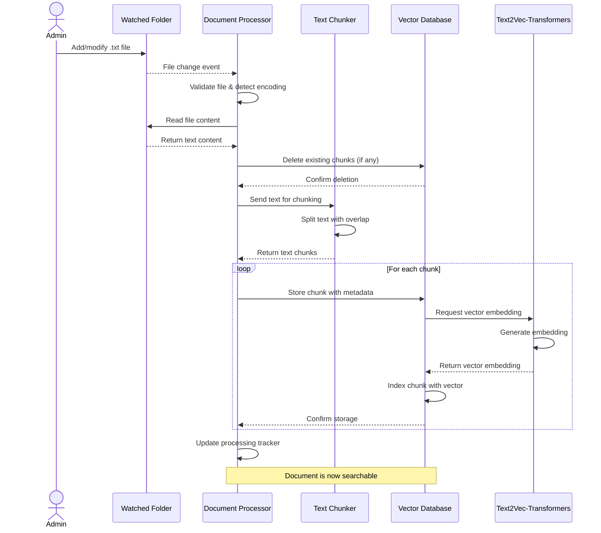

# Document Processing Workflow

This document explains how the system processes text files from ingestion to indexing.

## Overview

The document processing workflow is designed to be simple and automated. Administrators only need to place text files in a designated folder, and the system handles the rest.

```
User adds text file → File detection → Text chunking → Vector embedding → Storage in database
```

### Sequence Diagram

The following sequence diagram illustrates the document processing workflow:



## Detailed Workflow

### 1. File Detection

The system uses the Python `watchdog` library to monitor a designated folder for changes:

- New files: Processed and indexed
- Modified files: Re-processed and re-indexed
- Deleted files: Removed from the index

The processor tracks file modification times to avoid redundant processing.

### 2. Text Preprocessing

When a text file is detected:

1. File encoding is detected automatically
2. Text content is read into memory
3. Any existing chunks for this file are deleted from the database

### 3. Text Chunking

Text is split into manageable chunks for more precise retrieval:

- Default chunk size: 1,000 characters
- Default overlap: 200 characters
- Chunking attempts to preserve paragraph boundaries where possible

The chunking strategy balances:
- Small enough chunks for precise retrieval
- Large enough chunks for sufficient context
- Overlapping content to avoid missing information at boundaries

### 4. Vector Database Storage

Each chunk is stored in Weaviate with:

- **content**: The actual text content
- **filename**: Source document name
- **chunkId**: Sequential number within the document

A consistent UUID is generated for each chunk based on filename and chunk ID, ensuring that updates to existing files replace the correct chunks.

### 5. Embedding Generation

The Text2Vec-Transformers module in Weaviate automatically generates vector embeddings for each chunk, which are used for semantic similarity searches.

## Handling Errors

The processor includes several error handling mechanisms:

- File encoding detection attempts multiple encodings
- Processing errors for one file don't stop the entire workflow
- Failed processing attempts are logged with detailed error information
- The system continues monitoring even after errors

## Monitoring and Logs

The processor logs detailed information about its operations:

- File detection events
- Processing steps and timing
- Chunk statistics
- Errors and warnings

These logs can be viewed with:

```bash
docker-compose logs -f processor
```

## Document Verification

To verify that documents are properly processed and stored, you can:

1. Check the API statistics endpoint: `http://localhost:8000/statistics`
2. Run the `document_storage_verification.py` script in the `tests` directory
3. Query the system about content from your documents

## Performance Considerations

- Processing time scales with document size
- The default chunk size works well for most documents
- Very large files (>1MB) may take longer to process
- The system is designed to handle documents in the background without blocking user queries