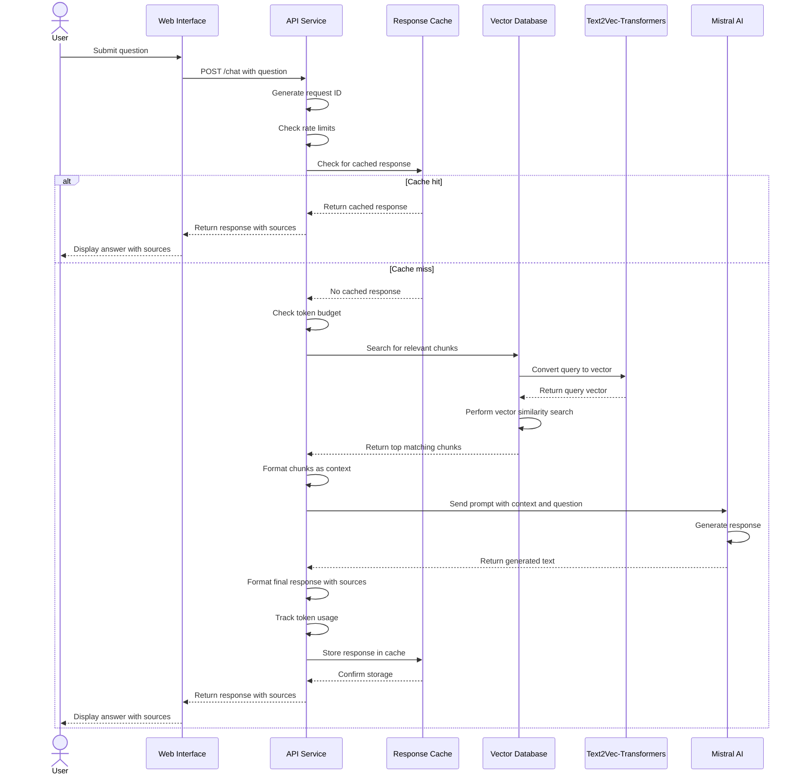

# Query Processing Workflow

This document explains how the system processes user queries and generates responses.

## Overview

The Query Processing workflow follows the Retrieval-Augmented Generation (RAG) pattern:

```
User query → Vector search → Context formation → LLM generation → Response with sources
```

### Sequence Diagram

The following sequence diagram illustrates the document processing workflow:



## Detailed Workflow

### 1. User Query Submission

The workflow begins when a user submits a question through the web interface. The query is sent to the API's `/chat` endpoint as a JSON payload.

### 2. API Processing

When the API receives a query:

1. A unique request ID is generated for tracing
2. Rate limit checks are performed
3. Token budget availability is verified
4. Cache is checked for identical previous queries

### 3. Vector Search

If the query passes initial checks:

1. The query is vectorized (automatically by Weaviate)
2. A semantic similarity search finds the most relevant document chunks
3. The top 3 most relevant chunks are retrieved (default setting)

### 4. Context Formation

The retrieved chunks are formatted into a context prompt:

```
Context:
[Content of chunk 1]

[Content of chunk 2]

[Content of chunk 3]

Question: [Original user query]
```

### 5. LLM Generation

The context and query are sent to Mistral AI:

1. A system prompt establishes the assistant's role
2. The formatted context and query are sent as user message
3. Temperature is set to 0.7 (balanced creativity/consistency)
4. Token usage is tracked for budget management

### 6. Response Formation

When the LLM generates a response:

1. The answer is extracted
2. Source information (filenames and chunk IDs) is added
3. The complete response is sent back to the frontend
4. The response is cached for future identical queries

### 7. User Presentation

The web interface:

1. Displays the generated answer
2. Shows source citations
3. Adds the interaction to the conversation history

## Error Handling

The system includes robust error handling:

- **Rate limiting**: If too many requests arrive, users receive a friendly message
- **Token budget**: If the daily budget is exceeded, users are informed
- **API errors**: Transient errors trigger automatic retries
- **Timeouts**: Long-running requests have appropriate timeouts

## Caching Mechanism

To improve performance and reduce API costs:

- Responses are cached for 1 hour
- Cache keys combine the query text and context hash
- Cache size is limited to 100 entries
- Oldest entries are removed when the cache is full

## Budget Management

The system carefully manages Mistral API usage:

- Daily token budget is configurable (default: 10,000 tokens)
- Token usage is reset daily
- Requests are estimated and checked against remaining budget
- Actual usage is tracked after completion

## Performance Optimization

To optimize performance:

- Rate limiting prevents API overload
- Response caching reduces duplicate work
- Context is limited to the most relevant chunks
- Token usage is carefully balanced against response quality

## Monitoring and Logging

Each step of the process is logged with the request ID:

- Query reception
- Vector search results
- Context formation
- LLM generation timing
- Token usage
- Cache hits/misses
- Errors and retries

These logs provide valuable insights for debugging and optimization.